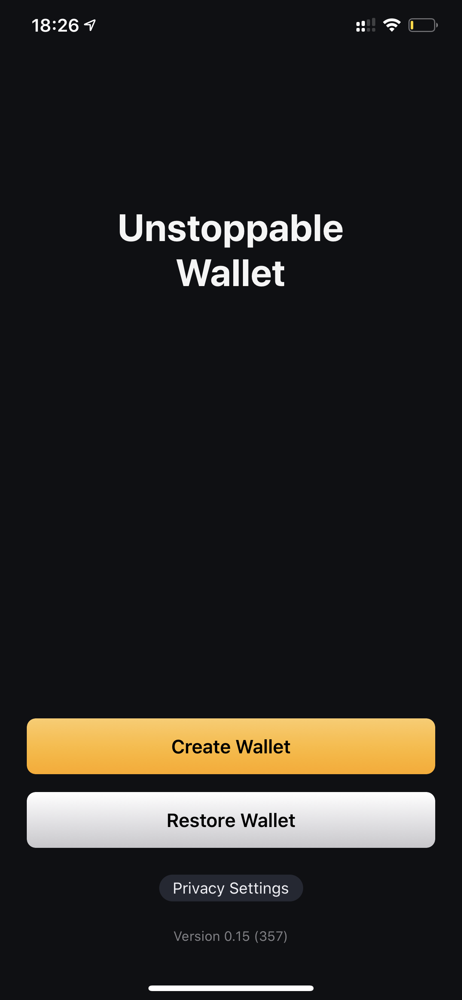

# Getting A Wallet

By now it's clear, cryptocurrency wallets come in various types. 

Next step is to actually get some wallet and go through 'things to know' when using the wallet app.

## Basic Features

While all non-custodial wallets built around the core principle of exclusive control over funds, on the surface the wallets may vary substantially.

The wallet built for an active investor may differ substantially from a wallet built for someone with extensive privacy requirements. Similarly, wallet designed for long term storage of large funds may be very different from a wallet designed for those just experimenting with cryptocurrencies.

That said, below are the basic set of features shared by all non-custodial wallets. 

- sending cryptocurrency
- receiving cryptocurrency

Every wallet showcases a list of cryptocurrencies it supports. From user's perspective, the basic expectation from any given wallet is the ability to independently store, send and receive the cryptocurrencies the wallet supports.

- A wallet supporting multiple cryptocurrencies should automatically manage the "receive" address for each cryptocurrency. For example, the wallet user's address for receiving payments in Bitcoin varies from the address for Ethereum. The wallet is expected to care of that under the hood and give user a correct address for each type of cryptocurrency.

- Generally, a wallet app is expected to check whether the payment is being sent to a 'valid' address. In other words, if the user mistakenly tries to send a Bitcoin payment to some Ethereum address the wallet app should be able to alert the user accordingly. The funds sent to an incorrect address are not recoverable.

The above are basic must-have features that all wallet apps provide out of the box. 

## Unstoppable Intro

These guides were written for someone looking to invest in cryptocurrencies on an ongoing basis. So, moving forward we are going to focus on those planning to invest and grow cryptocurrency portfolio.

We are going to use Unstoppable Wallet non-custodial wallet to illustrate some features.

> Disclaimer : The Unstoppable Wallet is being specifically build with the active investor in mind. 
> 
> https://unstoppable.money
> 
> This wallet is being built by Horizontal Systems, the company behind these guides.
>
> https://horizontalsystems.io

Regardless of the preferences below are key features the investor-type users should expect from their wallet app.

### 1. Backup / Restore 

Every non-custodial wallet starts either with the process of new wallet setup or migration of existing wallet.

The new wallet setup generates a new private key which needs to be backed up. 

restoren of existing wallets allows to enter the existing key and then wait for the phone to locate the funds associated with that key.

### 2. PIN Lock Security

Any decent wallet should ...

.. also hide balance

### 3. Multiple Cryptocurrencies
       
The more currencies the wallet able to store the better. It's a matter of convenience interacting with one app rather than switching between apps for different cryptocurrencies.

### 4. Price Features

The wallet should display latest market exchange rates for each supported cryptocurrency. 

Moreover, there should be historical price charts showing the assets price changes over extended periods of time.

### 5. Movement Alerts 

... +5%/+10% etc
... indicators

### 6. Project Overviews

Each cryptocurrency is essentially a project. Understanding of what problems the project aims to solve on a practical level and where it's currently at is key. Due to the young nature of the industry most projects are fairly obscure for the newcomers. It's critical for the person to ahve a working knowledge to be able to identify the good, the bad and the ugly.

### 7. Exchange Integration

- ability to exchange from within the wallet app

### 8. Privacy

It should further be noted that best non-custodial wallets are able to restore balance/transactions directly from the blockchain without relying on a intermediary server. 

This ensures that wallet app can connect to one of thousands of servers powering any given blockchain and download your history from it rather than requesting it from a third party server which at some point can become unreachable. 

### 9. Censorship Resistance

.. tor
