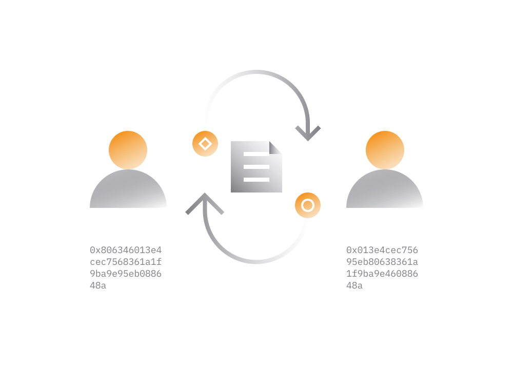

# Decentralized Exchanges

Nearly all major [cryptocurrency exchanges](/guides/fundamentals/6-buying-cryptocurrency-basics.md) that exist today are centralized. While these exchanges allow easy way to trade cryptocurrency for fiat money like USD or EUR, they come with some drawbacks.
    
Centralized exchanges typically operate only in some regions and require every user to pass identity and source-of-funds checks often requesting from users highly sensitive documents.
    
Due to centralized nature of these crypto exchanges there are substantial privacy issues as well as security risks when keeping funds on these exchanges.
    
> Emergence of decentralized exchanges opened access to cryptocurrency markets to anyone worldwide while providing substantially better security and privacy to the service users.
    
When trading on a DEX the exchange occurs without having to rely on an entity which acts as intermediary between the buyer and seller. 

- The trades controlled by smart contracts which cannot do anything outside the standard feature set.
   
- Anyone with some cryptocurrency can trade on a decentralized exchange without the need to go through identity checks or account verification procedures.

- Due to the nature of decentralized exchanges they typically operate only with cryptocurrency and do not provide any means to use fiat currency, other than cryptocurrency stablecoins.

Today there are decentralized exchanges which average over 100 million worth of USD 24-hour trading volume. 

As of August 2020, top decentralized exchanges by volume are:
 
- [Uniswap](https://uniswap.info/home)
- [Curve](https://curve.fi) 
- [Balancer](https://pools.balancer.exchange/#/)

The above mentioned DEXes are not the only decentralized exchanges on Ethereum blockchain, there are [many other](https://defiprime.com/exchanges#ethereum) as well. That said, these three are currently most popular DEXes. 

There are slo instruments like [1inch.exchange](https://1inch.exchange/) which act as aggregator and able to provide the best exchange prices on the market. It's able to do that by splitting a trade order among multiple DEXes in one single transaction.

> When using DEX make sure you always access the officially advertised website for the DEX. 

There are a lot of fake websites for various DEXes which look just like the original one.

## Liquidity Pools

Liquidity Pools are a type of DeFi services which are provided by decentralized exchanges. 

> The first generation of decentralized exchanges been struggling to attract cryptocurrency traders due to low trading volumes for most trading pairs. 
>
> As a result most people been using centralized exchanges which typically have more people and therefore higher trading volumes.

Liquidity pools emerged as a solution to increase the liquidity on decentralized exchanges. 

In essence, liquidity pools are fully-autonomous, human independent smart contracts which are pre-programmed to do two things:
 
1. allow cryptocurrency owners to deposit cryptocurrency assets into a smart contract and earn passive income from these deposits without loosing access to the funds.

2. the funds accumulated in a smart contract are than used to provide instant liquidity to buyers and sellers on a DEX for a small fee that goes to depositors.

Liquidity pools have no listing fees, or other barriers: anyone can put assets into an existing liquidity pool, or create a new one. The depositor can withdraw assets together with earnings from the pool at any time. 

In general, each trading pair on a DEX has its own liquidity pool smart contract. 

Lets take and ETH/USDT trading pair on some DEX that supports liquidity pools.
 
- an ETH/USDT liquidity pool can accept ETH and USDT cryptocurrency from a third party and then use funds to serve traders looking to sell/buy ETH for USDT.

- typically, liquidity pool requires depositors to deposit both tokens (from the pair) in equal amounts, taking current exchange rate between two.

- with every trade on this trading pair DEX traders pay "liquidity provider fee" to settle each trade, which typically varies between 0.02 - 0.04 %.

- the depositor to liquidity pool receives a certain number of tokens representing the ownership of certain amount of tokens in the pool including a share from accumulated trading fees.

To sum up, each trading pair on a DEX powered by a community-funded liquidity pool. Anyone can join the pool by depositing cryptocurrency assets accepted by the pool.

Pretty much all major DEXes including [Uniswap](https://uniswap.info/home), [Curve](https://curve.fi) and [Balancer](https://pools.balancer.exchange/#/) use liquidity pools that generate liquidity on the trading markets.