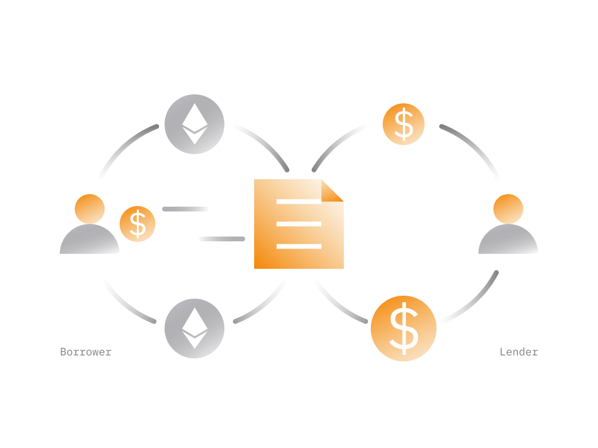

# DeFi Products

Other than dealing with cryptocurrency these services provide alternative to traditional financial services but without the means for someone to oversee your access to the service or interfere with your assets.

While all kinds of financial models can be built upon Ethereum blockchain most DeFi services today fall under one of the following categories:

## [Decentralized Exchanges](/guides/defi/5-decentralized-exchanges.md)

Nearly all major [cryptocurrency exchanges](/guides/fundamentals/6-buying-cryptocurrency-basics.md) that exist today are centralized. While these exchanges allow easy way to trade cryptocurrency for fiat money like USD or EUR, they come with some drawbacks.
    
Centralized exchanges typically operate only in some regions and require every user to pass identity and source-of-funds checks often requesting from users highly sensitive documents.
    
Due to centralized nature of these exchanges there are also substantial security risks when keeping funds on these exchanges.
    
> Emergence of decentralized exchanges opened access to cryptocurrency markets to anyone worldwide while providing substantially better security to the service users.
    
When trading on a DEX the exchange occurs without having to rely on an entity which acts as intermediary between the buyer and seller. 

- The trades controlled by smart contracts which cannot do anything outside the standard feature set.
   
- Anyone with some cryptocurrency can trade on a decentralized exchange without the need to go through identity checks or account verification procedures. 

Today there are decentralized exchanges which average over 100 million worth of USD 24-hour trading volume. 

As of August 2020, top decentralized exchanges by volume are [Uniswap](https://uniswap.info/home), [Curve](https://curve.fi) and [Balancer](https://pools.balancer.exchange/#/).

## [Liquidity Pools]

Liquidity Pools are a type of DeFi services which are provided by decentralized exchanges. 

> The first generation of decentralized exchanges been struggling to attract cryptocurrency traders due to low trading volumes for most trading pairs. 
>
> As a result most people been using centralized exchanges which typically have more people and therefore higher trading volumes.

Liquidity pools emerged as a solution to increase the liquidity on decentralized exchanges. 

In essence, liquidity pools are fully-autonomous, human independent smart contracts which are pre-programmed to do two things:
 
1. allow cryptocurrency owners to deposit cryptocurrency assets into a smart contract and earn passive income from these deposits without loosing access to the funds.

2. the funds accumulated in a smart contract are than used to provide instant liquidity to buyers and sellers on a DEX for a small fee that goes to depositors.

Liquidity pools have no listing fees, or other barriers: anyone can put assets into an existing liquidity pool, or create a new one. The depositor can withdraw assets together with earnings from the pool at any time. 

In general, each trading pair on a DEX has its own liquidity pool smart contract. 

Lets take and ETH/USDT trading pair on some DEX that supports liquidity pools.
 
- an ETH/USDT liquidity pool can accept ETH and USDT cryptocurrency from a third party and then use funds to serve traders looking to sell/buy ETH for USDT.

- typically, liquidity pool requires depositors to deposit both tokens (from the pair) in equal amounts, taking current exchange rate between two.

- with every trade on this trading pair DEX traders pay "liquidity provider fee" to settle each trade, which typically varies between 0.02 - 0.04 %.

- the depositor to liquidity pool receives a certain number of tokens representing the ownership of certain amount of tokens in the pool including a share from accumulated trading fees.

To sum up, each trading pair on a DEX powered by a community-funded liquidity pool. Anyone can join the pool by depositing cryptocurrency assets accepted by the pool.

Pretty much all major DEXes including [Uniswap](https://uniswap.info/home), [Curve](https://curve.fi) and [Balancer](https://pools.balancer.exchange/#/) use liquidity pools that generate liquidity on the trading markets.

## Lending Pools

A large segment of DeFi services built to facilitate borrowing and lending cryptocurrencies in a decentralized and secure manner. 

- For borrowers:

    Borrowing services allow someone to borrow cryptocurrency from a smart contract in exchange for a collateral in a form of another cryptocurrency as well as the service fee in a form interest.
    
    The borrower can generally repay the loan at any time and withdraw the deposited collateral. The smart contract is pre-programmed to repay the collateral back to the borrower when the loan returned.
    
    Generally speaking, borrowing services allow someone to access liquidity without having to sell their cryptocurrency. As will be shown later on there are many ways to make use of such services.
    
- For lenders:

    Lending DeFi services allow cryptocurrency holders to lend their assets to a smart contract and earn interest from a smart contract.
    
    The smart contract's interest rate for lending is higher than it's for borrowing. As a result, smart contract is able to serve both borrowers and lenders.
        
Some top DeFi services in that category include [Compound Finance](https://compound.finance/markets), [Aave](https://app.aave.com/home) and [Oasis](https://oasis.app/). 

The borrowing and lending rates, loan terms and collateral requirements usually vary from one service to another.

## Stablecoins

The term stablecoin refers to a type of cryptocurrency which attempts to peg its market value to some external reference, usually it’s USD, EUR or Gold.

> DeFi technologies like smart contracts enabled creation of cryptocurrencies which have a fixed value i.e. equal to 1 USD or say 1 oz (ca. 38 g) of gold. 
>
> Depending on how the stablecoin built it has various mechanisms in place to ensure its price always remains very close to the peg. 

While there are a lot of stablecoins in DeFi ecosystem each comes with its own specifics:

- The [DAI](/guides/token_guides/makerdao.md) stablecoin is decentralized and fully governed by smart contracts without any privileged parties.

- The Tether's [USDT](/guides/token_guides/tether.md) is also a stablecoin built on Ethereum. Unlike DAI, it is centralized where certain privileged parties can issue new tokens at will as well as freeze tokens belonging to other users.

So, while there are a lot of stablecoins built on Ethereum not all of them are built per DeFi attributes.

## 5. Derivatives

Decentralized financial derivatives is another category representing a growing segment of DeFi services.

> Derivatives derive their value from the value of the primary financial asset that they are linked to via smart contracts.

Smart contracts enable creation of tokenized derivatives (backed by a collateral) without the need for another entity other than smart contract.

This trend has allowed anyone to take advantage of opportunities previously restricted to those with brokerage accounts or specialized knowledge.

Some Examples:

- [Synthetix](https://www.synthetix.io)

    With Synthetix, anyone in the world can gain exposure to financial assets or securities (which are not natively present on Ethereum blockchain) like say like USD, EUR, Bitcoin or stocks (Apple, Tesla, etc) without having to deal with the high frictions of financial regulations.
    
    Synthetix enables creation of tokens (called Synths) which are backed (collateralized) by other cryptocurrency tokens. For instance, there is sBTC cryptocurrency token issued via Synthetix smart contracts: it is a stablecoin that's pegged to Bitcoin.
    
    In order for someone to create an sBTC token the person needs to pass to the smart contract SNX cryptocurrency tokens equivalent to 750% of Bitcoin value. A high collateral is there to ensure that the value of sBTC never falls below the Bitcoin price.
    
- [Augur](https://augur.net)
    
    Global, no-limit betting platform. Bet how much you want on sports, economics, world events and more.
    
    Each bet position represents an asset that either pays or not when the event occurs.
    
As DeFi continues to grow expect to see a lot of DeFi services covering entire derivatives market.