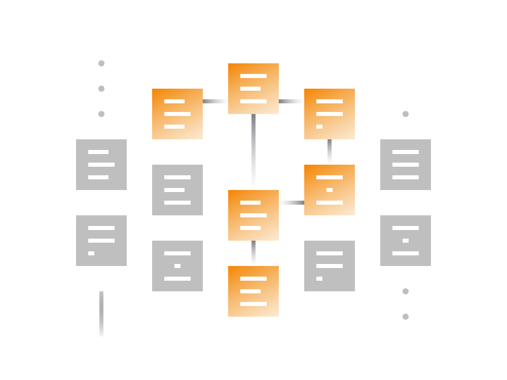
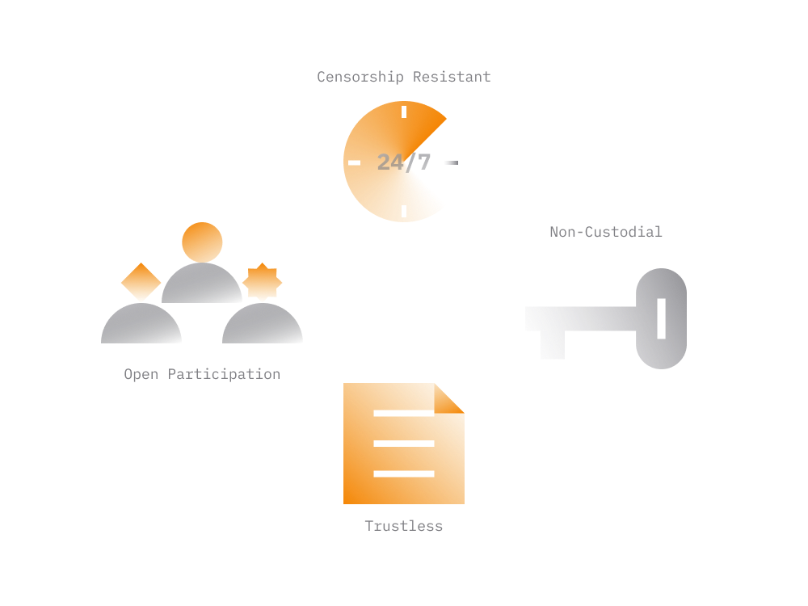
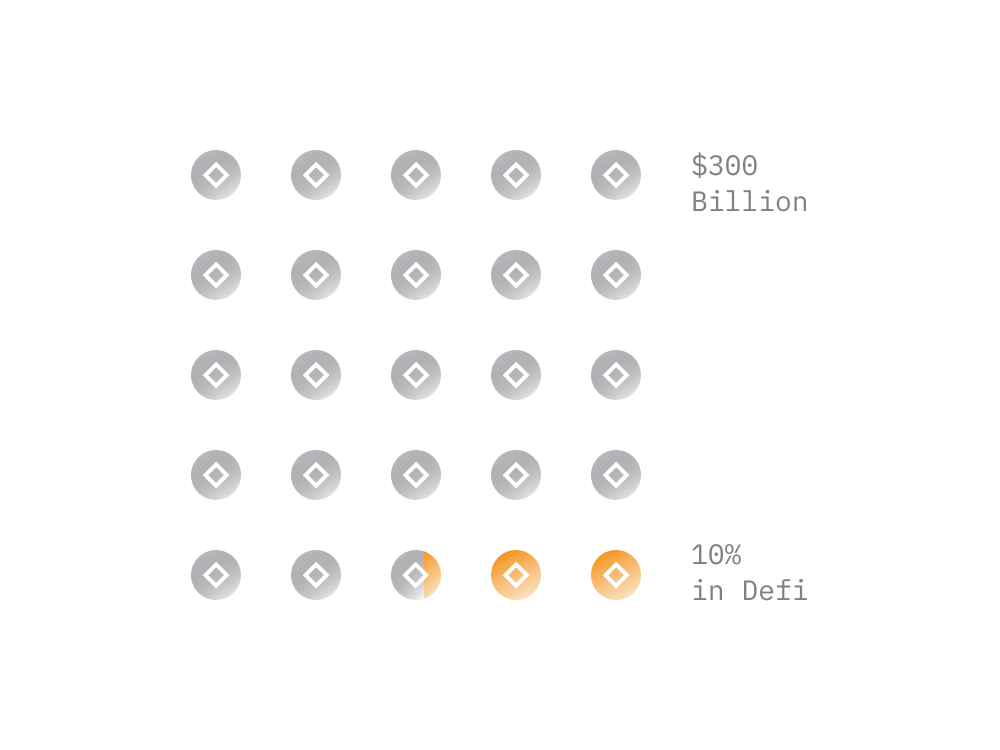

# DeFi Explained

The aim of this guide is to onboard someone into Decentralized Finance, or DeFi in short, as quickly as possible without going into technicals.

In traditional finance, also called centralized finance, service providers act as intermediaries between the user and service. User's access and participation in the service is conditional and regulated by that service provider. 

- Banks place minimum account balances, withdrawal caps and transfer limits on savings accounts.

- Credit card issuers can cancel your card and service if they see any activity they deem suspicious. 

- Investment opportunities are conditional and exclude most but the wealthiest members of society.

Decentralized Finance refers to a category of products which provide financial services but are not controlled by a centralized entity.

> In DeFi, offered services are generally not governed by a centralized entity, not regulated, and operate autonomously without the need to be administered by a human.

Technologies like the internet, cryptography, and blockchain provided means to create financial instruments where trust and reliability guaranteed by computer programs removing the need for a human intermediary.

> DeFi is an ecosystem, even a movement, driven by an aim to create a financial system that’s open to everyone and minimizes one’s need to trust and rely on central authorities.

Today, the majority of DeFi services operate on top of Ethereum blockchain and take the form of decentralized apps, more commonly known as DApps. 

While Ethereum is not the only platform where DeFi services are being built it is by far the most popular one. Thus, in this guide we'll specifically focus on DeFi services operating on Ethereum.

It's recommended to go over the [Ethereum guide](../../token_guides/en/ethereum.md). A good understanding of Ethereum, Smart Contracts and DApps is essential to understand DeFi.

## DeFi Attributes

Typically, DeFi services usually built around following principles:

- Open To All

    Anyone worldwide with an internet connection and some cryptocurrency can use a service regardless of location, age, experience, social status etc. 
    
- Censorship Resistant

    DeFi services live on a distributed blockchain powered by thousands of servers. This ensures uninterrupted access to service to anyone worldwide at any time.

- Non Custodial

    The service user always maintain full unconditional control over the assets. No dependence on other external factors, or some entity that acts as custodian of assets.
    
- Enforce Trust

    DeFi services are transparent and have an open code. Users do not need to trust it as the service practically unable to do anything outside the scope of the pre-programmed rules. It cannot cheat, steal or misuse funds.

- Independent

    In general, DeFi services don't belong to any single entity, or in some cases moderated by a geographically distributed group of anonymous entities.

Keeping above in mind, the goal of DeFi is to reconstruct the financial instruments for the whole world by building open, censorship-resistant, decentralized alternatives.

> An absolute minimum requirement for a DeFi service is to ensure that access to service is unconditional and users always maintain full control over their assets.

If a service provides means to freeze funds or censor users it cannot be classified as a DeFi service.
    
## DeFi History

Bitcoin and Ethereum are the DeFi systems. Both are now controlled by large networks of distributed computers, not central authorities. 

1. [Bitcoin](../../token_guides/en/bitcoin.md) was the first blockchain which paved the way for decentralized finance by allowing people to transact in Bitcoin (BTC) without the need for a third party to execute that transaction. Today, Bitcoin blockchain handles on average [300K transactions a day](https://bitinfocharts.com/comparison/bitcoin-transactions.html#1y).

2. Few years later, [Ethereum](../../token_guides/en/ethereum.md) took the idea further and enabled conditional transactions. It enabled programmers to build complex financial services that are always online, censorship resistant and autonomous. 

3. Over the last few years, Ethereum ecosystem has attracted a lot of engineers and entrepreneurs keen to build new generation of DeFi services. 

Despite some deficiencies Ethereum ecosystem managed to produce a number of large DeFi services operating significant sums. 

> Crypto entrepreneurs and engineers now recreate traditional financial instruments in a decentralized architecture, outside of companies’ and governments’ control.

Being a disruptive technology, the upside potential of the industry remains extremely high.

## DeFi Today

There are currently a lot of well-financed startups, entrepreneurs, and finance people working in DeFi ecosystem. In Nov 2021, the total sum controlled by top DeFi projects exceeded 100 billion USD in value.

If interested check out [defimarketcap.io](https://defimarketcap.io) to see top DeFi services on the market today.

All DeFi projects expected to have an open source code. This speeds up development of the entire ecosystem by enabling engineers reuse various components from other projects.
        
To raise funds DeFi projects generally conduct token sale via a process such as ICO (Initial Coin Offering) or similar. The project sells a specific cryptocurrency token representing governance weight or profit share in a project. 

DeFi projects usually take the form of a DAO (Decentralized Autonomous Organization) and are governed by a group of entities which may not even know each other. The governance may take place via proposals and voting mechanism.