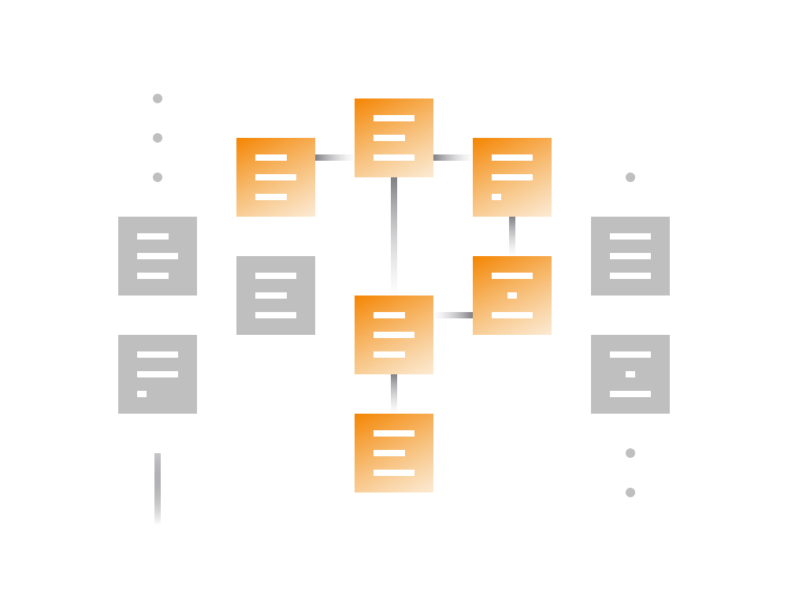
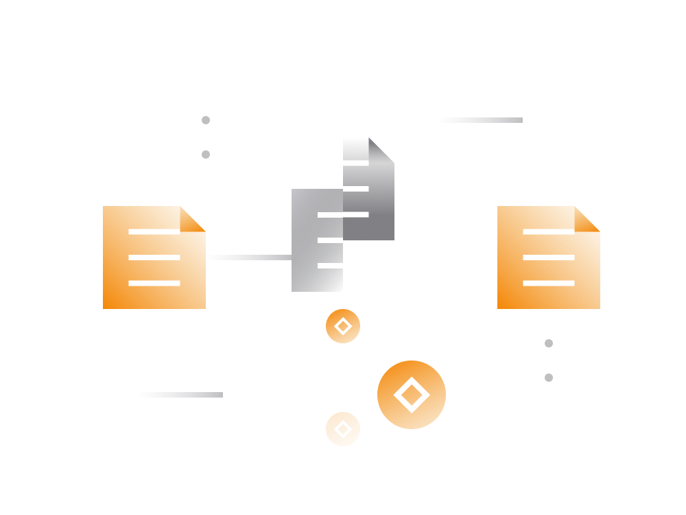

# How To DeFi

The only requirements for someone to start engaging with most DeFi services are the working internet and some amount of cryptocurrency. 

> There are no age, experience, geographical or any other conditions. DeFi services are open to all, at any time.

Let's go over tools and know-how needed to get you started on a practical level.

- A single DeFi service can have multiple websites/apps depending on its popularity. Since smart contracts reside on always-online blockchain anyone can build a graphical gateway to them in a form of a website or a mobile app.

- DeFi services require user to connect to the service using a [non-custodial](../../fundamentals/en/2-wallets-basics.md) cryptocurrency wallet like Unstoppable. The wallet is your way to authenticate and connect to the smart contract.

## Getting Started

Connecting to a DeFi service merely requires a non-custodial wallet with "WalletConnect" capability. Majority of well engineered non-custodial wallets (like Unstoppable, Trust or MEW) support "WalletConnect" feature.

1. When you're ready to DeFi, open the web browser and navigate to the DeFi service website you would like to use. 
2. Once there look for 'connect wallet' button or a similar option. Click on it and look for "WalletConnect" option.
3. Selecting "WalletConnect" option should present a popup window with a QR code.
4. Open the wallet app and look for "WalletConnect" feature. On Unstoppable, the option located in Settings tab.
5. Clicking on "WalletConnect" feature in the wallet app should open the QR code scanner. Use it to scan the QR code presented in step 3.
6. Click on Connect button.

## DeFi Risks

Majority of DeFi services operate in non-custodial manner where user communicates directly with the smart contracts that control the service. 

> The users always remain in control of the funds and can withdraw funds from the service at any time.

That said, there are also some caveats which makes DeFi a risky place to keep your assets. 

- Should something go wrong with the smart contract powering a DeFi service, there’s no insurance protecting the users' assets on contract's balance.

- Most DeFi products still considered experimental despite operating with large sums of cryptocurrency assets.

- It's not uncommon for entities launching DeFi projects to keep a sizeable portion of tokens to themselves and sell their holdings on hype when the price is high.

So, when it comes to DeFi, if something goes wrong you're on your own to bear the responsibilities. There is no entity to complain to or hold liable should there be an issue.

> We refer to DeFi as 'trustless' because you do not need to trust a third party to serve as an intermediary with your funds -- but you must in fact be able to trust the code and competence of people who built that code.
   
While some major DeFi services go through third-party security audits not all services are able to afford that. 

Therefore, the risk is present in all DeFi products. Keep that in mind and never invest more than you're willing to lose.