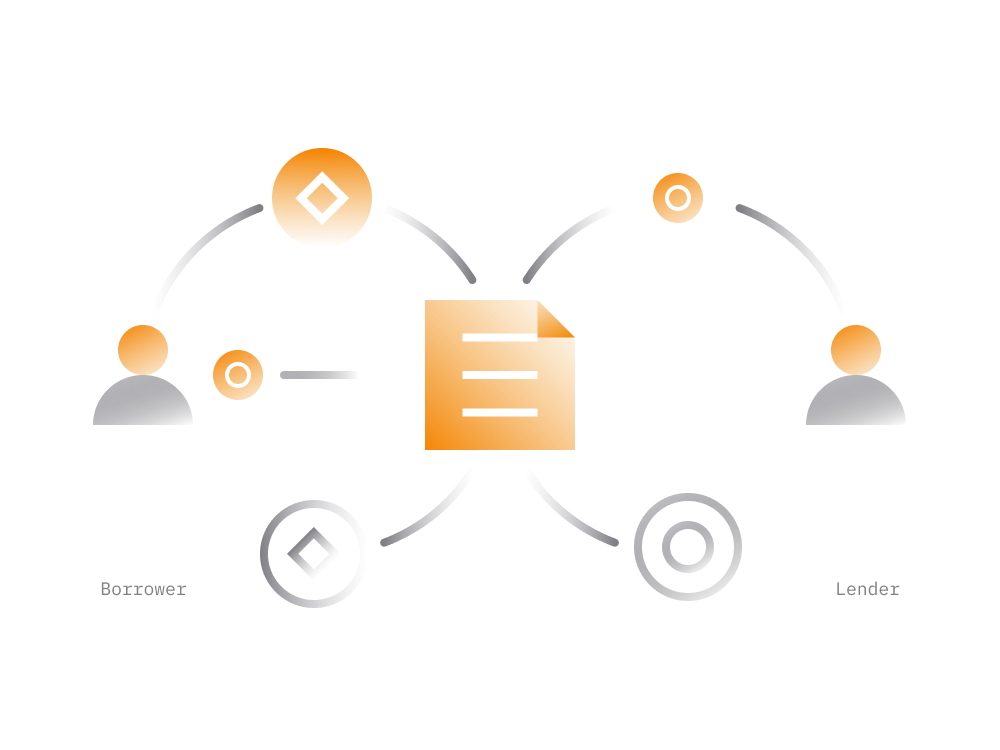

# Lending Pools

These are DeFi services which facilitate cryptocurrency lending and borrowing services in non-custodial manner.

- Borrowing

    Borrowing services allow someone to borrow cryptocurrency from a smart contract in exchange for a collateral in other cryptocurrency.
    
    Borrowing services allow someone to access liquidity without having to sell their cryptocurrency. The borrower may repay the loan at any time and return the collateral.
        
- Lending

    Lending services allow cryptocurrency holders to lend assets to a smart contract and earn interest. 
    
    The lender can pull deposits out of smart contract at any time along with accrued interest.

Typically, cryptocurrency market participants borrow assets from a smart contract in order to utilize these funds in activity where these assets can make more returns than the cost of borrowing them.

For instance, someone may borrow one cryptocurrency from one DeFi service and then lend it to another DeFi service with higher returns.

## Collateralized Loans

- The borrower has to put up another cryptocurrency as collateral, often significantly more than borrowed amount.

- High collateral is necessary to protect the lenders on the platform should the value of collateral assets drop sharply.

- If collateral value falls below the required, smart contract attempts to liquidate the collateral in an effort to repurchase lent assets. 

A borrower is incentivized to pay back loan and prevent their collateral from being liquidated in order not to lose part of the collateral.

## Flash Loans

There is another form of cryptocurrency borrowing which does not involve the collateral at all. 

> A flash loan allows the lender to borrow funds without any collateral, provided they pay back the loan within the same transaction. 

Flash loans are currently limited to those with inner knowledge of the ecosystem. A sample DeFi transaction below illustrates how someone may make use of flash loans. 

While most Ethereum transactions are simple and involve a 1-2 actions it's practically possible to have transactions that interact with multiple DeFi services, in a single transaction.

1. take out a flash loan (in tokenX) from a smart contract.

2. swap borrowed tokenX on some DEX1 to tokenB.

3. then convert tokenB to tokenC on some DEX2.

4. then convert tokenC to tokenA on some DEX3.

5. finally, repay flash loan to a smart contract.

If any steps in transaction chain fail then preceding steps would be reverted and transaction would fail as well, like it never happened.

> Anyone and anywhere can make use of flash loans and borrow as much as needed without a collateral, given that loan is returned within the same transaction.

A flash loan allows you to essentially simultaneously perform multiple financial transactions in an instant: borrowing the funds, using them to make several arbitrage trades across multiple DeFi platforms, and then paying them back to the original lender, all in one go.

## 1. Compound

A popular decentralized service for borrowing and lending cryptocurrency. 
    
[Compound Finance](https://compound.finance/markets) loans typically require a collateral which may change between 0-90% of the borrowed asset. 

Each asset on Compound can have a different collateral requirement.
    
Read: [Compound in Simple Terms](../../token_guides/en/compound.md)
    
## 2. Aave

[Aave](https://app.aave.com/home) provides access both to collateralized and non-collateralized flash loans.
    
The flash loans are provided from a liquidity pool which is financed by other users. Aave charges a 0.09% fee on flash loans.
    
For collateralized loans a 0.01% fee of the loan amount is collected on loan origination.
    
Read: [Aave in Simple Terms](../../token_guides/en/aave.md)    
    
## 3. Oasis

[Oasis](https://oasis.app/) is a DEX developed by MakerDAO which facilitates lending and borrowing of DAI stablecoin. 
    
- Users may borrow DAI from MakerDAO smart contracts which creates new DAI in exchange for a cryptocurrency collateral (i.e. 150% of loan value) from a borrower.
    
- When DAI tokens are returned, the collateral paid back to the borrower and returned DAI tokens are destroyed by a smart contract.
    
Read: [MakerDAO in Simple Terms](../../token_guides/en/makerdao.md)

## Risks

As with other DeFi services, there is always a possibility of a hack or exploit which could drain the liquidity pool of the lending service, causing lenders to lose their assets.

Therefore, lenders must be sure not to commit more money than they can afford to lose.