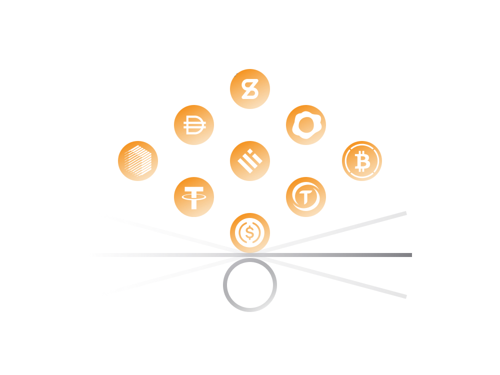

# Stablecoins

Stablecoins were one of the very first decentralized financial instruments emerging from DeFi ecosystem. 

The term stablecoin refers to a type of cryptocurrency which attempts to peg its market value to some external asset like USD, EUR, Gold or some other cryptocurrency.

> DeFi smart contracts enabled creation of cryptocurrencies which have a fixed value i.e. equal to 1 USD or say 1 oz (ca. 38 g) of gold. 
>
> Depending on how a stablecoin is programmed on a smart contract level it may have various mechanisms in place to ensure its price always remains very close to the peg. 

Stablecoins typically have a fixed price and thus avoid being exposed to cryptocurrency price swings. Most DeFi services operate with stablecoin cryptocurrencies due to their relatively stable value.

While there are a lot of stablecoins in DeFi ecosystem each comes with its own specifics:

- The [DAI](../../token_guides/en/makerdao.md) stablecoin is decentralized and fully governed by smart contracts without any privileged parties. It's a stablecoin that built per DeFi principles and to a large extent fully autonomous.

- The Tether's [USDT](../../token_guides/en/tether.md) is also a stablecoin built on Ethereum. Unlike DAI, it is centralized where certain privileged parties (i.e. Tether Limited) can add new tokens into circulation at will as well as freeze tokens belonging to other users.

So, while there are a lot of stablecoins built on Ethereum not all of them are built per DeFi principles.

## 1. DAI ( ~ USD)

Currently, the most decentralized stablecoin on Ethereum ecosystem. 
    
The DAI stablecoin is the financial service offered by DeFi entity known as MakerDAO.
    
Read: [DAI in Simple Terms](../../token_guides/en/makerdao.md)
    
### 2. USDT ( ~ USD)

The very first cryptocurrency stablecoin with a market cap nearing 100 billion USD.
    
USDT token is highly liquid and has one of the biggest trading volumes across centralized and decentralized cryptocurrency exchanges.

Read: [USDT in Simple Terms](../../token_guides/en/tether.md)
            
### 3. USDC ( ~ USD)

Introduced by the Centre Consortium, an organization co-founded by Circle and Coinbase cryptocurrency exchange.
    
Centre Consortium has full control over the stablecoin and claims to have each coin backed by USD on a 1-1 basis, held on its bank accounts.
    
Read: [Introducing USD Coin (USDC)](https://www.centre.io/usdc)

### 4. BUSD ( ~ USD)

A US dollar backed stablecoin from Binance and Paxos, the biggest cryptocurrency exchange in the world. 
    
Just like above mentioned USDT and USDC, it's a centralized stablecoin.
    
### 5. PAX ( ~ USD)

Another centralized stablecoin that claims to be backed 1:1 with the US Dollar. 

PAX tokens are issued by the Paxos Trust Company.

### 6. sUSD / sBTC

sUSD and sBTC are decentralized stablecoins pegged to the price of USD and BTC, respectively. 

Both tokens are derivatives created on Synthetix DeFi platform where each such token backed by the collateral up to 800% of the asset value the token represents.

Read: [Synthetix in Simple Terms](../../token_guides/en/synthetix.md)
    
### 7. renBTC  ( ~ BTC)

A bitcoin representation in Ethereum blockchain. Any asset minted on Ethereum by RenVM is a 1:1 backed by a token on Ethereum. 

If you have 1 renBTC (an ERC-20), you can always redeem it for 1 BTC delivered to your Bitcoin address. 
    
### 8. wBTC  ( ~ Bitcoin)

Wrapped Bitcoin (WBTC) is the first Ethereum-based cryptocurrency token which is backed 1:1 with Bitcoin.
    
There are certain selected entities which take the role of custodians which can create and destroy wBTC tokens.
     
A single wBTC token is created when 1 Bitcoin is deposited to an address belonging to custodian. In the same way, a person can exchange wBTC to a real BTC via the custodian.
     
All custodian activity is transparent allowing anyone to see how wBTC tokens are created and burned as well as the respective changes in BTC reserves.