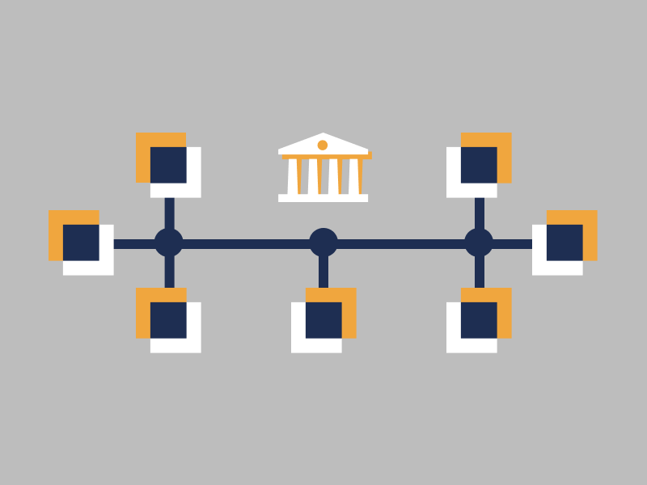

Let’s start with a brief introduction to Decentralized Finance or DeFi as everyone calls it these days.

Bitcoin was the first blockchain which paved the way for decentralized finance that allowed anyone to receive, send and hold Bitcoin without third party service providers such as banks. 

While this was a major achievement in itself the Bitcoin blockchain is limited to plain transfers of Bitcoins from one address to another.

> The Ethereum blockchain goes far beyong simple transfers and is not limited in complexity of logic that can be coded into a transaction. 
>
> Programmers can build any type of public services with complex logic describing the nature of a business or financial contract and let it operate autonomously without means for someone to interfere. 
>
> For as long as the Ethereum blockchain is online, these service remain operational and work exactly as intended.

When people say DeFI they usually refer to financial services built on top of Ethereum or one of its smaller alternatives like EOSIO blockchain platform. 

That said, most of the high net worth projects which are live and already serving the public in the DeFI ecosystem are working on top of the Ethereum blockchain. 

======

stablecoins

If interested, here is stablecoin cheat sheet created by Horizontal Systems, https://horizontalsystems.io/guides/stablecoins.pdf

===

A single stablecoin can be present on multiple blockchains in a form of a crypto token on that blockchain. For instance, Tether (USDT) is available on several blockchains including Ethereum and Tron. The DAI stablecoin on the other hand is present only on the Ethereum blockchain.

Any cryptocurrency wallet supporting Ethereum is likely to support stablecoins on Ethereum blockchain allowing users to store their stablecoins privately. 

Users of such wallets can seamlessly transact with each other using these stablecoins without involving any third party.

The DAI token is generally considered to be a highly liquid asset in the crypto currency space. It’s available on nearly all major cryptocurrency exchanges and widely used as currency in DeFi services built on the Ethereum blockchain.

// DEX Exchanges
