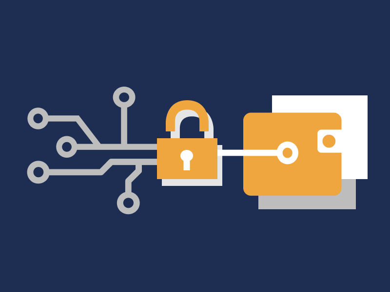
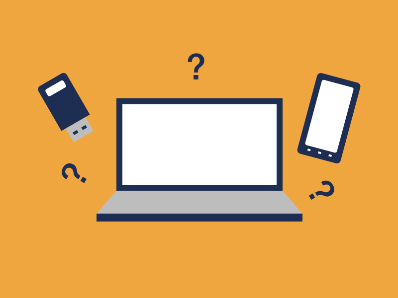
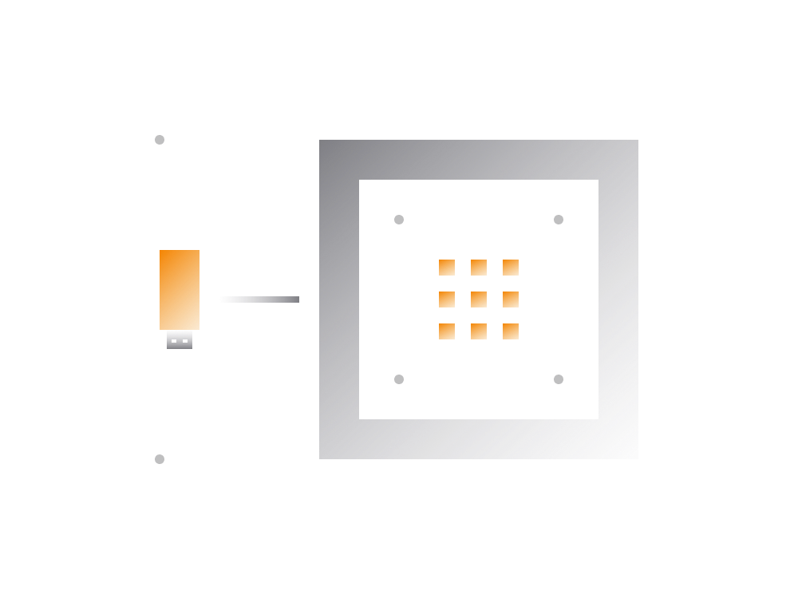
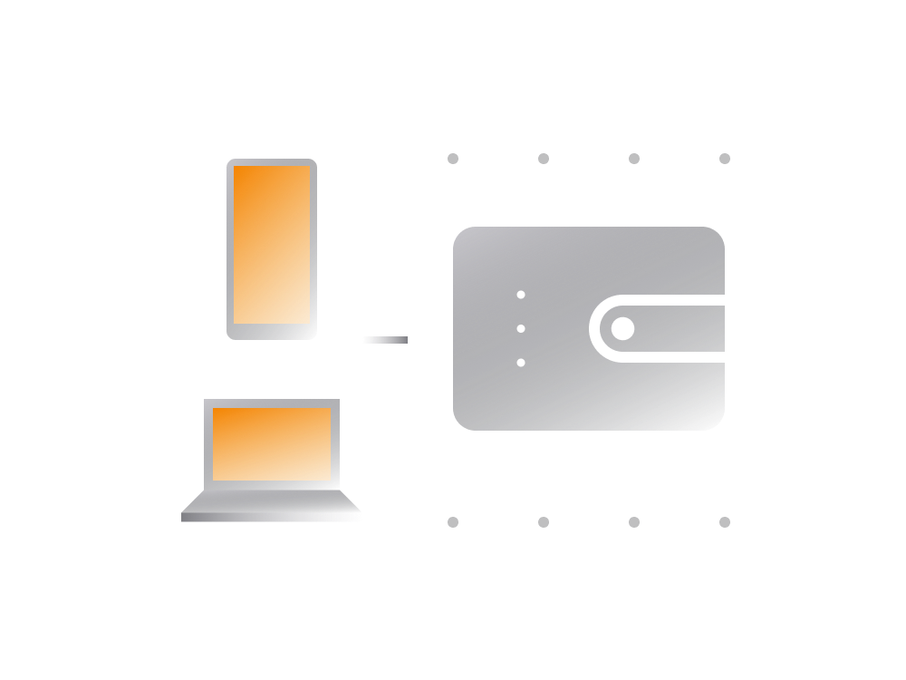

# Safe Storage

Now let's look at different types of non-custodial wallets.

First, there is no such thing as the most suitable wallet for all. Certain non-custodial wallets may be more appropriate for some and not for others. It depends on things like:

* familiarity with security aspects
* the amount of cryptocurrency to store
* how frequently the wallet to be accessed
* whether the person is a potential target
* the place the person lives in

Some wallets are more user-friendly and appropriate for new people with smaller balances. At the same time, for people with a crypto capital in millions and extensive security knowledge the expectations from wallets are considerably higher. Those people may prefer to use wallets engineered for higher security needs.

In this section we will try to look at common non-custodial wallets and get a balanced overview of the security aspects. A balanced approach involves a tiered approach, where the higher security requirements introduced as the risk factor grows. 

An ideal wallet for someone new with a capital below 10K is not the same as for someone in space for years and capital over 100K.

As the user's crypto capital grows so does the potential cost of loosing it. In such cases the capital can be divided into multiple wallets, where a larger chunk kept with extra secure considerations in mind while the remaining in potentially less secure but easily accessible wallet. 

## Non-custodial Wallet Types

All non-custodial wallets out there provide users with full control over the crypto. That's an underlying characteristic of such a wallet. 

There 3 main types of non-custodial wallets:

1. hardware wallets 
2. mobile app wallets
3. desktop software wallets

Non-custodial wallets potentially differ in the extent to which wallet private keys are protected. Some wallets are designed taking into account even the most unlikely scenarios.

For instance, ensuring a safe storage of the private key in a iOS or Android wallet running on a well-maintained phone is easier than on a desktop wallet running on an all-purpose Windows computer.

### 1. Hardware Wallets

The hardware wallets usually come in a form of small hardware devices resembling USB thumb drives and engineered for the sole purpose of storing large amount of cryptocurrencies securely.

Without going into technicals, it's enough to know that these devices are widely considered as ones with the highest level of security. The security considerations are built around the idea of making the physical extraction of the private keys impossible, even if the attacker has your wallet device in physical possession.

From usability point of view hardware wallets are somewhat more difficult to use. It's not difficult for someone familiar with ins and outs of cryptocurrencies but definitely not as easy for the newcomers.

Generally speaking, for someone with a large amount of crypto assets it would be advisable to use the hardware wallet. Or at the very least start exploring these wallets with the intent to move a chunk of their assets to a hardware wallet in the future.

Two well-known hardware wallet providers are:

- [Trezor](https://trezor.io)
- [Ledger Wallet](https://www.ledgerwallet.com)

Both companies have a wide range of products to choose from. It's important to buy those directly from the provider's website.

### 2. Mobile Wallets

The mobile based wallets for iOS and Android are the most common type of non-custodial wallet apps. These wallets are generally more user-friendly. Our very own [Unstoppable Wallet](https://unstoppable.money) is such a wallet.

From security point of view, the hardware wallet considered more secure than a mobile wallet.

The main point here is that there are more ways to attack a wallet running on a mobile operating system then a small hardware device that is designed to do one small thing. 

Mobile wallets operate on an all-purpose operating system (iOS, Android) with a lot of software components. The smartphone device itself has a lot of hardware components that potentially open up new attack surfaces.

Both Google's Android and Apple's iOS operating system come with so called 'secure element' which is specifically designed for handling highly sensitive data. Thus, well engineered wallets make use of that and keep the private key unreachable even if the phone ends up in the hands of someone looking to extract it.

### 3. Desktop Wallets

Desktop wallets are theoretically less secure when compared to a mobile wallet for the same reason why a mobile wallet is less secure than a hardware wallet. 

The potential attack surface on a desktop operating system is even larger than that of mobile. That's just the nature of a desktop platform.

It doesn't necessarily mean some desktop wallet is less secure than some mobile-based wallet app. 

Some of the more popular desktop-based wallets are:

- [Electrum](https://electrum.org)
- [Exodus](https://www.exodus.io)

## So, Which Wallet?

The classification above was primarily based around the notion of private key security. While it's the most important factor it should not be the only one when choosing the wallet. There are a lot of factors to consider.

For instance, a non-custodial mobile wallet app may potentially be more private than a hardware wallet. Or may have essential features not available in the hardware wallet.

The privacy aspect has many sides and generally should be taken into account as well.
 
>**A hardware wallet may offer a superior security but unintentionally expose customers' personal data. A [recent breach](https://decrypt.co/37063/bitcoin-wallet-ledgers-database-hacked-for-1-million-emails) of company selling Ledger hardware wallets is a good example of that.**

Keep in mind, you don't need a cartel level security if you're just starting out. The out-of-the-box security on most well-known non-custodial wallet apps is already pretty good.

> **A balanced approach is a tiered one, where the higher security requirements are introduced as the risk factor grows.**

The minimum security requirements for using any non-custodial wallet app should be as follows.
 
- **Security Basics**

    The owner of the device should have a basic understanding of digital security. If it's a mobile wallet the mobile OS should remain clean of unauthorized applications and stay up to date.
 
- **Standard Compliant**

    The wallet should generate private keys per publicly documented security standards. This will allow for seamless migration to a third party wallet should there ever be a need for that.

- **Unauthorized Access**
    
    The access to the wallet device should be protected with the PIN or a similar mechanism. Presuming a thief knows what they're looking for---cryptocurrency wallets, exchange apps, and so on---they could clean out your cryptocurrency accounts there is no PIN on the smartphone. The same applies to the PIN lock on the hardware wallet.
    
## Multiple Wallets

While your crypto remains relatively small (ex: < $10,000) stick to standard security measures. As the capital grows gradually become more demanding by introducing additional security measures like splitting the capital into multiple wallets.

For instance, someone may start with a single wallet with an initial crypto capital valued at $10,000. As the value of the capital grows the user may move to a tiered approach as below.

- **Generic Wallet**

    Mobile or a desktop non-custodial wallet that always with you and stores smaller amounts for all-purpose transactions. 
    
- **Investment Wallet**

    Mobile non-custodial wallet that keeps the capital meant for active investments. Meant for easy and frequent access to the funds.
    
- **Cold Storage Wallet**

    Hardware wallet that holds crypto meant for long term storage without the need for regular access.

    
Those making their way into cryptocurrency for the first time are likely to find mobile-based wallets easier to use.

Keeping your mobile wallet on your phone is handy. Your cryptocurrency remains close, easy to access, and you can use funds to invest, make payments wherever you are. 

Those holding large amounts in cryptocurrency can jump to a tiered approach from the start. 

> **The basic principle can be based around the concept of keeping a larger portion of the dormant holdings in a hardware wallet that's not meant to be accessed frequently.**

If the sum to be stored in the hardware wallet is substantial then as a further precaution it's advised to split between two or more hardware wallets.

## Wallet Backup Tips

As was mentioned earlier, having a backup of a private key for each wallet is critical.

Some people prefer to write the private key (presented in a form words) down on a piece of paper and store it somehow somewhere. Some prefer writing the words on a file and then store the encrypted copy online.

> **Note that it's not a good idea to have a digital version of the private key (even if it's encrypted) for any wallet with large amount of crypto.**
> 
> **For smaller amounts should not be a significant issue as long as you understand the risks.** 

### Tip 1 : Optional Password

Some wallet apps enable users to add an optional password next to 12/24 words when setting up a new wallet.

It's an additional security measure that allows the person to keep the 12/24 words separately from the password. 

> **Doing so allows the owner of the wallet to remain safe even if someone finds the list with words. The password will still be needed to access crypto funds.**

The password can be memorized or written down and kept separately from the list of words.

That said, adding a password next to 12/24 words to some extent limits the options when it comes to migrating to a third party wallet in the future. Not many non-custodial wallets currently support passwords.

For hardware wallets holding large sums it's recommended to set up private key in a form of 12/24 words + password. That option should be available on all hardware wallets. Those wallets enable creating and restore of such private keys.

### Tip 2 : Offline Backups

When storing private keys (or hardware wallets) offline, take into account following:

- private key backup should be kept in separate location from wallet device. 
- if private key consists of words and a password, both should be kept separately.
- private key backup or wallet device can potentially be found by someone else.
- the hardware wallet should be protected by a PIN lock.
- take necessary precautions against fire or floods.

A backup of words can be stored in a metal container from [Crypto Steel](http://cryptosteel.com). The password can be memorized or stored physically in a separate location. 

As a result you end up with:

1. hardware wallet device that is protected by a PIN.
2. private key (useless without password)
3. password (useless without words)

If all three items stored separately you are achieving a fairly good level of crypto security. To access your funds you will either need a wallet device + pin, or the private key + password.

It's also advised to share enough information with your close ones so that they can recover the access to funds if for some reason you become unreachable.

## Conclusion

If you have a basic understanding of what has been covered by now you already know quite a lot!

The aim was to explain that non-custodial wallet type is the only wallet that can guarantee the ownership of held cryptocurrencies. 

Wallets provided by cryptocurrency exchanges are custodial and can censor or block the access to funds at their sole discretion.

Those holding large amounts of crypto should consider splitting the funds into multiple wallets with a larger portion of the sum being on a hardware wallet.
