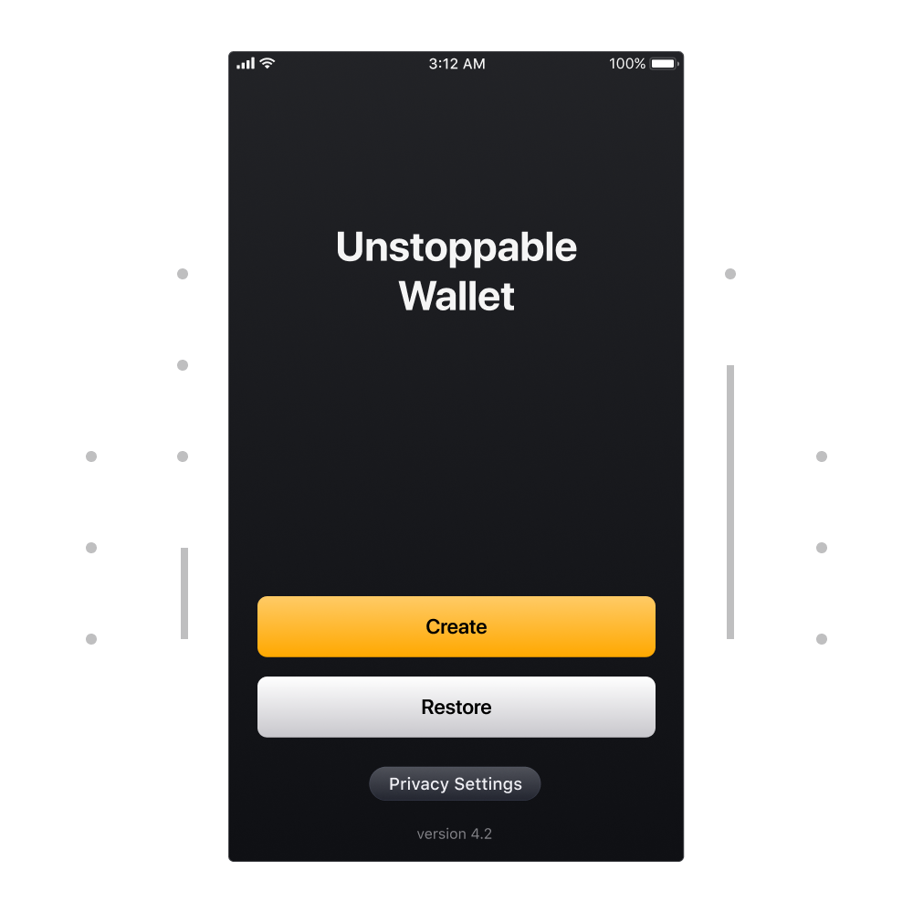
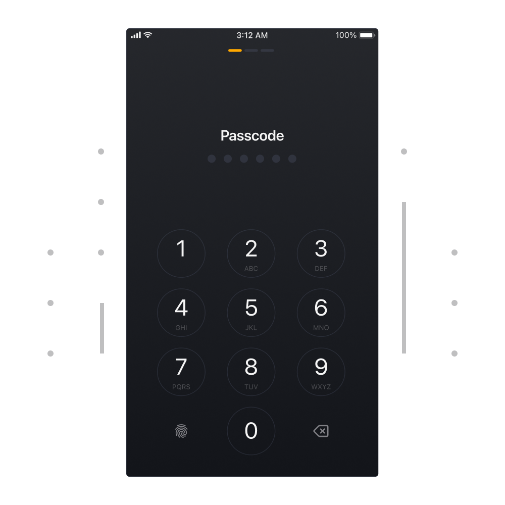
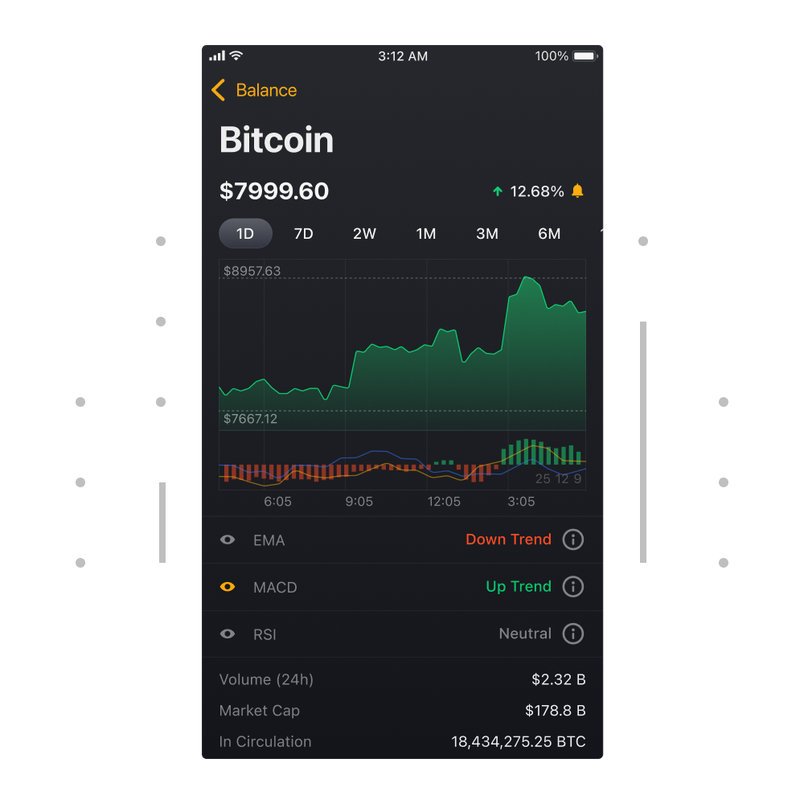
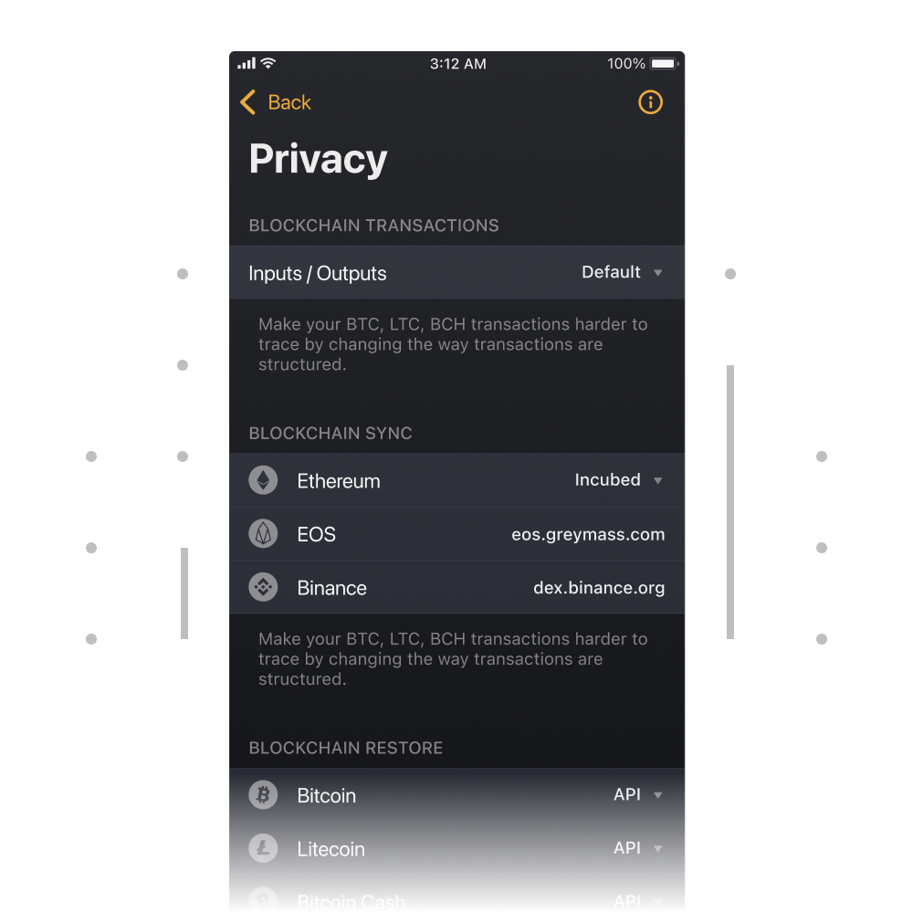

# Unstoppable Wallet

In this section we will focus on practical aspects and go through 'things to know' when using non-custodial wallet apps.

From user's perspective, basic expectations from any non-custodial wallet app should be:

1. the wallet app should generate private keys in a standard-compliant manner. This ensures that private keys are safe and are compatible with other third party wallet apps.

2. the wallet app supporting multiple cryptocurrencies should correctly manage the payment addresses for each cryptocurrency. For example, the user's address for receiving payments in Bitcoin varies from the address for receiving Ethereum.

3. the wallet app should store private keys as per documented guidelines. Both the iOS and Android wallet apps should make use of safe storage mechanisms provided by the operating system to keep the private key secure.

Apart from the above must-haves, there may be other expectations from the wallet depending on the target user. Someone looking for extensive privacy may require extra private features which are not available in most wallet apps.

> **Disclaimer: The [Unstoppable Wallet](https://unstoppable.money) was built by [Horizontal Systems](https://horizontalsystems.io), the company publishing these guides.**

Below we will go through some important points to keep in mind when using non-custodial wallet apps. We are going to use Unstoppable wallet app to illustrate these important aspects. 

### 1. Setup / Restore 

Every non-custodial wallet starts either with the process of a wallet setup or migration of the existing wallet.

- The 'Create Wallet' button generates a new private key and shows it in a form of 12 words which needs to be backed up.

- The 'Restore Wallet' option restores an existing wallet that might have been created earlier in Unstoppable or some other standard compliant wallet. 

Keep in mind that non-custodial wallets will require anywhere from a few minutes to a couple of hours to complete restore process. 

### 2. Authorization Lock

It's important for any non-custodial wallet app to come with inbuilt unauthorized access measures. Both mobile and hardware wallets implement that in a form of unlock code which is required in order to access the wallet.

This measure is essential to keep your funds safe even when an unauthorized entity gets your wallet device.

### 3. Supported Cryptocurrencies
       
The more currencies the wallet able to handle the better. It's a matter of convenience interacting with one app rather than switching between many apps for different cryptocurrencies.

The wallet app also needs to have access to current cryptocurrency prices to display your cryptocurrency balances in a currency you're used to such as USD or EUR. 

Moreover, current prices are necessary for sending payments. Sending someone 90$ worth of Bitcoin is not easy when you try to do the math in your head.

### 4. Coin Overviews

Each cryptocurrency is essentially a project with its own set of specifics. It's important to know about these specifics for anyone looking to purchase these cryptocurrencies.

While there are a lot of different cryptocurrencies there is lack of information describing these projects in accessible manner. Many projects are fairly obscure even for the newcomers with a technical background.

Unstoppable aims to provide a comprehensive overview for various cryptocurrencies in simple terms.

### 5. Charts & Data

Always look for the wallet that displays historical market exchange rates for tokens. 

Historical prices provide an overview of how the price of the cryptocurrency has changed in the past as well as enables user to see historical exchange rates on past transactions.

### 6. Multi Wallet

Some wallets including Unstoppable enables creation of unlimited number of wallets within a single app. 

Having a wallet app capable of storing many wallets allows its owner to easily manage multiple cryptocurrency portfolios.

### 7. Privacy

When it comes to non-custodial wallets, the privacy aspect has many sides and may vary substantially between wallets.

Certain points should be taken into consideration when evaluating non-custodial wallet for privacy features:

- **Basic User Data**
    
    Depending on how the wallet built, it may be possible for the wallet provider to know some non-identifiable data like the user's IP address and location. When that data kept on some server there is always a risk of leak.
    
- **Balance and Transactions**

    Non-custodial wallet apps usually allow users to restore or migrate an existing wallet to the wallet app. To serve those users, wallet providers may keep a special server specifically optimized for that task. 
    
    While this method is convenient for the wallet provider it can potentially expose some info about user's balance and past transactions.
    
    To address this, some wallets like Unstoppable support restoring directly from the blockchain network itself rather than via a third-party server. This ensures that wallet provider has no clue about balance or transactions of the user.
    
- **Blockchain Privacy**

    Different blockchains provide varying level of privacy: when you transact in Bitcoin the level of privacy is higher than when compared to Ethereum. 
    
    Certain non-custodial wallets may have additional features which increase the privacy on that specific blockchain. For instance, Unstoppable wallet app integrates features which make it significantly more difficult linking different Bitcoin transactions to a single entity. 
    
While many wallets brand themselves as non-custodial and peer to peer they may still have privacy risks. 

The minimum privacy requirement for the user should be a wallet which knows absolutely nothing about its users.

### 8. Censorship-Resistance

Due to the young nature of cryptocurrencies some governments are reluctant to legalize cryptocurrencies and provide clear regulations.

Therefore, look for a wallet app which is engineered in a way where it's impossible for someone to:

- censor access to the app
- censor the app in a region
- stop users from transacting

A genuine non-custodial wallet should be built in a way where it works everywhere and always accessible for transactions.

Keep in mind, if you're using a non-custodial which was somehow blocked in your region you should be able to migrate your private key to another non-custodial wallet app.