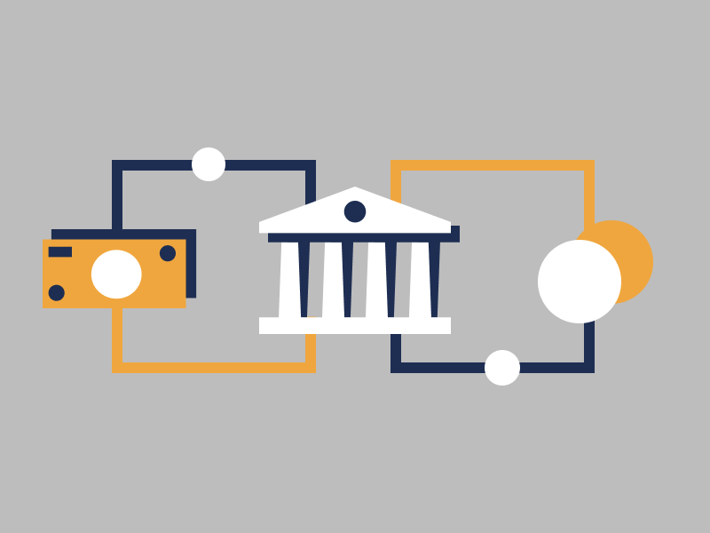

# Buying Cryptocurrency

By now you are expected to have a solid understanding of basics when it comes to dealing with cryptocurrencies and wallets.

In this section let's explore various ways of acquiring cryptocurrency.

## 1. Buying Crypto With Credit Card

The easiest option for buying smaller amounts is using a credit or debit card. While the option to buy cryptocurrency is convenient, you often pay a slight premium for the privilege. 

The following list contains safe websites and services to purchase cryptocurrency using a credit or debit card. 

1. [Binance.com](https://www.binance.com/en/register?ref=42579924)
2. [Coinbase.com](https://coinbase.com)

The majority of these websites will work without fail for EU and US residents. However, those living in other areas of the world may find fewer opportunities.

## 2. Buying Crypto on an Exchange

If you plan to acquire a large amount of cryptocurrency, you should consider signing up to and using a cryptocurrency exchange. A cryptocurrency exchange will usually feature a more competitive price than a straight credit card. 

A cryptocurrency exchange lists hundreds of different cryptocurrencies which users may trade for fiat currency like USD or other cryptocurrencies. Trading on an exchange may sound confusing, but it isn't difficult once you get into the swing of things. 

Cryptocurrency exchanges must adhere to local currency dealing laws. Financial regulations vary from country to country, so not all exchanges are available around the globe. 

Most cryptocurrency exchanges will practice Know Your Customer ([KYC](https://en.wikipedia.org/wiki/Know_your_customer)) and Anti-Money Laundering ([AML](https://en.wikipedia.org/wiki/Money_laundering#Combating)) checks before allowing users to make cryptocurrency purchase.

Cryptocurrency exchanges and even some peer-to-peer crypto vendors practice these regulations to ensure they are not handling stolen fiat currency or engaging with identity fraud.

The process for purchasing cryptocurrency on an exchange usually goes as follows:

1. Create an account on exchange
2. Verify identity
3. Transfer funds to account
4. Purchase cryptocurrency
5. Withdraw cryptocurrency to a wallet

The amount a user can purchase on an exchange usually changes depending on the level of verification of the user. 

For example, if you sign up and verify email address on an exchange, you will be able to purchase $500-$1000 worth of Bitcoin. However, if you sign up, verify email address, add an official ID document, and verify address, you can purchase a lot more. 

While this is a fictional example, many exchanges use a similar tiered approach to user verification. 

Here is a list of trusted cryptocurrency exchanges:

* [Binance.com](https://www.binance.com/en/register?ref=42579924)
* [Coinbase.com](https://coinbase.com)
* [Kraken.com](https://kraken.com)

For users looking to purchase cryptocurrency in large amounts, stablecoin issuers like [Tether](https://tether.to) and [Circle](https://www.circle.com/en/usdc) can be a good option. 

Both Circle and Tether allows someone to buy large amount of cryptocurrency stablecoins for fiat via bank deposit.

## 3. Getting Paid In Crypto

It's not uncommon these days for online freelancers to accept cryptocurrencies as a means of payment. 

If you provide some kind of services online or have an online store look for the ways to accept payments in cryptocurrencies. There are several options available including services like [BitPay.com](https://bitpay.com) or the one from [Coinbase](https://commerce.coinbase.com).

There are also free DIY solutions like [BTCPayServer](https://btcpayserver.org) for technical folks who are able to set it up on their own.

Should you need a thorough overview of the options available check out [this video](https://www.youtube.com/watch?v=OA08wZNvN8c) on Youtube.

You can also just use a non-custodial cryptocurrency wallet to receive payments directly.

## 4. Buying Crypto on a P2P Platform

If you know someone who would be willing to sell you some crypto then buying it with cash is not a bad idea. In fact most people make get their first cryptocurrency from someone they know.

For that you only need a non-custodial wallet. Open the app, copy the 'receive' address for the cryptocurrency you plan on receiving, send it to the sender and wait for the cryptocurrency to appear in your wallet.

There are also P2P platforms like [LocalBitcoins.com](https://localbitcoins.com) and [Bisq](https://bisq.network) which connect buyers and sellers from different regions allowing them to exchange assets via various options. 

Such platforms might be useful in regions where access to cryptocurrency exchanges listed above is not an option. 

While a lot of people are using those platforms there is a lot of risks. It's hard to know whether the selling party is a legit one and not a scammer trying to rob you. 

Thus, be careful and proceed with care before transacting with large sums.

## 5. Buying Crypto on a DEX

Decentralized Exchange (aka DEX) is a fairly new phenomena. Just like the cryptocurrency itself, decentralized exchanges utilize the blockchain technology to provide a platform for direct cryptocurrency exchanges. 

Generally, a decentralized exchange is the most secure and private way to purchase cryptocurrency. At the moment, most such exchanges work only for exchanging Ethereum and Ethereum based tokens.

Decentralized exchanges connect buyers and sellers in a peer to peer manner according to a pre-programmed protocol. There is no room to cheat for any party.

Decentralized Exchanges:

- [https://app.1inch.io/](https://app.1inch.io/)
- [https://app.sushi.com/swap](https://app.sushi.com/swap)

Note that most decentralized exchanges support trading only with Ethereum-based assets. There is also no way to deposit or withdraw fiat currencies i.e. USD, EUR etc.

Such exchanges usually do not require account verification of any kind. There are no limitations in the amount that can be sold or purchased. Generally no data collected about the user.

At this point in time it's fairly difficult for a beginner level user to participate in those.