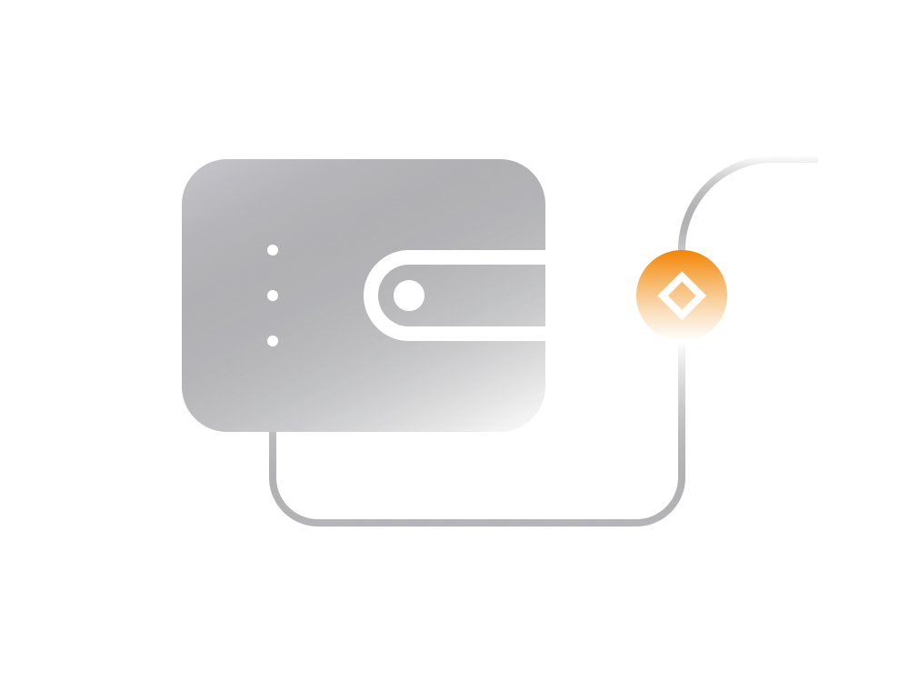

# توضیح کیف پول

طبیعتا  رمزارز به مالک امکاناتی را می دهد که با ابزارهای مالی سنتی مجحذ نیست.

درک این قابلیت ها به ویژه برای شخصی که به دنبال ذخیره ایمن و جمع آوری رمزارزها است ، بسیار مهم است.

هنگام معامله با ابزارهای مالی سنتی مانند سپرده گذاری در بانک (یا سهام با کارگزار) این تصور وجود دارد که کسی دارایی را به نمایندگی از کاربر ذخیره می کند. مؤسسه ای که وجوه خود را نگه می دارد به عنوان متولی دارایی عمل می کند و کنترل کامل بر

آنها دارد. دسترسی شما به این دارایی ها به سازمانی بستگی دارد که دارایی های شما را در بازداشت نگه دارد.

وقتی صحبت از رمزارز می شود ، گزینه ای وجود دارد که کاربر تنها موجودی باشد که به وجوه دسترسی و کنترل دارد. رمزارز

کاربر را قادر می سازد تنها متولی دارایی ها ، بدون هیچ گونه وابستگی به واسطه ها باشد.

برای کسی که به دنبال ذخیره ایمن و متعاقبا انباشت دارایی های رمزارز است ، مهم است که بداند جنبه مالکیت در ارزهای رمزپایه

## .چگونه کار می کند

هاافراد زیادی وارد فضا می شوند و بدون درک این اصول شروع به انباشت رمزارز می کنند. این امر آنها را در معرض خطراتی

تصور کسی که دارای بیت کوین یا اتریوم است با ایده پول سنتی در کیف پول شما متفاوت است.

>**مالکیت در رمزارز به معنای تملک کلید رمزنگاری ویژه ای است که قدرت صرف مقدار مشخصی از رمزنگاری را دارد.**

 بنابراین ، وقتی شخصی می گوید ۵ بیت کوین داشته باشد ، این بدان معنی است که این شخص دارای کلید رمزارزی است که می تواند ۵ بیت کوین را خرج کند.

وقتی شخصی ۱ بیت کوین را به شخص دیگری ارسال می کند ، فرستنده از کلید رمزارزی خود استفاده می کند تا ۱ بیت کوین را از مانده موجود خارج کند و مالکیت آن ۱ بیت کوین را به گیرنده منتقل کند. پس از انجام معامله ، آن بیت کوین فقط با رمزارز متعلق به گیرنده می تواند هزینه شود.
.بنابراین ، نکته قابل قبول اینجاست که مالکیت مقدار مشخصی از رمزارزها اساسا به معنای مالکیت کلید رمزنگاری ویژه است

کلید زیر هود ممکن است چیزی شبیه به این باشد:

>**5Kb8kLf9zgWQnogidDA76MzPL6TsZZY36hWXMssSzNydYXYB9KF**

آشکار کردن کلید رمزنگاری شده برای شخصی یا از دست دادن آن در اصل به معنای از دست رفتن دسترسی به رمزنگاری است که کنترل می کند. توجه داشته باشید که غیر ممکن است کسی (حتی قدرتمندترین رایانه) آن کلید را حدس بزند ، حتی اگر سعی کند این کار را بیش از یک میلیارد سال انجام دهد.

غیر معمولی نبود که در روزهای ابتدایی افرادی را پیدا کنید که کلید بیت کوین خود را از دست می دهند. در نتیجه بسیاری از بیت کوین ها (شاید ۱۰-۱۵٪) به این روش خسته شوند. بیت کوین ها هنوز در آنجا هستند ، اما کلید رمزنگاری کنترل این بیت کوین ها از بین می رود.

از نظر عملی ، می توان کلید خصوصی را به عنوان یک جایگزین مطمئن برای نام کاربری سنتی و روش تأیید رمز عبور تصور کرد اما بدون وسیله ای برای بازیابی در صورت گم شدن ان.

## کیف رمزارزی

کیف پول های رمزارز صرفا ابزاری برای نگه داشتن و مدیریت کلیدهای رمزنگاری هستند.

>**در عوض کیف پول کیف پول رمزهای رمزگذاری شده را ذخیره نمی کند ، در عوض کیف پول کلیدهای رمزنگاری را ذخیره می کند که می توانند بیش از مقدار مشخصی از ارزهای رمزپایه استفاده کنند.**

کیف پولهای اصلی رمزارز امکان ذخیره ایمن و خصوصی کلیدهای رمزنگاری را فراهم می کنند. ما عمدا گفتیم "اصلی" زیرا کیف پول های رمزنگاری شده به اشکال مختلفی عرضه می شوند.

ساخت کیف پول واقعی به طور قابل توجهی دشوار است و بنابراین بیشتر ارائه دهندگان کیف پول کیف پول ارز شبه ایجاد می کنند. کیف پول های شبه کنترل واقعی بر دارایی ها در اختیار کاربران قرار نمی دهند.

در حالی که موارد زیادی وجود دارد که می توان هنگام ارزیابی کیف پول در این بخش مورد توجه قرار گرفت ، ما می خواهیم به اصل توجه کنیم. مالکیت بی قید و شرط.

حداقل هزینه لازم برای هر کیف پول مناسب باید مالکیت کامل بدون قید و شرط کاربر از بودجه کیف پول باشد.

همه کیف پول از این نظر برابر نیستند. بسته به نحوه ساخت این کیف پول ممکن است مالکیت کاملی بدون قید و شرط بر روی .رمزپایه ، جزئی یا اصل وجود داشته باشد

### کیف پول های غیر حضانت .۱

یک نوع کیف پول غیر حضوری کنترل منحصر به فرد بر وجوه خود را به کاربر می دهد. نهاد ارائه دهنده کیف پول هیچ کنترلی بر دارایی های کاربر ندارد.

چنین کیف پول هایی از لحاظ نظری امن ترین شکل کیف پول رمزنگاری هستند زیرا هیچ شخص ثالثی نمی تواند در وجوه کیف پول اختلل ایجاد کند. کاربر کنترل انحصاری روی وجوه را دارد و نیازی به اعتماد به هیچ موجودیتی ندارد.

کیف پولهای غیر حضوری کد کیفی را برای بررسی در معرض دید عموم قرار می دهند.

>**انتظار می رود کاربران کیف پول های غیر متعهد این درک را داشته باشند که وجوه روی کیف پول تحت کنترل انحصاری کاربراست**
>
>**هنگام برخورد با دارایی های رمزپایه روی کیف پول ، کاربر کنترل کامل و همچنین مسئولیت کامل را به دست می آورد.**

این تنها نوع کیف پول است که ما برای ذخیره سازی ایمن توصیه می کنیم. در بخش های بعدی می خواهیم به تفاوت های موجود .بین کیف پول های مختلف غیرقانونی و خطرات مرتبط با آنها بپردازیم

### کیف پول های حضانت .۱

یک کیف پول نگهبان کنترل اختصاصی وجوه رمزنگاری روی کیف پول را به کاربر نمی دهد. ارائه دهنده کیف پول در اصل به کیف پول "شبه" می دهد که تعادل و معاملت را نشان می دهد.

هر زمان کاربر معامله ای را انجام دهد ، ارائه دهنده کیف پول است که در واقع آن وجوه را از طرف کاربر ارسال می کند. چنین کیف پولهایی کمترین کیف پول هستند. بودجه کاربران و دسترسی به آنها کامل در اختیار تهیه کننده کیف پول است.

>**ارائه دهنده کیف پول به راحتی می تواند کاربر را از دسترسی به کیف پول منع کند یا حتی وجوه را مسدود کند.**
> 
>**برخلف بانکهایی که به عنوان ارائه دهنده کیف پول واسطه ای نیز فعالیت می کنند ، مؤسسات مالی نیستند و بنابراین به همین ترتیب تنظیم نشده اند. خطر زیادی برای کاربرانی که مقدار زیادی رمزپرداخت در کیف پولهای نگهبان را دارند ، وجود دارد.**

علوه بر این ، کیف پولهای حضانت خصوصی نیستند زیرا ارائه دهنده کیف پول تاریخچه معامله کامل کاربر را می داند.

لازم به ذکر است که تبادلات رمزارز معمولا کیف پولهای حضانت را در اختیار کاربران قرار می دهد. بنابراین ، توصیه نمی شود از کیف پول تهیه شده توسط مبادله رمزارز برای نگه داشتن رمزارز برای مدت طولانی استفاده کنید.

>**اگر وجوه رمزپایه را در مبادله رمزارز یا هر نوع کیف پول نگهبانی رها کنید ، این صندوق ها در برابر هک شدن یا انواع دیگری از نقض داده ها آسیب پذیر هستند. این اتفاق در گذشته بسیار رخ داده و احتمالا در آینده نیز اتفاق خواهد افتاد.**

هنگامی که وجوه شما روی کیف پول نگهبان باقی می ماند ، ارائه دهنده کیف پول می تواند وجوه را یخ بزند ، استفاده شما را محدود کند ، یا حتی شما را بدون هشدار از کیف پول / حساب خود مسدود کند.

متأسفانه بیشتر کیف پولهای مشهور در خارج از کشور متشکل از آن است که از نظر طبیعت حضانت برخوردار است.

### کیف پول ترکیبی .۳

نه صاحب کیف پول و نه ارائه دهنده کیف پول کنترل کامل بر بودجه کیف پول را ندارند. یک کیف پول ترکیبی که برای تأمین .اعتبار لازم از طرفین برنامه ریزی شده است ، قبل از صرف بودجه می تواند

سیستم کیف پول ترکیبی در برابر هک ارائه دهنده کیف پول محافظت می کند اما در ارائه دهنده کیف پول را برای سانسور کاربران .در سناریوهای خاص باز می کند

فقط هنگام استفاده از کیف پول غیر حضوری می توانید مطمئن باشید که این وجوه تحت کنترل شما هستند و به شخص ثالثی وابسته .نیستند