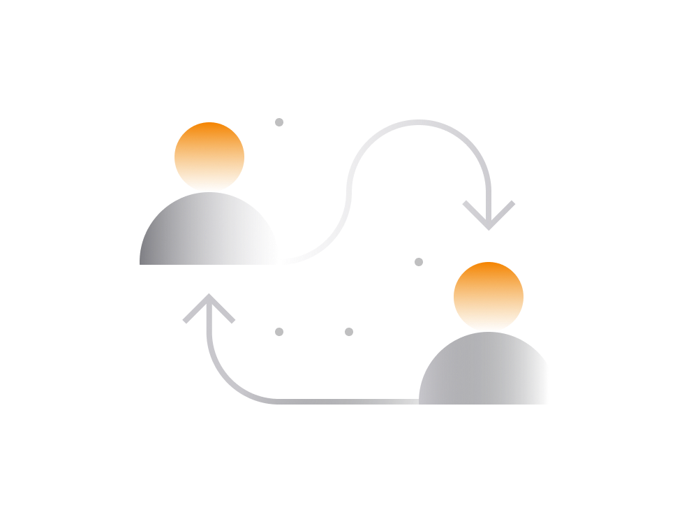
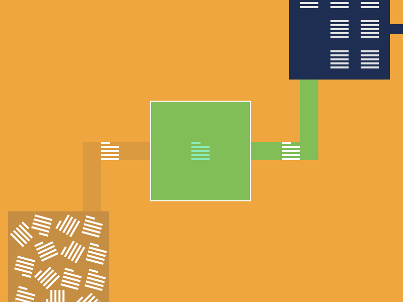

# معاملات توضیح داده شده است

زمان برای یادگیری صندوق های عقب و خارج از معاملات رمزارز.

در حالی که روند ارسال و دریافت پرداخت برای همه ارزهای رمزنگاری مشابه است ، جنبه هایی وجود دارد که تمایل به تغییر از یک رمزنگاری به دیگری دارند.

در این بخش ما به موارد ضروری می پردازیم تا درک روشنی از نحوه عملکرد معاملات تقریباً برای تمام ارزهای رمزپایه به شما واضح بگوییم.

## ارسال و دریافت

روند ارسال و دریافت رمزنگاری تقریباً در همه کیف پولها یکسان است.

- **برای ارسال رمزنگاری**
    
در برنامه کیف پول خود ، گزینه "ارسال" یا معادل برنامه را جستجو کنید. اگر برنامه کیف پول از چندین ارز پشتیبانی می کند ، حتماً رمزارزصحیح را انتخاب کنید.   
    
   مبلغ ، آدرس گیرنده ، هزینه تراکنش (بیشتر در مورد آن را در زیر) وارد کنید و بر روی دکمه ارسال کلیک کنید.
    
- **برای دریافت رمزنگاری**

برنامه کیف پول را باز کنید و به دنبال گزینه "دریافت" یا معادل آن برنامه باشید. همانطور که قبلاً ذکر شد ، اطمینان حاصل کنید که آدرس سکه مناسب را کپی می کنید.   
    
برنامه کیف پول برای برخی از ارزهای رمزنگاری شده و همان آدرس برای دیگران ، آدرس مشخصی را ارائه می دهد. به عنوان مثال ، تمام ارزهای رمزنگاری شده مستقر در اتریوم همان آدرس دریافتی را در یک برنامه کیف پول دارند.   
    
آن آدرس را به فرستنده ارسال کنید و صبر کنید تا رمزارزدر کیف پول شما ظاهر شود.   

## مراحل تراکنش

معاملات رمزنگاری سریع انجام نمی شود. برای برخی از ارزهای رمزنگاری شده ثانیه طول می کشد در حالی که برای سایر موارد ممکن است چند دقیقه یا در بعضی موارد حتی ساعت ها طول بکشد.

هنگام انجام معاملات با استفاده از معاملات کیف پول غیر حضوری ، به ترتیب زیر مستقیماً از طریق یک زنجیره بلوکی عبور می کنید:

-  **معامله در انتظار است**

پس از معامله ارسال شده از یک کیف پول ، تقریبا بلافاصله به شبکه زیربنایی زنجیره بلوکی می رسد. معاملات بیت کوین ارسال شده به شبکه بیت کوین ، معاملات اتر به شبکه اتریوم و غیره.  
   
 در این مرحله ، هم فرستنده و هم گیرنده می توانند از قبل وضعیت معامله را در برنامه های کیف پول خود یا در 
 
  کنترل کنند. blockchair.com عمومی یعنی   explorer blockchain

-  **معامله تأیید می شود**

با توجه به اینکه معامله معتبر است ، تمام گره های موجود در آن زنجیره بلوکی مسابقه خواهند یافت تا آن را به ر وارد کنند. مدت زمان این مراحل از یک زنجیره به دیگری متفاوت است.   
    
   برای بیت کوین به طور کلی می تواند ۱۰ دقیقه طول بکشد ، در اتریوم حدود ۳-۳ دقیقه و غیره.
    
   معامله ای که بعد از افزودن به زنجیره بلوکی کامل تلقی شود.

-  **معامله نهایی است**

پس از افزودن معامله به زنجیره بلوکی ، می توان نهایی را در نظر گرفت. گفته می شود ، برای برخی از زنجیره بلوکی ها و به ویژه بیت کوین توصیه می شود تا تعداد مشخصی از بلوک های جدید منتظر بمانند.   

   برای مبالغ زیاد ، معمولاً قبل از اینکه معامله را از نظر تئوری غیرقابل برگشت تلقی کنید ، باید منتظر بمانید تا ۶ بلوک منتقل شود. برای بیشترین پرداخت ، ۲-۱ تائید باید خوب باشد.

  
## هزینه های معامله

معامله تأیید می شودهنگام ارسال ارزهای رمزنگاری مانند بیت کوین یا اتریوم ، فرستنده انتظار دارد مبلغ تراکنش را بپردازد. این هزینه به عنوان یکی از گره های زنجیره بلوکی که اولین کسی خواهد بود که معامله را به یک زنجیره بلوکی  اضافه می کند ، جبران می شود.

> **لازم نیست جزئیات را در اینجا بفهمید ، فقط بخاطر داشته باشید که هزاران گره نیرو بخش زنجیره بلوکی پس از ارسال ، معامله را طی چند ثانیه دریافت می کنند.** 
>
> **گره ای که ابتدا آن را به زنجیره بلوکی اضافه می کند ، هزینه همراه را به عنوان پاداش دریافت می کند. هر بار که معامله ارسال می کنید هزینه های دیگری را به گره دیگر پرداخت می کنید. آن را به عنوان هزینه خدمات برای استفاده از شبکه در نظر بگیرید.** <

بسته به اعتبار رمزارز شما می توانید هزینه های معامله متفاوت باشد. برای برخی از زنجیره بلوکی هزینه ممکن است به عنوان کسری از درصد کم باشد ، برای سایر مانند بیت کوین می تواند به راحتی از ۱ دلار آمریکا  فراتر رود.

بلاکچین های دارای ارز رمزنگاری مانند بیت کوین و اتریوم در حال حاضر محدود به چند میلیون معاملات در روز هستند. هزینه معامله به عنوان ابزاری برای اولویت بندی معاملات مورد نظر با تعیین هزینه بالاتر از آن استفاده می شود.

اگر هزینه بسیار کمتر از متوسط ​​شبکه باشد ، معامله شما ممکن است ساعت ها در انتظار باشد ، اگر خیلی بالاتر از حد متوسط باشد ، انتظار دارید که معمولاً در عرض چند دقیقه به زنجیره اضافه شود.

> **اگر معامله به دلیل هزینه کم برای چند روز در انتظار باقی بماند ممکن است رد شود ، مثل اینکه هرگز ارسال نشده است.**
>
> **اگر معامله معلق دارید که در بیشتر موارد تأیید می شود ، در بیشتر موارد اگر در حد کافی منتظر بمانید ، در نهایت پذیرفته می شود.**

برخی از کیف پول های موجود در آنجا مبلغ بهینه هزینه معامله را با در نظر گرفتن وضعیت فعلی فعالیت در شبکه توصیه می کنند.

هنگام ارسال مبالغ زیاد یا پرداخت های حساس زمانه ، همیشه سعی کنید مبلغی را پرداخت کنید که بسیار بالاتر از حد متوسط ​​باشد. این اطمینان حاصل می کند که معامله شما بدون تأخیر به گیرنده می رسد.

##     معامله را لغو کنید

بعضی اوقات ممکن است در شرایطی قرار بگیرید که یک معامله باید فسخ شود. در بعضی موارد ، امکان لغو یا تغییر معاملات در حالی که هنوز در حالت انتظار است وجود دارد.

هر دو معاملات بیت کوین و اتریوم می توانند در حالی که در حالت انتظار هستند تغییر دهند اما برای اینکه بتوانند این کار را انجام دهند ، برنامه کیف پول باید راهی برای انجام آن فراهم کند.

گفته می شود ، به محض افزودن معامله به زنجیره بلوکی  ، معمولاً هیچ روش عملی برای فسخ آن وجود ندارد. بنابراین ، پس از اضافه شدن معاملات به زنجیره بلوکی ، نهایی می شوند.

## حریم خصوصی معاملات

در آخر اینکه ، در مورد معاملات و حریم خصوصی ، ملاحظات حیاتی وجود دارد که باید در نظر داشته باشید.

معاملات در اکثر بلاکچینها که به صورت علنی ذخیره می شوند. هر کس می تواند ببیند چه زمان معامله انجام شده ، مبالغ درج شده و آدرس گیرنده فرستنده را مشاهده می کند. در حالی که شخص ثالث می تواند آدرس های موجود را مشاهده کند ، هیچ ارتباطی با هویت دنیای واقعی ندارد.

در حالی که برخی از ارزهای رمزنگاری شده با محوریت حفظ حریم خصوصی (به عنوان مثال مونرو) هیچ اطلاعاتی در مورد معامله را نشان نمی دهند ، برای بیشترین ارزهای رمزنگاری. زنجیره بلوکی بیت کوین و اتریوم داده های معامله را آشکارا ذخیره می کند.

در زیر می خواهیم کمی گسترش دهیم و به طور خاص خطرات حریم خصوصی هنگام تعامل با استفاده از بیت کوین و اتریوم را بررسی کنیم.

- **حریم خصوصی بیت کوین**

کیف پول های بیت کوین به شکلی ساخته شده است که کاربر به طور بالقوه می تواند میلیون ها آدرس را ایجاد کند که می تواند برای دریافت پرداخت در یک برنامه کیف پول ایجاد کند. هر آدرس پرداخت می تواند یک بار ، چندین بار یا اصلاً استفاده نشود. بستگی به کاربر دارد.    
    
یک کیف پول خوب همیشه پس از دریافت پرداخت به آخرین آدرس ، آدرس جدید دریافت می کند. این کار برای ناامید کردن کاربر از استفاده از همان آدرس "دریافت" بارها و بارها انجام می شود.    
    
اگر کاربر از همان آدرس استفاده کند ، هرکسی می تواند یک تراکنش کاربر را انجام دهد و از آن طریق سایر معاملات ورودی و خروجی متعلق به کاربر را پیدا کند. از آن به طور بالقوه می توانید کل ترازو و تاریخ معامله را استخراج کنید!    
    
بنابراین ، سعی کنید از آدرس دریافت جدید برای هر مهمانی که با آنها معامله کرده اید استفاده کنید.    

- **حریم خصوصی اتریوم**

همانطور که گفته شد در صورت بیت کوین آدرس دریافت پرداخت با هر تراکنش قابل تغییر است.   

وقتی صحبت از کیف پول اتریوم می شود ، آدرس شما برای دریافت پرداخت های اتر همیشه یکسان خواهد بود. اگرچه ممکن است در آینده تغییر کند ، تقریباً امروزه تقریباً همه کیف پولهای اتریوم با یک آدرس واحد کار می کنند. دلایل فنی زیادی برای آن وجود دارد.   
    
 >   **زنجیره بلوکی اتریوم کاملاً شفاف است و به هر کسی امکان مشاهده کلیه معاملات ورودی و خروجی برای آدرس پرداخت داده شده را می دهد.** 
    
بنابراین ، هنگامی که اتریوم را ارسال یا دریافت می کنید این نکته را بخاطر بسپار که مهمانی که با آنها معامله می کنید ، می تواند به طور بالقوه با دانستن آدرس خود ، تعادل اتر و سایر نشانهای مبتنی بر اتریوم را جستجو کند.   
    
بنابراین توصیه می شود از کیف پول های جداگانه برای معامله با مردم و برای انباشت دارایی استفاده کنید.   
    
کیف پول مورد استفاده برای معاملات نباید بودجه زیادی را روی آن نگه دارد تا در معرض دید شما قرار نگیرد.   
    
به طور خلاصه ، در شرایط فعلی ، معاملات بیت کوین نسبت به معاملات اتریوم حریم خصوصی بیشتری را در اختیار کاربران قرار می دهد.

تنها چیزی که برخی از عناصر حداقل حفظ حریم خصوصی را به مخلوط اضافه می کند این واقعیت است که هیچ راهی برای بررسی اینکه این آدرس متعلق به چه کسی باشد ، نیست.
