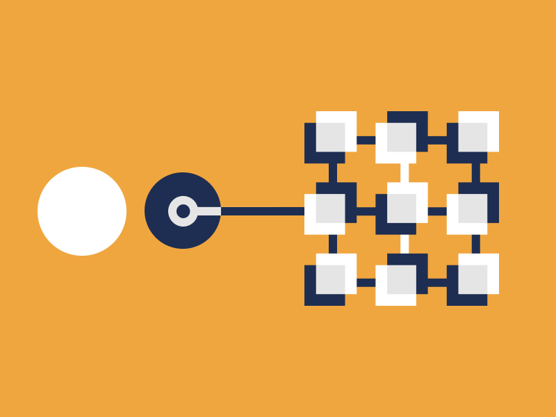
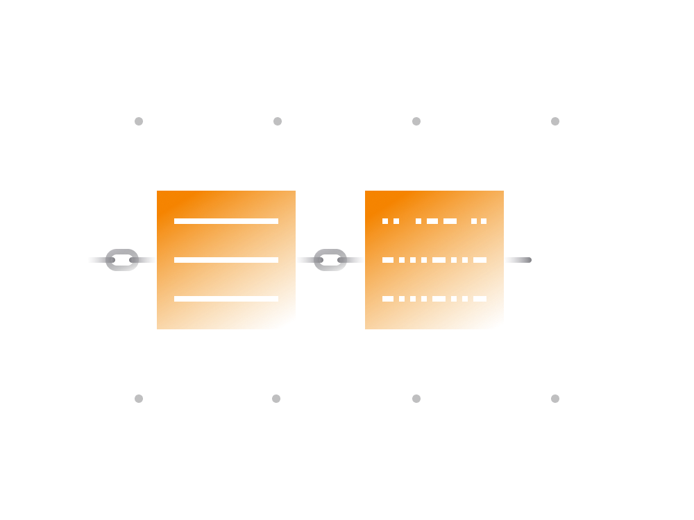
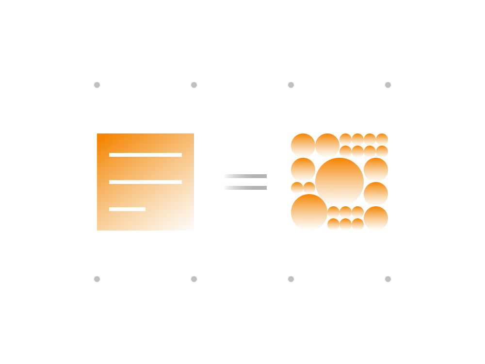

# Crypto-monnaie

L'objectif de ce guide est de permettre à une personne ayant peu de connaissances sur les crypto-monnaies de se mettre à niveau le plus rapidement possible.

Les crypto-monnaies sont alimentées par un certain nombre de technologies, mais principalement par une technologie blockchain.

>**La technologie blockchain a été appliquée pour la première fois en créant la crypto-monnaie Bitcoin.**
>
>**La cryptomonnaie la plus précieuse est généralement celle qui possède le plus grand réseau et non pas nécessairement celle qui possède le plus de fonctionnalités.**

Lorsque l'on utilise un produit construit sur une telle blockchain, les affirmations suivantes sont toujours valables :

- l'utilisateur n'a pas à faire confiance à qui que ce soit
- l'utilisateur n'a pas besoin de permission pour participer
- l'utilisateur a un contrôle inconditionnel sur les actifs
- Les transactions des blockchains ne sont pas modifiables

La technologie blockchain peut potentiellement s'appliquer à tout ce pour quoi des notions comme la confiance, la résistance à la censure et l'immuabilité sont essentielles. Pensez aux services de notariat, aux élections, etc.

À l'heure actuelle, de nombreux organismes financiers et juridiques existent pour faire respecter des mesures qui peuvent être appliquées par une blockchain de manière impartiale. Si la technologie blockchain continue à se développer, ces services seront probablement portés sur une blockchain.

>**La première génération de produits basés sur une blockchain comme Bitcoin vise à fournir une plate-forme financière pour l'échange de valeurs sans qu'il soit nécessaire que le système repose sur des intermédiaires tels que les banques.**

À cet égard, Bitcoin est le premier produit où l'idée de blockchain a été appliquée pour contester les domaines actuellement contrôlés par le système financier.

## Attributs de la blockchain

Alors, qu'est-ce qu'une blockchain ? Bien que de nombreuses définitions donnent l'impression que c'est compliqué, c'est en fait assez simple.

>**Sans aller trop loin dans la technicité, considérez une blockchain comme un historique chronologique de transactions.**
>
>**Il peut s'agir d'un historique des transactions, d'un historique des votes soumis par les électeurs, etc.**

Bien que l'histoire réelle des transactions ne soit pas si spéciale en soi, lorsqu'elle est mise sur une blockchain, elle acquiert certains attributs qui lui confèrent une valeur sociale. Ces attributs sont :

- **Nature distribuée**

    Au lieu d'être conservée dans un lieu centralisé, la blockchain permet de conserver l'"historique des transactions" dans des milliers de lieux en même temps. Chaque copie est connectée à Internet et est mise à jour en temps quasi-réel.
    
- **La transmission de pair à pair**

    Tout le monde peut ajouter de nouvelles transactions à un "historique des transactions" global en communiquant avec toute entité qui conserve les transactions. Cela garantit une disponibilité 24 heures sur 24, 7 jours sur 7 et un accès inconditionnel à la participation.
    
- **Transparence et pseudonymat**

    Les blockchains sont généralement transparentes, c'est-à-dire que l'ensemble de l'historique des transactions est public et accessible à tous ; bien que les transactions soient publiques, les entités concernées sont masquées : tout tiers peut voir ce qui se passe, mais ne peut pas dire qui exactement est impliqué.

- **Irréversibilité des transactions**

    Les blockchains sont conçues de manière à ce qu'il soit impossible de les modifier après une action. Cela garantit qu'aucune entité n'est en mesure de changer quoi que ce soit dans l'historique des transactions.

- **Logique d'entreprise**

    Dans notre exemple d'"historique des transactions", nous avons pu involontairement supposer que ces transactions sont d'un type spécifique comme "Utilisateur 1 a payé Utilisateur 2 X Bitcoins". Les blockchains actuelles permettent d'ajouter une logique conditionnelle aux transactions. Au lieu de "A payé B x Bitcoins", il peut avoir une transaction du type "A a payé B x Bitcoins, mais B ne peut pas les dépenser avant 10 ans".   

Les blockchains sont donc bien plus qu'un simple historique de transactions. Cette technologie a permis à une société de s'organiser et d'échanger d'une manière qui nécessitait auparavant l'intervention d'un tiers.

## Les blockchains sont gratuites

En général, les blockchains ont un code source ouvert, ce qui permet à tout le monde de le réutiliser à quelque fin que ce soit. Les blockchains Bitcoin et Ethereum sont toutes deux open source.

Des milliers d'ingénieurs dans le monde entier travaillent à l'amélioration de ces blockchains de manière distribuée. Les blockchains majeures sont des projets en constante évolution et ont tendance à attirer de plus en plus d'ingénieurs.

Bien que la plupart des blockchains aient été créés par un petit groupe de personnes au début, les grands projets de blockchains sont maintenant pilotés par un grand groupe d'ingénieurs indépendants.

Il est impossible pour quiconque de bloquer les compromis ou de censurer le réseau blockchain tel que Bitcoin ou Ethereum.

## Les crypto-monnaies expliquées

Essayons maintenant de comprendre la nature de base de la cryptomonnaie.

Les cryptomonnaies sont des unités de quelque chose sur une blockchain. Selon les caractéristiques de la blockchain correspondante, une cryptomonnaies peut varier par rapport à une autre.

**Par exemple:**

- La crypto-monnaie Bitcoin est une unité de mesure propre à la blockchain [Bitcoin](../../token_guides/en/bitcoin.md). Elle est désignée par le symbole "BTC". Une seule unité de Bitcoin est divisible en 100 millions de sous-unités appelées Satoshi. De par sa conception, la blockchain de bitcoins plafonne le montant total à 21 millions de Bitcoins. La blockchain Bitcoin est limitée dans le type d'enregistrements qu'elle peut stocker, principalement des enregistrements de transactions d'une adresse à une autre.

- La crypto-monnaie Ether est une unité de mesure propre à la blockchain [Ethereum](../../token_guides/en/ethereum.md), désignée par le symbole "ETH". Une seule unité d'Ethereum se compose de 100 000 000 000 000 000 wei. Contrairement à Bitcoin, la blockchain Ethereum ne limite pas la quantité d'Ether qui peut potentiellement exister sur la blockchain. De plus, la blockchain Ethereum n'impose aucune limite au type d'enregistrements qu'elle peut conserver.

Certaines blockchains comme Ethereum permettent de créer ses propres "unités de quelque chose", quel que soit le but recherché. Ils sont souvent appelés " tokens de cryptomonnaies " et peuvent être utilisés à des fins diverses, comme nous le verrons plus loin.

Les tokens représentent 80 à 90 % de [toutes les cryptomonnaies](https://coinmarketcap.com) en circulation. La blockchain Ethereum est généralement une plate-forme de choix pour la création de tokens pour les crypto-monnaies.

D'un point de vue technique, le mot "token" devrait être utilisé pour désigner les cryptomonnaies qui sont construites sur une blockchain existante, plutôt que de posséder leur propre blockchain unique. Un token de cryptomonnaie peut prendre plusieurs formes selon les cas d'utilisation.

## La croissance des crypto-monnaies

Beaucoup de gens se demandent pourquoi il existe tant de cryptomonnaies et pourquoi certaines sont plus populaires ou plus chères que d'autres.

Bien que certaines cryptomonnaies soient uniques dans la façon dont la blockchain sous-jacente est construite, il y a beaucoup de copieurs.

Comme les blockchains ont un code ouvert, n'importe qui peut lancer une cryptomonnaies dupliquée sans grand effort. À cet égard, le double ne sera pas vraiment différent de l'original, sauf en ce qui concerne la taille du réseau.

>**La taille du réseau sous-jacent est ce qui rend une crypto-monnaies plus précieuse qu'une autre.**

Une façon simple de réfléchir à la taille du réseau est le nombre de personnes qui interagissent avec la blockchain en question.

1. Plus il y a de participants sur la blockchain, plus son réseau est grand. 

2. La sécurité et la décentralisation de la blockchain augmentent au fur et à mesure que le réseau se développe.

3. À mesure que le nombre de personnes rejoignant le réseau augmente, la blockchain devient une plateforme ouverte permettant à chacun de participer et d'offrir des services.

La blockchain de Bitcoin est un bon exemple pour illustrer ce point.

La blockchain de Bitcoin a été lancée en 2009 et ce qui était à l'origine un jouet amusant pour un petit groupe de personnes a attiré des millions de personnes au fil des ans.

>**Aujourd'hui, des milliers de personnes utilisent des serveurs blockchain de Bitcoin sur leurs ordinateurs. En conservant une copie dynamique de la blockchain de Bitcoin (historique des transactions), ces participants agissent à la fois comme gardiens et validateurs de la blockchain.**
>
>**De plus en plus de personnes participent à l'écosystème Bitcoin en utilisant Bitcoin ou en créant des services autour de l'écosystème  Bitcoin.**

Aujourd'hui, Bitcoin est devenu une plate-forme mondiale, non soumise à la censure et ouverte à tous.

Le fait que Bitcoin et les plates-formes similaires soient ouvertes et sans permission signifie que tout le monde peut commencer à participer à l'écosystème. Cette participation peut prendre la forme d'un utilisateur régulier ou même d'un prestataire de services. Toute entité peut construire un service fonctionnant sur la blockchain de Bitcoin.

>**Plus le réseau d'une blockchain est grand, plus il est attrayant pour les fournisseurs de services.**

Ainsi, outre les attributs de blockchain mentionnés précédemment, l'élément clé pour évaluer les blockchains est la taille du réseau.

La cryptomonnaie la plus précieuse est généralement celle qui possède le plus grand réseau et non pas nécessairement celle qui possède le plus de fonctionnalités.
