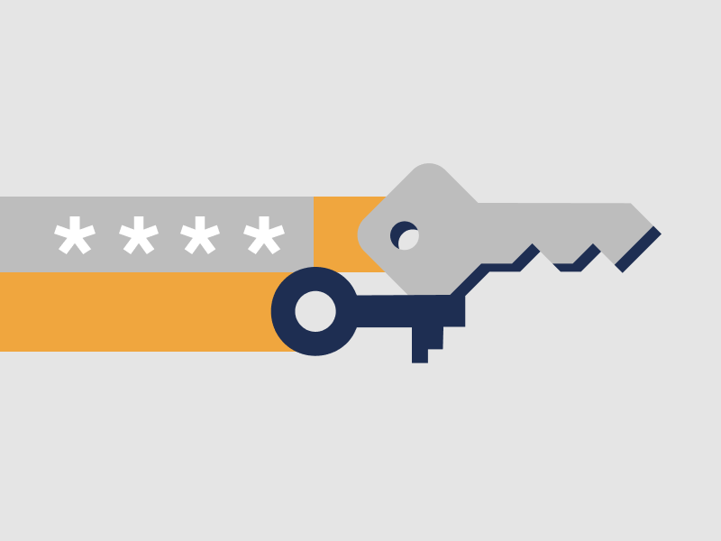
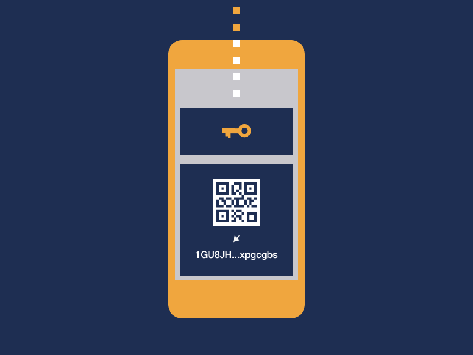

# Clés privées

Comme nous l'avons vu précédemment, les portefeuilles de crypto-monnaies authentiques contiennent des clés cryptographiques qui permettent de contrôler une certaine quantité de crypto-monnaie.

À partir de cette clé cryptographique, l'application de portefeuille peut comprendre la quantité de crypto-monnaie possédée par l'utilisateur et dériver les transactions passées associées au portefeuille. Cette clé cryptographique est généralement appelée clé privée.

> **L'application portefeuille est un instrument qui stocke essentiellement votre clé privée. C'est cette clé privée qui vous permet de contrôler une certaine quantité de crypto-monnaies.**
>
> **L'application de portefeuille non privative utilise une clé privée pour récupérer les soldes de crypto-monnaies et les transactions passées de la blockchain.**

Nous n'allons pas expliquer comment les clés privées fonctionnent en détail. Sachez simplement que le terme de clé privée fait généralement référence à la clé cryptographique dont nous avons parlé plus haut.

Ci-dessous, nous allons baisser un peu plus le niveau de sécurité pour vous donner une meilleure compréhension des clés privées, et des aspects de sécurité qui y sont liés.

## 1. Gardez la clé privée

Très souvent, les fraudeurs (en se faisant passer pour des équipes d'assistance au portefeuille) trompent les utilisateurs en leur faisant partager leurs clés privées. Lorsqu'un utilisateur partage la clé, le fraudeur vole les fonds qui se trouvent sur le solde.

> **Rien ne justifie que vous, en tant qu'utilisateur d'une application de portefeuille, partagiez les clés privées avec qui que ce soit. Cela s'applique à tous les portefeuilles.**
>
> **Ne révélez jamais votre clé privée à quiconque, même lorsque vous communiquez avec les personnes qui ont créé votre application portefeuille.**

Vous ne pouvez révéler votre clé privée à quelqu'un que lorsque vous voulez intentionnellement lui transmettre la propriété de vos fonds. Pratiquement tous les portefeuilles non privatifs permettent à l'utilisateur d'accéder à sa clé privée et de la consulter à partir de l'application portefeuille.

## 2. Clé de sauvegarde

La plupart des applications portefeuille non privatives affichent la clé privée lors de la configuration de l'application portefeuille. L'application portefeuille invite généralement l'utilisateur à noter la clé privée et à la stocker dans un endroit sûr hors ligne.
 
> **La clé privée est le seul moyen de restaurer l'accès aux fonds au cas où le dispositif avec l'application portefeuille deviendrait inaccessible, c'est-à-dire s'il est volé ou s'il cesse simplement de fonctionner.**

Pour faciliter la sauvegarde de la clé privée, les ingénieurs de blockchain ont trouvé un moyen de convertir la clé privée en un simple ensemble de 12 ou 24 mots réguliers.

La plupart des portefeuilles non privatifs afficheront la clé privée sous une forme lisible par un être humain, généralement sous une forme de 12/24 mots.

Sauvegardez la clé privée et assurez-vous qu'il n'y a pas de fautes de frappe dans votre sauvegarde. En plus des mots, l'ordre est tout aussi important.

> **Si vous perdez votre clé privée ou que vous la révélez à quelqu'un sans vous en rendre compte, cette personne peut prendre le contrôle de vos crypto-monnaies.**

Les 12/24 mots doivent être sauvegardés dans le bon ordre. Un portefeuille non privatif peut comprendre si vous faites une faute de frappe dans l'un des mots et afficher un avertissement approprié.

Si les mots sont mal positionnés, un portefeuille non privatif vous restituera tout de même un portefeuille quelconque, mais ce ne sera pas le vôtre. Le bon ordre est donc tout aussi important.

## 3. Génération de clé privée

Lorsque vous installez une application portefeuille non privative pour la première fois, le code qui alimente l'application portefeuille vous fournit une clé privée sécurisée de manière aléatoire. Pour que la clé privée soit vraiment sécurisée, il est important qu'une application portefeuille génère une clé privée qui soit vraiment aléatoire.

> **Si la clé privée générée par un portefeuille non privatif n'est pas aléatoire, alors le portefeuille n'est pas sécurisé.**

C'est l'une des raisons pour lesquelles les portefeuilles non privatifs maintiennent le code ouvert. Des ingénieurs tiers peuvent alors analyser le code et vérifier si l'application de portefeuille génère correctement la clé privée.

Il existe des sites Web comme [WalletScrutiny.com](https://walletscrutiny.com) qui veillent à ce que les portefeuilles publiés sur Google Play utilisent en fait le même code que le code partagé publiquement avec la communauté.
   
Toute bonne application portefeuille non privative doit être conçue en conformité avec les directives de sécurité et les normes de portefeuille publiquement documentées.

## 4. Une clé, beaucoup de monnaies

Autre aspect essentiel, une seule clé privée peut être utilisée pour contrôler les soldes de plusieurs crypto-monnaies. En utilisant une telle clé, les applications portefeuille peuvent automatiquement localiser les soldes pour toutes les crypto-monnaies prises en charge.

Par exemple, lors de la création du portefeuille avec [Unstoppable wallet](https://unstoppable.money) l'utilisateur obtient une seule clé privée pour 5 crypto-monnaies:

- Bitcoin
- Dash
- Bitcoin Cash
- Litecoin
- Ethereum

La même clé privée est utilisée pour contrôler plusieurs crypto-monnaies, chacune ayant son propre solde et ses propres transactions.

## 5. Soldes et transactions

Comme nous l'avons déjà mentionné, il existe des normes de "clé privée" conçues par des ingénieurs au fil des ans. Ces normes définissent exactement comment les applications portefeuille doivent gérer la clé privée pour une utilisation avec plusieurs crypto-monnaies.

> **Le portefeuille utilise votre clé privée pour obtenir votre adresse de paiement pour chaque crypto-monnaie. L'adresse de paiement est l'adresse que vous partagez avec d'autres personnes qui veulent vous payer en crypto-monnaie.**

Il suffit de regarder votre clé privée pour que l'application portefeuille puisse dériver votre adresse pour Bitcoin, Ethereum et bien d'autres crypto-monnaies. Une adresse différente pour chaque cryptomonnaie.

Lorsque vous importez la clé privée dans une autre application portefeuille conforme aux normes, cette autre application en déduit également les mêmes adresses.

C'est essentiellement ainsi qu'une application portefeuille peut prendre une clé privée utilisée sur une autre application, et à partir de cette clé, restaurer les soldes et les transactions pour plusieurs cryptomonnaies.

> **Si une clé privée est générée d'une manière conforme aux normes, alors tout autre portefeuille conforme aux normes devrait être en mesure de dériver correctement les adresses de paiement et les transactions passées pour chaque cryptomonnaie prise en charge.**

Une fois que l'application connaît les adresses de, disons, Bitcoin, elle se connecte à la blockchain de Bitcoin et recherche les transactions utilisant ces adresses. Grâce à ce processus, l'application portefeuille peut afficher les soldes et les transactions passées associés à cette clé privée.

## 6. Passer d'un portefeuille à l'autre

Les bons portefeuilles non privatifs permettent la migration des clés privées d'un portefeuille à l'autre. En d'autres termes, une clé privée créée sur une application portefeuille non privative doit être compatible avec les autres applications portefeuille non privatives.

> **L'utilisateur ne devrait pas être limité à un seul fournisseur de portefeuille et devrait pouvoir migrer facilement vers d'autres applications portefeuille non privatives construites par des tiers.** 

Si votre téléphone tombe en panne, ou si l'application portefeuille cesse de fonctionner, vos fonds sont en sécurité ; vous pourrez toujours rétablir l'accès à votre crypto-monnaie en utilisant la clé privée. Il n'y a pas de durée de vie, la même clé pourrait fonctionner des années plus tard.

Lorsque vous choisissez un portefeuille, recherchez-en un qui soit conforme aux normes et qui permette l'importation/exportation de clés privées.

> **Remarque : lors de la migration de votre clé privée d'un portefeuille à un autre, vous avez besoin du portefeuille de destination pour prendre en charge toutes les crypto-monnaies que la clé privée contrôle.**

Si votre clé privée a un certain solde de Bitcoin et Ethereum mais que le portefeuille de destination ne prend en charge que Bitcoin, alors votre solde Ethereum ne sera pas visible. Il sera toujours votre propriété et accessible à partir d'un autre portefeuille. 
