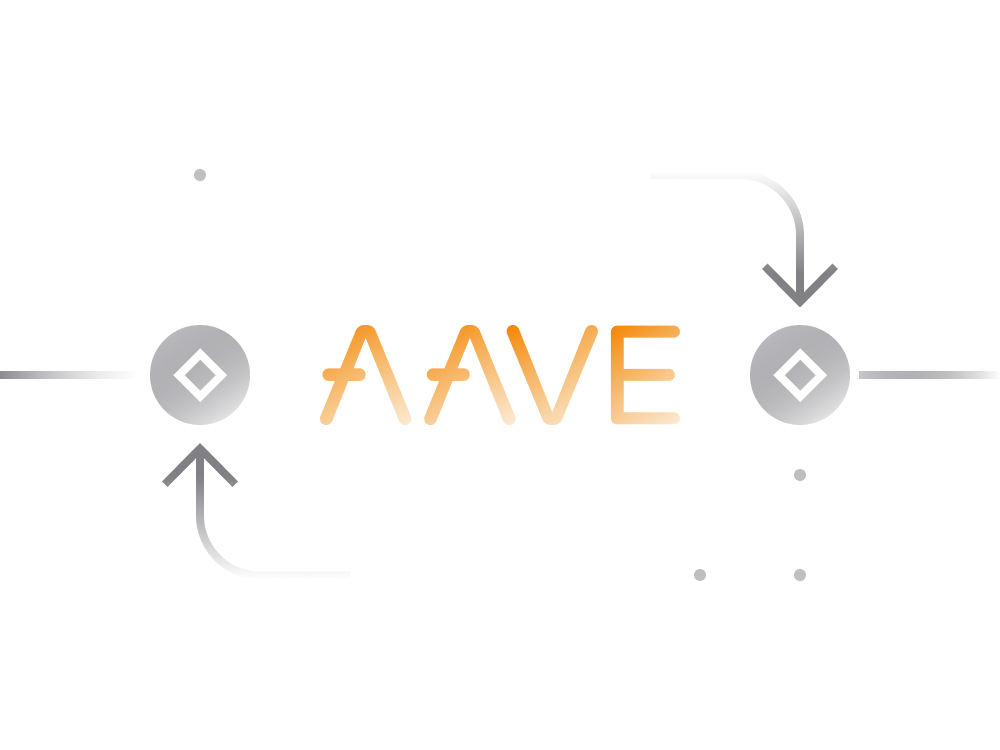

# Aave in Simple Terms

[Aave](https://app.aave.com/) is a non-custodial Ethereum-based decentralized service which allows lending and borrowing Ethereum-based cryptocurrency assets. 

Aave launched in January 2020 and over the course of 8 months attracted close to 2 billion USD worth of cryptocurrency to its platform. 

- Depositors provide liquidity by depositing cryptocurrencies into a decentralized lending pool and earn interest. 

- Borrowers obtain loans by tapping into these lending pools in exchange for a fee.

- Unlike other lending service such as [Compound](../../token_guides/en/compound.md) or [MakerDAO](../../token_guides/en/makerdao.md), Aave provides means to borrow without a collateral. No need to deposit other cryptocurrency to get a loan.

- When compared to alternative service the lending and borrowing rates are generally higher on Aave.

- Smart contracts powering Aave are non-custodial and decentralized without means for Aave team to access users' funds on the platform.

## Supported Assets

As of September 2020, Aave supports lending and borrowing of 20 different Ethereum-based cryptocurrency tokens.

- [USD Coin (USDC)](https://app.aave.com/reserve-overview/USDC?pool=Aave)
- [Tether (USDT)](https://app.aave.com/reserve-overview/USDT?pool=Aave)
- [True USD (TUSD)](https://app.aave.com/reserve-overview/TUSD?pool=Aave)
- [Dai (DAI)](https://app.aave.com/reserve-overview/DAI?pool=Aave)
- [sUSD](https://app.aave.com/reserve-overview/SUSD?pool=Aave)
- [Binance (BNB)](https://app.aave.com/reserve-overview/BUSD?pool=Aave)
- [Ethereum (ETH)](https://app.aave.com/reserve-overview/ETH?pool=Aave)
- [ETHLend (LEND)](https://app.aave.com/reserve-overview/LEND?pool=Aave)
- [YFI](https://app.aave.com/reserve-overview/YFI?pool=Aave)
- [Basic Attention Token (BAT)](https://app.aave.com/reserve-overview/BAT?pool=Aave)
- [EnjinCoin (ENJ)](https://app.aave.com/reserve-overview/ENJ?pool=Aave)
- [REN](https://app.aave.com/reserve-overview/REN?pool=Aave)
- [Kyber Network (KNC)](https://app.aave.com/reserve-overview/KNC?pool=Aave)
- [ChainLink (LINK)](https://app.aave.com/reserve-overview/LINK?pool=Aave)
- [Decentraland (MANA)](https://app.aave.com/reserve-overview/MANA?pool=Aave)
- [Maker (MKR)](https://app.aave.com/reserve-overview/MKR?pool=Aave)
- [Augur (Rep)](https://app.aave.com/reserve-overview/REP?pool=Aave)
- [Synthetix (SNX)](https://app.aave.com/reserve-overview/SNX?pool=Aave)
- [WBTC Coin (wBTC)](https://app.aave.com/reserve-overview/WBTC?pool=Aave)
- [0x (ZRX)](https://app.aave.com/reserve-overview/ZRX?pool=Aave)

Each listed asset on Aave has its own set of borrowing and lending requirements.

According to the project's decentralization roadmap the control over the cryptocurrencies that are available on Aave will be passed to Aave token holders.

> At the moment power to remove and add new cryptocurrency to the platform lies with the Aave team. 

## Lending on Aave

Cryptocurrency owners may lend any of the supported assets to Aave protocol and earn interest. 

- The lending rates as well as some risk-related parameters vary between supported cryptocurrency assets. 

- The lender's deposits on Aave are secured by the collateral (in a form of another cryptocurrency) provided by those borrowing from Aave protocol.

- When lenders deposit assets into Aave they receive the interest-earning aTokens which can always be used to withdraw the deposits in the future along with earnings.

- The aToken is pegged 1:1 to the value of the underlying asset deposited with Aave. The aTokens are destroyed by Aave protocol when redeemed by a lender for his/her collateral. 

## Borrowing on Aave

Borrowing from Aave requires a collateral in a form of another cryptocurrency supported by Aave protocol.

- The borrowing terms vary from one collateral to another. Using one currency as collateral may offer better terms to borrowers. 

- A so called Loan-to-Value ratio represents the maximum borrowing power of a specific collateral. If a collateral has a LTV of 75%, the user can borrow up to 0.75 of the collateral value.

- Aave allows borrowers to choose between fixed or varied interest rates for borrowing. Varied interest rates are typically lower than fixed rates but can change dramatically in a short period.

- Every borrower needs to ensure that real-time value of collateral always remains above the minimum required for that specific collateral. 

- Should the value of collateral fall below the minimum the Aave protocol is programmed to sell collateral at discount and attempt to recover borrowed assets.

- So, every borrower on Aave is economically incentivized to keep their loans healthy to avoid loosing part or some of the collateral.

## Flash Loans

Aave has one feature that sets it apart from other lending services. Flash loans allow customers or to take out loans without any collateral. 

- Flash loans enable a customised smart contract to borrow assets from Aave’s reserve pools within one transaction. 

- The loan is made on the condition that the loan is returned to the pool before the transaction ends.

- Aave charges a 0.09% fee on flash loans which needs to be repaid together with the flash loan. 

In current form, flash loans are primarily accessible to programmers with trading experience. Flash loans enable someone to participate in activities i.e. arbitrage and refinancing which normally require the access to capital.

## Aave Governance

The Aave aims to be a fully community-governed decentralized autonomous organization where all aspects of this service are being overseen by the owners of the AAVE token (formerly LEND).

In that regard, Aave project is on the path to become self-sustainable DAO with many similarities to [MakerDAO](../../token_guides/en/makerdao.md). 

- The native AAVE token is a core securing element of the Aave governance and can be used for voting on protocol improvements such as borrowing and lending related parameters.

- The token holders can add new assets for borrowing or lending on the Aave protocol with its own risk parameters.

- AAVE token holders are rewarded via various incentives like getting a portion of fees collected by the Aave protocol.

- The token holders willing to participate in the governance have to lock their cryptocurrency assets as a collateral into Aave. The emergency fund is there to protect assets of entities lending on the platform in case of some unexpected event.

- AAVE token is deflationary as Aave is programmed to use a portion of its earnings from service fees to buy out LEND token from the market and destroy them from circulation.

The path to the full decentralization as well as various incentives for someone to become part of DAO are covered in detail [here](https://docs.aave.com/aavenomics/).

## Introducing Aave 2.0

A new version Aave 2.0 [was announced](https://medium.com/aave/aave-v2-the-seamless-finance-d52075d97a70) on 14th August 2020. The new Aave will address issues brought forward by community over the 8 months since the Aave launch.

- Pay With Collateral

    Currently, if users want to repay an existing Aave loan with part of their collateral they need to do 4 separate transactions. 
    
    Aave 2.0 aims to provide a feature where such loan repayment transactions can be made in 1 transaction.

- Fixed Rates

    As you may remember from [Compound](../../token_guides/en/compound.md), the lending and borrowing rates are adjusted every block depending on the market supply and demand for the given cryptocurrency asset.
    
    Aave 2.0 aims to add predictability here by having lending and borrowing rates which are not bound by market variations.
        
- Transaction Costs

    This feature will lead to a significant drop in transaction costs for most of the interactions on Aave platform.

- Trading Features

    Aave v2 will introduce the ability for users to natively trade their debt position from one asset to another, i.e. you can borrow DAI, and if USDC becomes cheaper to borrow, you could change your debt position to USDC in one transaction. 
    
    Users can also trade their deposited assets across the various cryptocurrencies supported by Aave, even when it is being used as collateral

## Risks

As with any DeFi service the largest risk of interacting with Aave come from a possibility of undisovered bug in smart contract powering Aave platform.

That said, Aave Protocol has had its smart contracts audited by Trail of Bits, Open Zeppelin and Consensys Diligence. 

There is also an ongoing bug bounty program where community members can report any bugs or vulnerabilities and get rewarded.
    
## Links

- [Official Aave Porta](https://app.aave.com/)
- [Official Aave Blog](https://medium.com/aave)
- [Documentation Portal](https://docs.aave.com/portal/)
- [Governance Porta](https://governance.aave.com)
