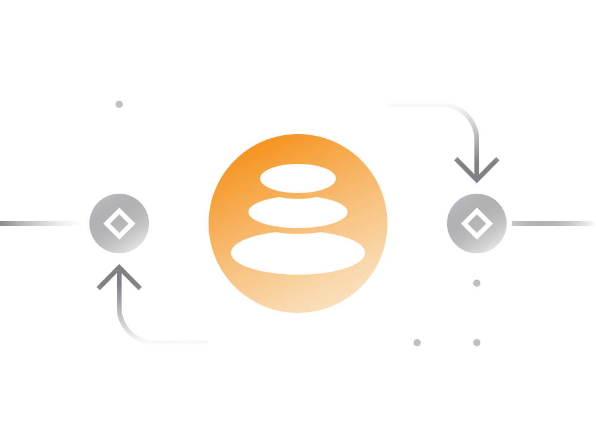

# Balancer in Simple Terms

[Balancer](https://balancer.exchange/) is a relatively new decentralized exchange that was launched in March 2020.

The project initially started in early 2018 as a research initiative by [BlockScience](https://block.science/). 

The Balancer team came up with a powerful mathematical framework that enables any portfolio to continuously self-rebalance while also generating fees.

This DeFi framework is now referred to as the Balancer protocol. The Ethereum token powering its economics is BAL. 

## Trading on Balancer

From trader's perspective it's another decentralized platform to exchange Ethereum and ERC20 tokens in a decentralized manner.

For each order, Balancer filters through all available pools in the platform (containing your requested tokens) and spread your order using the most efficient allocation to provide the best possible price.

- Trading fees on Balancer will vary from one pool to another.

- As the case with Uniswap, the bigger amount in relation to available liquidity the higher is the slippage in the price.

- The trading fee for the order will depend on the tokens and liquidity pools involved in the order. Each pool has its own fee.

- Balancer encourages liquidity providers to keep fees low by distributing Balancer's native token BAL as an incentive.

## Providing Liquidity

Just like Uniswap and Curve, Balancer enables users to earn fees on their Ethereum-based idle assets.

Balancer provides more flexible opportunities for liquidity providers on the platform by introducing different types of liquidity pools.

- A user can provide liquidity by either creating a liquidity pool or adding their assets to existing pools.

- Each pool can have 2-8 assets in its liquidity pool. Assets can be configured to maintain a certain ratio in relation to other tokens in the pool. 

- The pool auto-balances itself and always maintains the required ratio.

- Unlike Uniswap which requires all pool assets for a deposit, on Balancer providers are able to provide liquidity in any asset supported by the pool.

- Liquidity providers receive pool ownership tokens (represented by ERC-20 token) which are needed to withdraw liquidity from the pool in the future.

- Each pool has its own transaction fee policy. Remember that pools with lower transaction fees receive more BAL tokens distributed by Balancer smart contract.

- Setting up a new pool may easily incur an Ethereum transaction fee over 100$ when the network is busy.
 
## Pool Types

1. Shared Pools

    In such pools the pool’s tokens, weights, and fees are permanently set on creation without means to change them. 
    
    Pool creator has no special privileges. Anyone may add liquidity to shared pools and ownership of the pool’s liquidity is tracked with a specific token called BPT - Balancer Pool Token.

2. Private Pools

    The creator of the pool has full permissions and only he/she has full control over pool parameters i.e. accepted tokens, token weights, fee traders have to pay to access liquidity, etc.
    
    However, the only address that can provide liquidity to it is the pool creator. This is useful for index funds that manage funds of third parties for example.
     
3. Smart Pools     
     
    Smart pools are a type of private pools that are owned by a smart contract, rather than a person who created the pool. 
  
    Like Shared Pools, ownership in these pools are tracked by pool specific ERC20 tokens. 
    
    These pools can also accept liquidity from anyone and at the same time can have arbitrary restrictions on how pool parameters can be changed.

## Index Funds

One of the key uniques selling points of Balancer lies in ability to set up personal index fund without undertaking complex re-balancing actions.

In a conventional index fund the investor has to pay a fee for the re-balancing service, but in a Balancer pool the liquidity provider rewarded for their service of providing liquidity to the protocol.

- Self balancing liquidity pools allow cryptocurrency investors to group cryptocurrency assets meant for long term investments into auto-balancing index fund for easier tracking.

- Users may deposit an entire portfolio into an automated re-balancing liquidity pool & earn fees as other users trade against their portfolio.

- Anyone can now create their own self-balancing index fund or invest in someone else’s.

- Since all Balancer pools are themselves represented by ERC-20 tokens, it's possible to create a pool consisting of Balancer pools.

- Balancer is permissionless in that the pools cannot be censored nor can the smart contracts be edited or shut down once they’ve been activated. 

## Balancer Token

BAL token only just started getting distributed to liquidity providers on June 1, 2020. These BAL token rewards are in addition to the pool’s fees. 

Furthermore, the BAL token is the governance token of the Balancer protocol.

- Total supply 100M BAL tokens

- 25M BAL tokens to founders, devs, advisors and investors

- 75M BAL tokens to be distributed to liquidity providers

The to be governance model as well as token distribution explained [in detail](https://balancer.finance/2020/05/15/proposing-balancer-liquidity-mining/) on project's blog.

## Links

- [Project Whitepaper](https://balancer.finance/whitepaper/)
- [Official Blog](https://balancer.finance/blog-feed/)
- [Balancer Pool Management](https://pools.balancer.exchange/#/)
