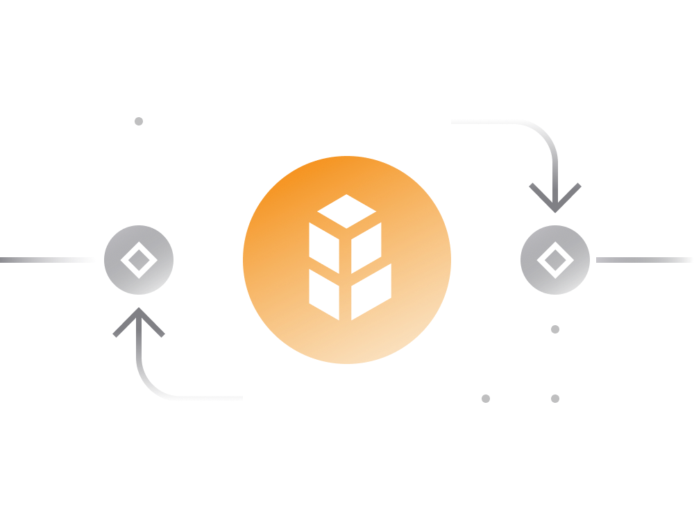

## 5. Bancor DEX

[Bancor](https://www.bancor.network/) is Uniswap-like decentralized exchange that offers yet another place to trade Ethereum-based tokens.

Bancor has a native token called Bancor Network Token. Users who trade on Bancor do not need to hold BNT; however, users creating a liquidity pool on Bancor or providing liquidity to an existing pool must hold BNT.

There are some additional incentives for liquidity providers:

- Bancor V2 takes this a step further by enabling liquidity providers to get into a liquidity pool with just one token, removing the two-sided liquidity deposit requirement.

- Just like the other DEXes, Bancor liquidity pool tokens can accrue value by collecting trading fees.

- In addition to trading fees, pool rewards can be also provided by the Bancor Protocol itself (via BNT token inflation) as well as a project behind the token via 'liquidity provider incentive programs'.

- Every liquidity pool on Bancor holds BNT in its reserves as well as the “base token” receiving liquidity. BNT serves as the intermediary token connecting pools in the network and across blockchains. For example, a trade from DAI to BAT has the following conversion path: DAI > BNT > BAT.

For more information about Bancor and its working mechanics refer to [official documentation](https://support.bancor.network/hc/en-us/sections/360000256751-Bancor-Network).

In July of 2018, Bancor suffered the loss of a combined $23.5M in crypto assets1 (a mix of ETH, NPXS, and Bancor’s own BNT). This was due to a hack to a wallet which had been used to upgrade some smart contracts. Bancor stepped in to temporarily shut down the exchange and froze the BNT, though they had no ability to freeze the lost ETH and NPXS. Bancor’s actions were an early indicator that not every entity claiming to be “decentralized” should truly be deemed DeFi. Charlie Lee, creator of the cryptocurrency Litecoin, publicly criticized the exchange, saying that “An exchange is not decentralized if it can lose customer funds OR if it cna freeze funds. Bancor can do both.
