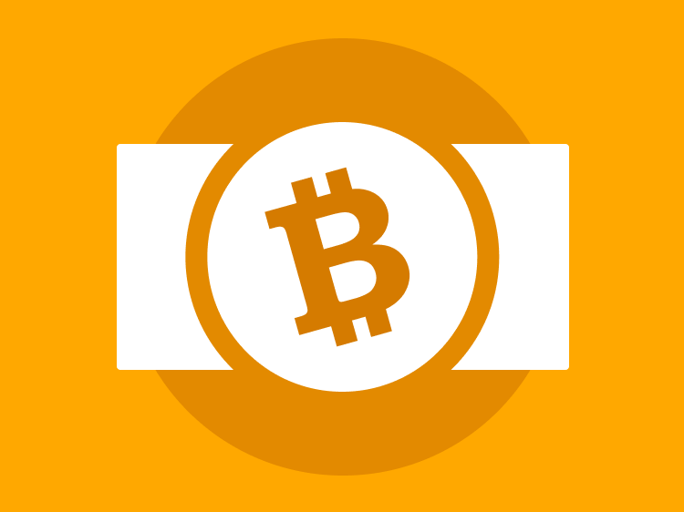
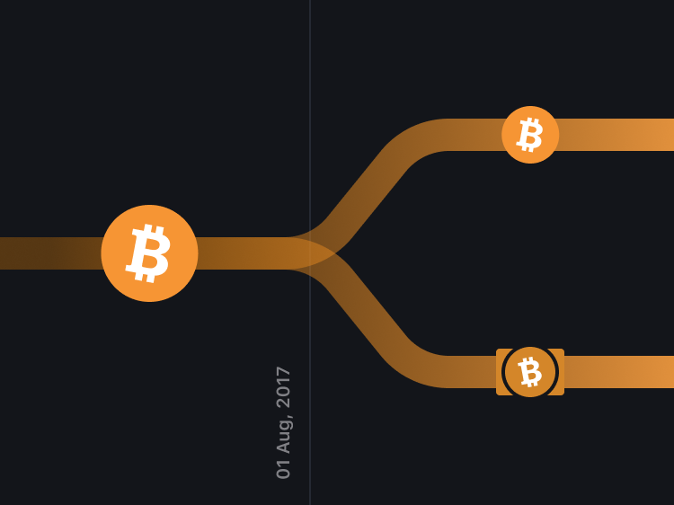
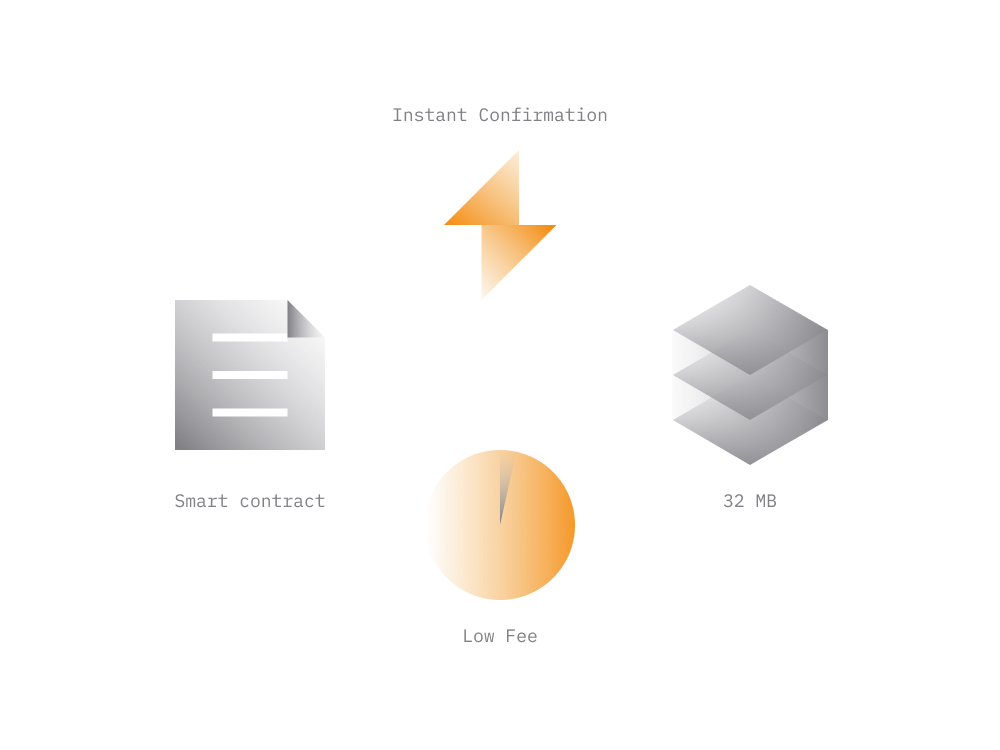

# Bitcoin Cash In Simple Terms

Bitcoin Cash, denoted by a symbol BCH, is a cryptocurrency that is a fork of a Bitcoin. Being a fork means that it was created from the [Bitcoin (BTC)](bitcoin.md) cryptocurrency. 

Bitcoin Cash emerged out of the Bitcoin blockchain in August 2017. While it shares the fundamentals with the Bitcoin (BTC) it's a different cryptocurrency with its own blockchain.

In this guide we'll explain the process of how Bitcoin Cash (BCH) came into existence, its relevance to Bitcoin and how it's different from the original Bitcoin.

> **Bitcoin (BTC) and what's now known as Bitcoin Cash (BCH) technically used to be one cryptocurrency until August 2017.**

Right now, despite having some similarities and 'Bitcoin' in its names, both represent different cryptocurrencies and traded at different prices.

- [Bitcoin (BTC) Price](https://coinmarketcap.com/currencies/bitcoin/)
- [Bitcoin Cash (BCH) Price](https://coinmarketcap.com/currencies/bitcoin-cash/)
 
Each blockchain powered by its own decentralized network of servers, has its own community, engineering resources and distinct vision for the future.

The official websites for each:

- Bitcoin Cash - [bitcoin.com](https://www.bitcoin.com) / [bitcoincash.org](https://www.bitcoincash.org)
- Bitcoin - [bitcoin.org](https://www.bitcoin.org) / [bitcointalk.org](https://bitcointalk.org)

Below we'll look at how the Bitcoin Cash (BCH) is different from the Bitcoin (BTC). As both currencies share fundamentals it's recommended for you to go over the [Bitcoin guide](bitcoin.md) first.

## 1. Bitcoin Cash Origins

The underlying blockchain powering Bitcoin is limited to about half a million transactions per day. 
 
>**In its current state, the Bitcoin network can only process about 5 transactions per second. On some busy days, it's not uncommon for Bitcoin transactions to remain in pending state for hours, sometimes even days.** 
>
> **For comparison, the Visa network does around 1,700 transactions per second on average and can scale up to [24,000 transactions](https://usa.visa.com/run-your-business/small-business-tools/retail.html) per second.**

The Bitcoin Cash emerged as a result of the original Bitcoin community trying to find ways to increase the capacity of the Bitcoin blockchain. Back in 2017, when trying to address this issue, the community couldn't reach consensus on the best way forward. 

The debate was primarily about the maximum size of the block in the blockchain. Because transactions added to blockchain in blocks, the more transactions can fit in a block the more transactions can occur in a 10-minute interval.

   - One group wanted to increase the Bitcoin blockchain block size limit from 1 MB to 8 MB and subsequently even more. This would enable Bitcoin blockchain to instantly process up to 8x more transactions per block. 

   - The other group was against increasing the block size and insisted on addressing the scalability via other means. The group argued that increasing block size provides a temporary fix and won't solve the problem in the long run.

While the block size limit was at the center of the argument there were many other factors both technical and social which led to the split of opinion. As a result, the original Bitcoin community which had been united since 2009 has divided into two camps.

This disagreement resulted in the split of the Bitcoin network and the emergence of Bitcoin Cash blockchain and its native cryptocurrency BCH. The group which was in favor of larger block size limit has split from the Bitcoin community and created Bitcoin Cash.

## 2. The Fork

As cryptocurrencies are open-source and no entity has exclusive rights ove the code powering them, anyone can create a duplicate via a simple process known as ['fork'](https://en.wikipedia.org/wiki/Fork_(software_development)) and market it as another product.

The term fork is a technical term in software engineering and used to describe the process of deriving one software product from another.

Forks may occur when the community members are not able to agree on the way forward. It provides a natural dispute resolution mechanism by allowing the conflicting parties to split and continue with a distinct vision.

> **While anyone can create a cryptocurrency by forking the existing one, it will not see the adoption unless there is a significant value proposition which can attract support of engineers, users and speculators.** 
>
> **Without the community the cryptocurrency has no organic network that can guarantee its survival and growth.**

In August 2017, the proponents of larger block size initiated a fork, effectively creating a new blockchain and cryptocurrency.

While that group didn't represent the majority, it had support of major Bitcoin miners, and a number of influential early-adopters, and some engineers. 

> **In a way, the fork of Bitcoin Cash was a good demonstration of how the ideological conflicts can be resolved for open-source cryptocurrency projects which are not owned by any entity.**

Although, the Bitcoin Cash is not the only cryptocurrency that was forked from Bitcoin (there was [Litecoin](https://en.wikipedia.org/wiki/Litecoin) as well), it's the most significant in terms of the impact it had on community.

Here are some key points regarding how Bitcoin Cash fork took place:

- both blockchains share identical history of transactions until the fork date, August 1 at 12:37 p.m. UTC.

- both blockchains have the same amount of cryptocurrency units, capped at 21 million.

- anyone who had Bitcoins in a [non-custodial wallet](../../fundamentals/en/2-wallets-basics.md) at the time of fork also ended up with a [same amount](https://www.smh.com.au/business/markets/bitcoin-cash-is-essentially-printing-money-20170803-gxo981.html) of Bitcoin Cash units on the balance. While there were strong fork opponents on both camps, for the most users the event turned out to be an opportunity to get some free cryptocurrency.

Over the last few years Bitcoin Cash has managed to foster a significant community and became one of the few cryptocurrency projects that keeps evolving on various fronts.

The project has a strong marketing community encouraging merchants worldwide to accept Bitcoin Cash for payments. Although we are yet to see any major merchant accepting it as a form of payment.

## 3. BTC vs BCH

Today, the community regards as Bitcoin the one with a symbol BTC. It's the cryptocurrency people refer to when talking about the Bitcoin.

> **It should be noted, there is an ongoing debate between Bitcoin and Bitcoin Cash communities as to which of the two cryptocurrencies is the 'true' Bitcoin that Satoshi Nakamoto [intended](https://bitcoin.org/en/bitcoin-paper) to create.**

Although both cryptocurrencies share origins, the post-fork changes to blockchain code took each project in its own direction.

> **Bitcoin Cash (BCH) community views the BCH as a peer-to-peer 'digital cash' which can be used to pay for anything, quickly and with close to zero transaction fees.**
>
> **Bitcoin (BTC) is generally perceived as a 'store of value' rather than digital cash. In that regard, more emphasis being put on security and privacy of the blockchain rather than the speed. While there is an ongoing work to improve the speed of Bitcoin via projects like [Lightning Network](https://lightning.network), we are yet to see a widely adopted solution.**

While it can be assumed that original Bitcoin network lost a chunk of its network as a result of the fork it's hard to quantify the extent of this. 

**Bitcoin Cash (BCH)**

- As a result of post-fork block size limit increases, a single block on Bitcoin Cash can now hold up to 32 times more transactions than Bitcoin. With such blocks the Bitcoin Cash is theoretically capable of handling 18,000,000 transactions per day.

- Despite larger blocks, Blockchain Cash sees less than [30,000 - 40,000](https://bitinfocharts.com/comparison/bitcoin%20cash-transactions.html#6m) transactions per day with transaction blocks [rarely](https://bitinfocharts.com/comparison/bitcoin%20cash-size.html#6m) going over 1 MB in size.

- Transacting with Bitcoin Cash is very cheap and often costs [below 1 cent](https://bitinfocharts.com/comparison/transactionfees-bch.html#6m). Combine it with the fact that Bitcoin Cash payments reach finality faster (more on that below) you get both fast and cheap payments. 

**Bitcoin (BTC)**

- Throughout 2020, there have been [on average](https://bitinfocharts.com/comparison/bitcoin-transactions.html#6m) 300K Bitcoin transactions per day. At this stage, the Bitcoin blockchain is close to reaching the capacity with the average block now being about [90% of capacity](https://bitinfocharts.com/comparison/size-btc.html#6m). Taking into account that most transactions occur during peak hours the high fees is pretty much a daily issue at this point.

- The average fee for Bitcoin transactions been generally in the range of [1 USD throughout 2020](https://bitinfocharts.com/comparison/bitcoin-transactionfees.html#6m) with a brief period in May 2020 where it reached as high as 6$. 

Transactions aside, when you look at the amount of activity taking place on the blockchain itself, the original Bitcoin still has a much larger network and more engineers working on its ecosystem.

- **Network Nodes**

    There are on average 10 times more network [nodes online for Bitcoin](https://bitnodes.io) blockchain then [Bitcoin Cash](https://cash.coin.dance/nodes). As was mentioned before, nodes guarantee security, availability and decentralization of the blockchain.
  
- **Hashrate** 

    Another parameter indicating both the size and power of the blockchain network is a [hashare](https://bitinfocharts.com/comparison/difficulty-btc-bch.html). It reflects the number of network nodes involved in mining of the given cryptocurrency. The more nodes there are on the network competing in mining the harder it's for someone to attack the network.

- **Active Addresses**

    The page [here](https://bitinfocharts.com/comparison/activeaddresses-btc-bch.html#6m) compares both blockchains by the number of unique entities involved in transactions over the 24-hour period. Bitcoin outperforms Bitcoin Cash on average by 10-15 times.

So, looking at stats above we can conclude that Bitcoin Cash is considerably smaller than Bitcoin blockchain. However, it's still big in comparison to other cryptocurrencies. 

## 4. BCH Highlights

Many tend to look at Bitcoin Cash as an alternative to Bitcoin, giving an impression that's either one or the other.

However, taking into account different direction of the engineering efforts on both sides these projects are likely to coexist. 

As a result of the increased block size and post-fork blockchain code changes, the Bitcoin Cash blockchain got some significant differences.

- **Instant Confirmation**

    Bitcoin Cash (BCH) transactions reach finality faster making it more usable for everyday payments like paying for coffee, or a taxi ride where instant settlement is required.
    
    The Bitcoin Cash (BCH) transactions can generally be considered final as soon as they reach the network, few seconds after the sender sends a transaction.
    
    When it comes to Bitcoin (BTC), after the transaction reaches the network it also needs to be included in the blockchain before it can be considered final. That may easily take a few hours on a busy day, or even a few days. 
    
- **Low Transaction Fees**

    The [transaction fees](../../fundamentals/en/8-transactions-basics.md) become relevant when a blockchain receives more transactions than it can fit in the block. In such cases, fees used to prioritize transactions, giving priority to transactions that pay higher fees.

    Due to larger block size limit and generally lower volume of transactions on the BCH blockchain, it has much lower fees. Even when someone pays 1 cent per transaction there is always enough space in the current block to process it.
    
-  **Decentralized Storage**

    Due to low transaction fees and larger block sizes the Bitcoin Cash blockchain can also be used as a decentralized and censorship-resistant data storage layer for decentralized applications (DApps).
    
    There are already third party applications like [Memo.cash](https://memo.cash) utilizing the cheap storage aspect of the Bitcoin Cash blockchain.
    
    Practically speaking, using that feature of Bitcoin Cash someone can build a Twitter-like application where the user data stored on the blockchain privately and not controlled by any entity.

- **Smart Contracts**

    The Bitcoin Cash blockchain is capable of having 'smart contract' like programs/entities which can be pre-programmed to work autonomously, have its own balance and perform condition-based transactions.
    
    This capability is fairly new, and we are yet to see any Ethereum-style decentralized apps utilizing that aspect of Bitcoin Cash blockchain.   

Both Bitcoin and Bitcoin Cash blockchains evolve very fast, and the highlights listed above may no longer be relevant in the future. Both blockchains driven by a distributed engineering community constantly working on expanding the capabilities of the blockchain. 

## 5. Bitcoin Cash Price

On 1 August 2017, shortly after the split, Bitcoin Cash emerged as a cryptocurrency and began trading at about $240, while the Bitcoin traded at about $2,700. 

Since then, [BCH price](https://coinmarketcap.com/currencies/bitcoin-cash/) hasn't changed significantly while [BTC price](https://coinmarketcap.com/currencies/bitcoin/) been ranging between $3,500 - $12,000.

In the long run, the price of the cryptocurrency likely to reflect the growth of its blockchain network and the size of engineering/user community around the project.

Although Bitcoin Cash has one of the largest social media communities around it's still significantly behind Ethereum and Bitcoin in that regard. In order for it to overtake the Bitcoin the demand for the Bitcoin Cash (BCH) cryptocurrency should exceed the demand for Bitcoin (BTC).
