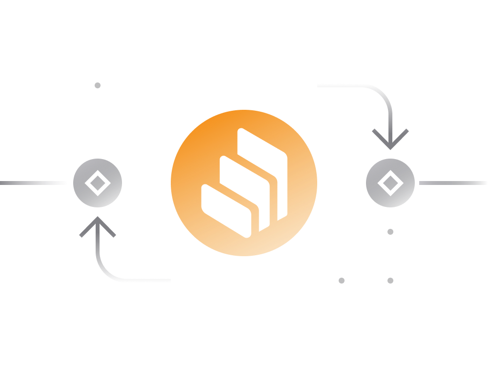

# Compound in Simple Terms

[Compound](https://app.compound.finance) is a decentralized platform that connects cryptocurrency lenders and borrowers. 

In essence, users lend idle cryptocurrency assets to the Compound Finance liquidity pool, from which borrowers can borrow the assets.

- for cryptocurrency owners Compound allows to deposit their holdings into a smart contract and earn an interest on deposits. 

- at the same time potential borrowers may request credit from Compound for a fee and collateral deposit (in form of another cryptocurrency).

- borrowing and lending available to regular users as well as smart contracts. This enables DeFi engineers to build services which are able to access liquidity in other DeFi services.

Compound currently supports 8 cryptocurrencies: 

- [wrapped BTC (WBTC)](https://compound.finance/markets/WBTC)
- [Ethereum (ETH)](https://compound.finance/markets/ETH)
- [USD Coin (USDC)](https://compound.finance/markets/USDC)
- [Tether (USDT)](https://compound.finance/markets/USDT)
- [Dai (DAI)](https://compound.finance/markets/DAI)
- [Augur (Rep)](https://compound.finance/markets/REP)
- [0x (ZRX)](https://compound.finance/markets/ZRX)
- [Basic Attention Token (BAT)](https://compound.finance/markets/BAT)

Each supported cryptocurrency has its own borrowing and lending requirements in the platform:

- Interest Rates

    Borrowing / lending  interest rates tend to change in real time depending on the market supply and demand for the given cryptocurrency asset.
    
- Collateral Factor

    The amount of collateral needed to borrow some cryptocurrency. In other words, a collateral factor of 70%, means that user may borrow up to 70% of the collateral value.
    
By going to the individual asset pages on Compound (linked above) you can also see the total number of lenders, borrowers and the amount of a given asset available for borrowing. 

The data shown on Compound website can be easily validated by looking up respective Compound smart contracts.

## Borrowing on Compound

To borrow on Compound users have to put up a collateral in another cryptocurrency. The maximum amount users can borrow depends on the 'reserve factor' for a collateral. 

> For instance, if a user supplies 100 DAI as collateral, and the collateral's reserve factor for DAI is 75%, then the user can borrow at most 75 DAI worth of other assets. 

So, each asset on Compound can have a different collateral factor. 

- Borrowing cryptocurrencies on Compound does require users to pay fees in a form of borrowing interest rate.

- Compound has floating interest rates which are adjusted based on market supply and demand for a particular cryptocurrency.

- Once loan repaid, the account’s collateral can be entirely withdrawn to the external wallet. The loan can be repaid by a borrower or some third party account. 

Borrowing is not risk-free, there are some circumstances where collateral assets can be liquidated by the protocol.

The borrowers have to monitor price of collateral assets in real-time and make sure the value of the collateral never falls below the minimum required for the loan. 

> It's recommended to always borrow less than max. allowed limit to ensure the value of collateral remains always above the minimum even if the price of collateral asset drops sharply.

A borrowing account becomes insolvent when the total borrowed balance exceeds the maximum allowed amount. 

When some account becomes insolvent, other platform users can repay a portion of its outstanding debt in exchange for a portion of its collateral, with a liquidation incentive — currently set at 8% but can change through governance system. 

Having your account liquidated is bad because you lose some or all of your collateral.

## Lending on Compound 

- Lenders may withdraw their cryptocurrencies (along with earned interest) at any time with a 15-second lag.

- When users supply assets, they receive cTokens from Compound in exchange. These cTokens are ERC20 tokens that can be redeemed for their underlying assets at any time. 

- As interest accrues to the assets supplied, cTokens are redeemable at an exchange rate (relative to the underlying asset) that constantly increases over time, based on the rate of interest earned by the underlying asset.

- The cTokens received by the lenders can also be used to borrow assets from the platform.

Lending is not risk-free, there are some circumstances i.e. borrower default and liquidation malfunction that can affect the safety of the assets in the lending pool.

To protect lenders against unforeseen situations Compound maintains a reserve pool that grows in size by taking a small cut from the rate paid by the lenders.
 
## cTokens 

cTokens are the primary means of interacting with the Compound Protocol; when a user mints, redeems, borrows, repays a borrow, liquidates a borrow, or transfers cTokens, she will do so using the cToken contract.

Each supported cryptocurrency on Compound has its own respective cToken i.e. cDAI for DAI, cUSDT for USDT and so on.

When users supply assets, they receive cTokens from Compound in exchange. cTokens are ERC20 tokens that can be redeemed for their underlying assets at any time.

## Compound Governance

Since May 2020, Compound has transitioned to community governance using its native COMP governance token.

> COMP holders can make proposals and vote on decisions relating to how Compound should operate, which collateral assets should be supported, interest rates and so on. 

There is a total supply of 10 million COMP tokens:
 
- 42.3% of total is reserved for distribution to active Compound users supplying or borrowing cryptocurrencies. On every Ethereum block, 0.5 COMP is distributed across Compound’s lending and borrowing pools.
 
- Distributed tokens are divided 50:50 between suppliers and borrowers of that particular cryptocurrency. The cryptocurrency which is earning the most COMP per day is always changing.

- Users may also earn $COMP by voting on various governance proposals.

Compound is on the path to decentralize all aspects of the platform. You can read about the transition [here](https://medium.com/compound-finance/expanding-compound-governance-ce13fcd4fe36).

## Links

- [Official Compound Website](https://compound.finance)
- [Governance Proposals](https://compound.finance/governance/proposals)
- [Compound Owners Leaderboard](https://compound.finance/governance/leaderboard)
- [Project Documentation](https://compound.finance/docs)
