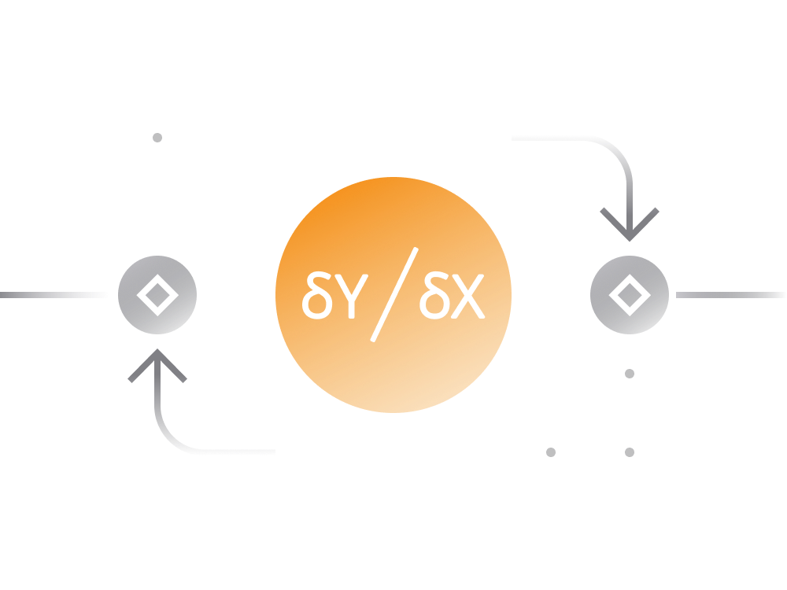

### 6. dYdX DEX

Most DEX platforms allow investors to take long positions in various cryptocurrency assets. However, it is currently very difficult to take short, hedged, or more complex financial positions.

dYdX is a decentralized exchange for short selling and derivatives built on the Ethereum blockchain.

- Short positions allow investors to profit on price decreases, and can be used for speculation or to hedge existing positions.

- Fully-collateralized low risk loans for short sellers allow token holders to earn interest fees

- On dYdX someone can trade on margin with up to 10x leverage. Back your positions with any supported collateral.
