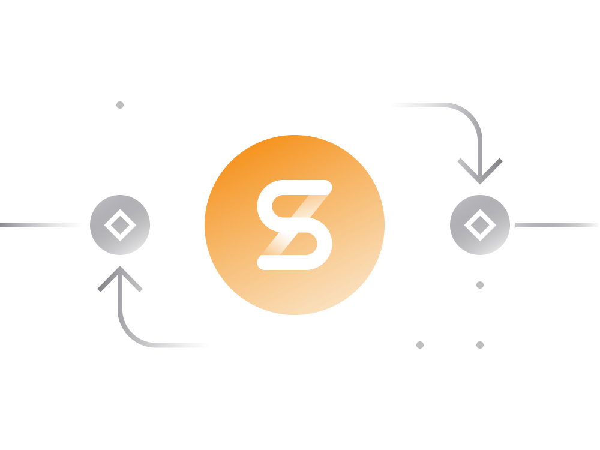
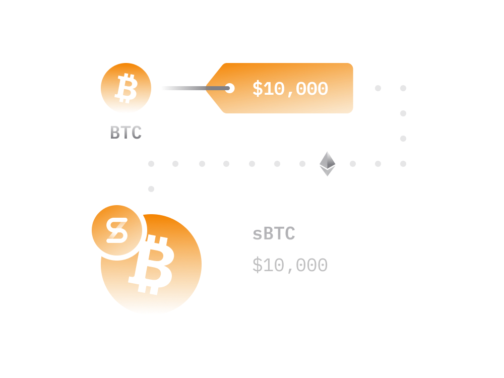
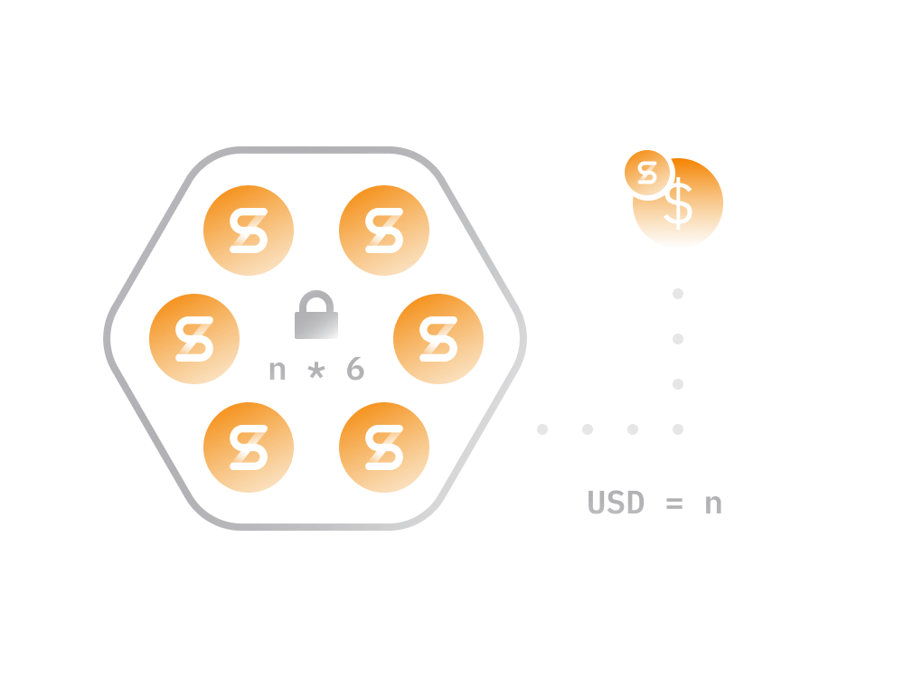
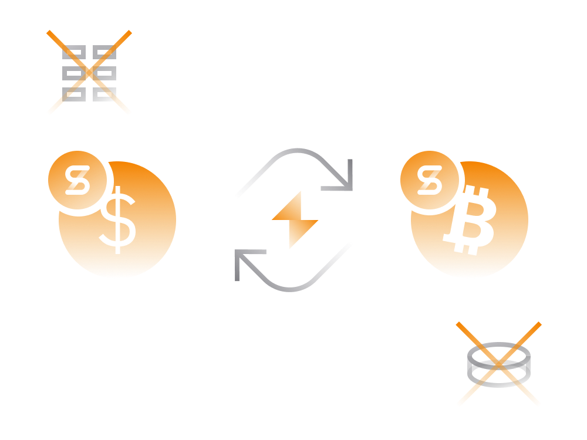
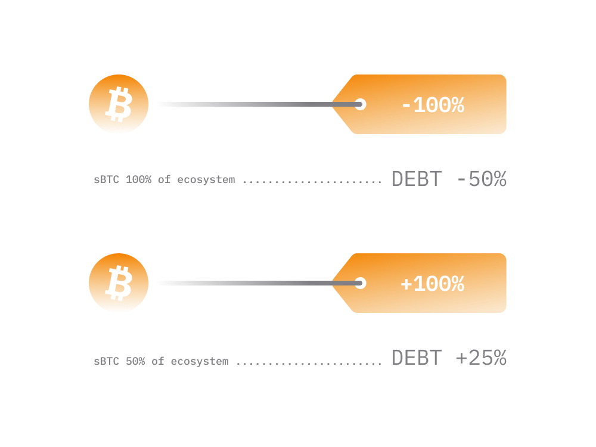

# Synthetix In Simple Terms

[Synthetix](https://synthetix.io/) is a decentralized platform on Ethereum for trading synthetic assets (called Synths).
 
> Synths are ERC-20 token representations of cryptocurrencies, stocks, fiat currencies, precious metals, and potentially any other tradable assets.

Synths are programmed to copy the price of an asset they are linked to and leave behind all of its other properties. 

For instance, sBTC is a synthetic Bitcoin synth asset that can be bought and sold on Synthetix exchange at current Bitcoin price.

In the same way, an sMKR synth token has the same price as a real [MKR](../../token_guides/en/makerdao.md) token, but without the voting rights an actual MKR token holder would have. 

- from an asset price perspective owning synth tokens has same benefits as owning the tokens these synths represent.

- users are able to bet on the price of various financial instruments (outside Ethereum) without holding the actual asset.

- synth assets are transferable between users and tradable on decentralized exchanges.

To conclude, Synthetix enables creation of Ethereum-based tokens of ERC20 type which represent real-world assets.

> Any tradable asset with a price feed can be potentially added to the Synthetix platform in a form of synth asset.

Current synth assets include cryptocurrencies, stocks and precious metals. In the long run, Synthetix will likely have a lot more assets that are available on traditional markets such as stocks.

## Supported Synths

While Synthetix platform supports about two dozen different synths, there are no barriers for it to have a lot more.

> Any asset which has a market price can technically be added to Synthetix platform. 
>
> Smart contract powering Synthetix platform only require the price feed for the given asset (and approval from its community) to add new synth asset into ecosystem.

Therefore, should Synthetix continue growing expect to see many more synthetic assets to be added to the platform.

Currently, there are two types of synth assets:

1) Standard Synths

  Follow the price of the asset they represent and meant for those who would like to go long on the assets.

  - sUSD : synthetic USD
  - sEUR : synthetic EUR
  - sAUD : synthetic AUSDollar
  - sBTC : synthetic Bitcoin
  - sETH : synthetic Ether
  - sMKR : synthetic Maker
  - sBNB : synthetic BNB
  - sXTZ : synthetic Tezos
  - sADA : synthetic Cardano
  - sXRP : synthetic Ripple
  - sLTC : synthetic Litecoin
  - sBCH : synthetic Bitcoin Cash
  - sXAU : synthetic Gold Ounce
  - sXAG : synthetic Silver Ounce
  - sDEFI : synthetic DEFI Index
  - sLINK : synthetic Chainlink

2) Inverse Synths

  Allow anyone to essentially go short on the price of an asset and profit inversely to any price depreciation of the asset synth represents.

  - iBTC : inverse Bitcoin
  - iETH : inverse Ethereum
  - iBNB : inverse Binance
  - iXTZ : inverse Tezos
  - iADA : inverse Cardano
  - iXRP : inverse Ripple
  - iLTC : inverse Litecoin
  - iBCH : inverse Bitcoin Cash
  - iDEFI : inverse DEFI Index
  - iLINK : inverse Chainlink
    
Synths are traded 24/7 on non-custodial [Synthetix.Exchange](https://synthetix.exchange) allowing anyone in [Ethereum ecosystem](../../token_guides/en/ethereum.md) to go long or short on various assets.
    
## How Synths Created

To understand the mechanics of Synthetix platform it's crucial to understand the process by which new synths assets are added and removed from circulation.

1. Synthetix allows creation of sUSD (synthetic USD) token by [locking](https://mintr.synthetix.io/) own SNX tokens into a smart contract at an approximate ratio of 600% to the sUSD synth token being minted.

2. If someone wants to create 1000 sUSD tokens the person needs to lock at least 6000 worth SNX tokens into a smart contract. Locked tokens are returned when user returns the borrowed amount (which changes in real time as will be shown later).

3. Once sUSD tokens are created the borrower can trade them on Synthetix exchange for other synth assets at current market prices.

4. The orders on Synthetix exchange are instant and at market prices.

5. The traders always trades against the exchange which buys synth asset from the user (i.e. sUSD) and gives him/her another synth asset (i.e. sBTC) taking into account current market prices of both assets.

6. Note that, during the exchange process, Synthetix basically destroys (removed from circulation) the asset it received from user and creates (adds to circulation) a synth asset user bought from it. 

7. For instance, if the current price of Bitcoin is $10,000, buying sBTC from Synthetix exchange would mean destroying 10,000 sUSD tokens and creating 1 sBTC token in Synthetix ecosystem.

Every single synth in circulation comes into existence as per the steps shown above.

> The process above ensures that every single synth asset in the ecosystem is backed by a collateral in a form of SNX tokens.

User looking to speculate on synth assets do not have to go through steps above but can purchase existing sUSD or sETH from someone on a [decentralized exchange](../../defi/en/3-decentralized-exchanges.md) like [Uniswap](../../token_guides/en/uniswap.md), generally using native Ethereum's ETH token.

## How Synths Traded

Synthetix ecosystem comes with its own decentralized exchange platform for trading synths known as [Synthetix.Exchange](https://synthetix.exchange).

- Unlike other decentralized exchanges Synthetix exchange doesn't require any kind of liquidity matching instruments like order books or [liquidity pools](../../defi/en/3-decentralized-exchanges.md). 

- All orders are guaranteed to happen at market prices in a few seconds time. 

- This can be a big deal for many traders as most decentralized exchanges will incur a significant price slippage for larger trades.

- There is a 0.1% - 1% (typically 0.3%) fee for each trade on Synthetix exchange. That fee goes to the entities creating sUSD tokens on the platform by locking their SNX tokens as collateral. 

From a trader's perspective trading on Synthetic exchange is significantly cheaper especially for larger orders.

So, there is an economic incentive for someone to use the Synthetix exchange rather than a DEX like [Uniswap](../../token_guides/en/uniswap.md) or [Curve](../../token_guides/en/curve-finance.md).

## Why Create Synths

Above we covered the process of how new synths enter the ecosystem as well as the incentives for someone to trade synths rather than the assets these synths represent. 

> Trading synths is not only cheaper but comes with a convenience of being able to get exposure to an asset of any tradable asset in the world, all on Ethereum blockchain

So, there are strong incentives for speculators to trade Synths rather than actual assets.

The only question that remains is what are the incentives for someone to create new synths given that those creating synths need to lock 600% of the created value in SNX tokens as a collateral.

> Note that, the 600% ratio is chosen by Synthetix community and meant to provide a protection to the stability of the synth asset against the price fluctuations of the backing SNX token. 

Those willing to lock their SNX into Synthetix platform any by doing so create new synths, receive two kinds of rewards: 

1. SNX staking rewards, which are created through the inflationary monetary policy of SNX token.     

    Between March 2019 - August 2023, the total SNX supply will increase from 100,000,000 to 260,263,816, with a weekly decay rate of 1.25%. 

2. Exchanging synths on [Synthetix.Exchange](https://synthetix.exchange/#/) typically costs %0.3 to the trader.
   
    These fees are sent to a fee pool, available for SNX stakers to claim their proportion from it each week.

The entities staking their SNX tokens essentially create a debt position when they lock their SNX tokens. 

- This debt begins as the amount of sUSD they initially mint.

- The debt increases or decreases according to price gains or losses made by all other Synth assets in the ecosystem. 

- If at any time there is a Synth asset that appreciates in value, that gain is covered proportionally by all the staked SNX holders??? debts. 

- Every staker must pay off their debt to a smart contract before they can unlock their staked SNX tokens.

For example:

- If 100% of the Synths in the Synthetix ecosystem were synthetic Bitcoin (sBTC), which say halved in price, the total debt in the system would halve as well. Every staker???s debt would also halve as a result. 

- On the other hand, if only 50% of the ecosystem were sBTC, and BTC doubled in price, each staker???s debt???would increase by one quarter. 

In this way, SNX stakers act as a pooled counter party to all Synth exchanges; stakers take on the risk of the overall debt in the system.

## Synthetix Stats

If you would like to know the amount of funds currently locked on Synthetix platform as well as the number of synths in circulation and other parameters go to Synthetix overview on [DeFi Pulse](https://dashboard.synthetix.io).

Here are some key stats what we have as of September 9, 2020:

- Total Locked (in USD): $650.2M
- Total Locked (in ETH): 1.9M ETH
- Total Locked (in BTC): 63.3K BTC
- Total Locked (in SNX): 141M SNX
- % of SNX Supply Locked: 70.36%
