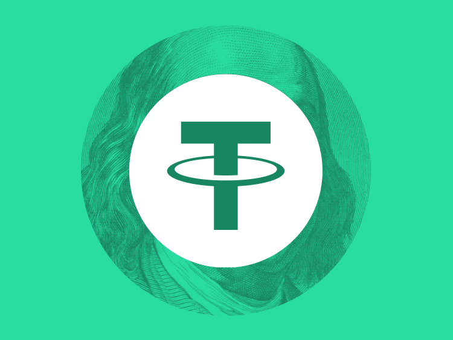
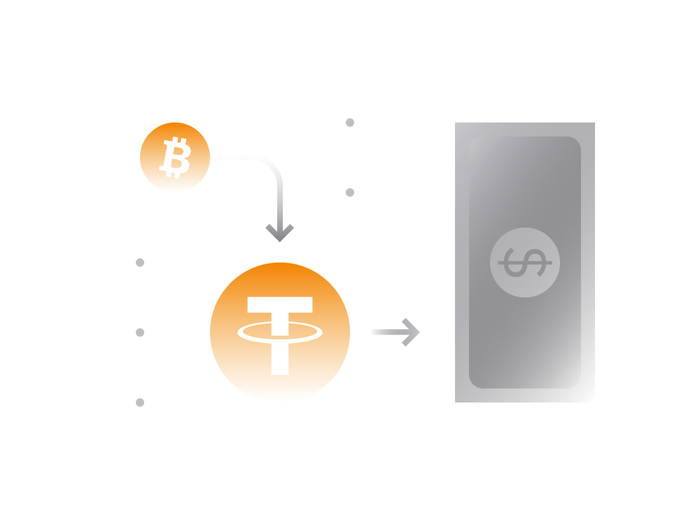
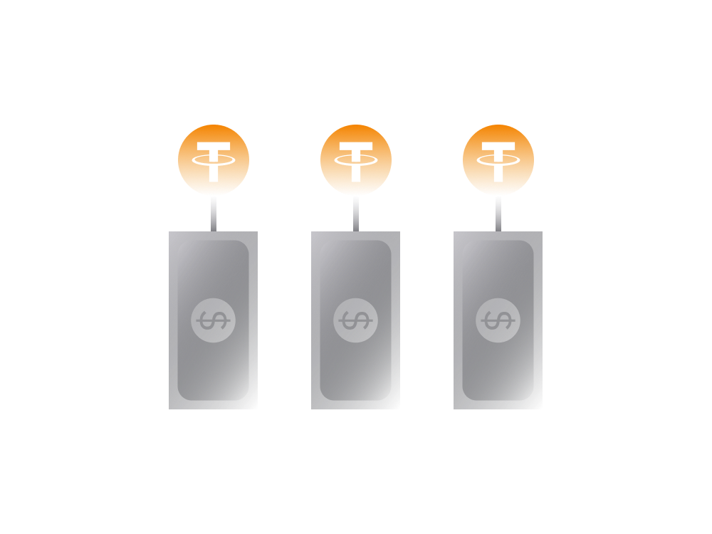

# Tether in Simple Terms

Tether (symbol: USDT) is a cryptocurrency [stablecoin](../../defi/en/5-stablecoins.md) with a value meant to mirror the value of the US dollar. It is the biggest stablecoin in the cryptocurrency space. Tether enables easy exposure to USD.

Tether can be found on most [cryptocurrency exchanges](../../fundamentals/en/6-buying-cryptocurrency-basics.md) and supported by most crypto currency wallets. It's usually traded in pairs with the highest daily trading volume. 

- The [BTCUSDT](https://www.binance.com/en/trade/BTC_USDT) pair on Binance exchange alone occasionally exceeds half a billion USD in daily trading volume. 

- The Market Capitalization of Tether has been consistently growing over the years and in May 2020 has exceeded [8 billion USD](https://coinmarketcap.com/currencies/tether/).

While Tether tokens are issued on several blockchains, the largest amount are exists on [Ethereum blockchain](ethereum.md). 

There are over 5.5 billion Tether USDT tokens issued via its [smart contract](https://etherscan.io/token/0xdac17f958d2ee523a2206206994597c13d831ec7) on Ethereum blockchain. This smart contract can be explored using publicly accessible tools like [Etherscan.io](https://etherscan.io/token/0xdac17f958d2ee523a2206206994597c13d831ec7).

## Tether Use Cases

Tether tokens are primarily used by cryptocurrency traders to avoid volatility by on-demand converting crypto holdings to Tether. Given its highly liquid nature across a number of cryptocurrency exchanges there is an element of convenience to this.

For individuals Tether opens up ways for anyone to store assets in USD equivalent on exchanges or ([non-custodial wallet](../../fundamentals/en/2-wallets-basics.md) like Unstoppable) without the need to have a bank account.

For cryptocurrency exchanges Tether provides means to enable cryptocurrency-to-fiat trading without using legacy banking and payment providers which are currently heavily regulated and just plain slow. 

> **Sending 20,000 USDT Tether tokens from your wallet to your exchange account would take a few minutes in comparison to a few days when sent from a bank account.**

Tether tokens in circulation exist as cryptocurrency tokens (primarily on Ethereum blockchain). Being a token on Ethereum blockchain, Tether adopts some benefits of Ethereum-based cryptocurrency allowing parties to transact with each other pseudo anonymously. 

Any individual accepting Tether tokens as payment may potentially do so without knowing the identity of the sender. The sender only needs a [crypto wallet](https://unstoppable.money) that supports sending and receiving of Tether tokens.

Tether tokens may be purchased directly from the [Tether’s website](https://tether.to) or on [cryptocurrency exchanges](../../fundamentals/en/6-buying-cryptocurrency-basics.md) using fiat money (USD, EUR etc) or other cryptocurrency like Bitcoin. In the same manner, users may redeem Tether tokens into fiat currency by selling them on crypto exchanges or via Tether's website. 

When someone wants to deposit fiat money to buy Tether tokens via Tether's website, there is a minimum deposit amount of 100,000 USD. The same minimum amount applies when redeeming Tether tokens into fiat currency.

It goes without saying, in order to purchase a significant amount of Tether tokens from the cryptocurrency exchange the user will have to go through ID verification and KYC (Know Your Customer) checks.

## How Reliable Is Tether

In essence, Tether (USDT) is what is known as a centralized stablecoin, which unlike decentralized stablecoins such as DAI is neither fully transparent nor trustless. Tether's currency requires high level of trust from its holder towards the issuer.

This distinction represents the core element when it comes to the risk assessment and reliability of holding Tether tokens.

The term ‘trustless’ is usually associated with cryptocurrency where the pre-programmed unchangeable rules guarantee that things work as expected without the need of trusting any entity. In that regard, good examples of trustless cryptocurrencies are [Bitcoin](bitcoin.md), [Ethereum](ethereum.md), or [DAI stablecoin](makerdao.md).

### DAI vs Tether

Both DAI and Tether are stablecoins. However, unlike Tether, the DAI stablecoin is decentralized. If you are interested to learn more about it check out here [how DAI works](makerdao.md).

When holding DAI tokens, users place trust on a pre-programmed code which can't do anything beyond what it was programmed to do. That code is what ensures that DAI tokens in circulation are fully covered by a real collateral.

Asa result DAI stablecoin has following properties:

- no entity can block someone from using DAI

- no entity can freeze someone's DAI balance

- no entity can misuse the collateral funds backing DAI

Points above do not hold for Tether and users essentially have to place their trust in the company and people running the Tether Limited.

> **The basic operating principle behind any centralized stablecoins like Tether is that there should be an equivalent amount of USD held by the company issuing the stablecoin.** 

This deposit ensures that the Tether Limited can always act as a buyer of last resort to purchase all Tethers in circulation should every Tether token holder decide to sell it.

> **On 2020 alone, Tether Limited has printed several billions worth of USDT tokens nearly doubling the amount of tokens in circulation.**
>
> **If those newly minted Tether tokens are not properly collateralized then there is a significant risk for Tether holders.**

The Tether Limited currently acts as a centralized custodian of the reserve assets. The company claims that all Tether tokens in circulation are 100% backed by cash and other liquid assets. 

At this point there is no sure way to know that Tether Limited has the required amount of cash or other liquid reserves. There has been some controversy around that. 

### Other Risks

Trust aside, there are some other issues as well:

- Tether Limited may go bankrupt. Should this happen it’s not entirely clear how Tether holders can be compensated then. Even if they do, that's likely to be a highly inconvenient outcome for someone holding a large amount of Tether tokens.
    
- The bank servicing Tether Limited may go bankrupt or for whatever reason freeze the company’s access to its bank account. In April 2017, Tether already experienced a freeze of their fiat operations, when US Bank and Wells Fargo withdrew as banking partners.

So, at the end of the day, the reliability of Tether tokens is fully dependent on the amount of trust someone is willing to place into the Tether Limited as a company as well as the external factors that may affect its ability to operate.

The further info about the reserves as well as the amount of tokens in circulation can be found on official [Tether website](https://tether.to).
