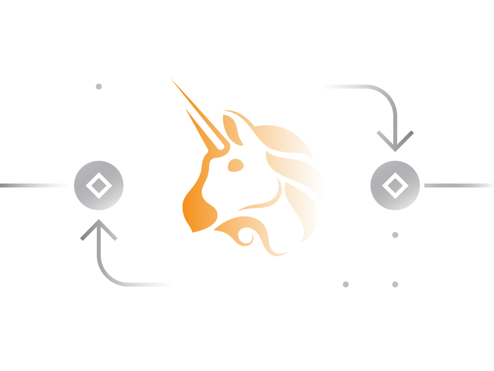

# Uniswap in Simple Terms

[Uniswap](https://uniswap.info/home) is a peer-to-peer, decentralized cryptocurrency exchange to trade Ethereum and Ethereum-based tokens. 

Uniswap is one of the first [decentralized exchanges](../../defi/en/3-decentralized-exchanges.md) to emerge out of the Ethereum.

- Uniswap smart contracts today manage hundreds of millions worth of cryptocurrency in autonomous and decentralized manner.

- it's considered as one of genuinely decentralized cryptocurrency exchanges. Exchange operators cannot censor service users nor shut it down.

- the exchange has the highest trading volume among decentralized exchanges and exceeds many centralized exchanges.
    
- lists a lot of cryptocurrency trading pairs and has a free token listing policy, allowing anyone to list any token and provide liquidity for it.

- uses a simple math formula and tokens available in its liquidity pool to determine price of listed assets and execute trades. An overview of this model can be found [here](https://uniswap.org/docs/v2/protocol-overview/how-uniswap-works) and [here](https://uniswap.org/docs/v2/core-concepts/swaps/).

- has two versions, Uniswap V1 and newer Uniswap V2. As it was built per deFi principles it's not possible for Uniswap to shut down earlier versions. 

- Uniswap V3 is in the works aimed at further improving various elements of the exchange. 
    
Today, Uniswap is one of the biggest DEXes with [over 100 million](https://migrate.uniswap.info/home) in 24-hour trading volume.

## Trading on Uniswap

The Uniswap trading interface can be accessed through its public front-end at [uniswap.org](https://app.uniswap.org/#/swap).

- there is a 0.03% service fee for traders to execute a transaction on Uniswap.

- it's generally cheaper to trade between Ethereum's native ETH currency and Ethereum-based ERC20 tokens, then exchanging between ERC20 tokens.

- the design of smart contract powering Uniswap allows for much cheaper Ethereum transaction fees when compared with other decentralized exchanges.

- traders may see significant price slippage (deviation from market price) for larger orders. 

- trading pairs with more liquidity in respective liquidity pools will provide better prices for larger orders then pairs with less liquidity.

- for Uniswap to function well and allow large trades it needs large liquidity pools.

Page [here](https://uniswap.info/pairs) shows all trading pairs on Uniswap along with liquidity pool for each.

## Liquidity Providers

Uniswap was one of the first projects to introduce automated market making algorithm via liquidity pools.

- each trading pair on Uniswap has its own liquidity pool. Anyone can create a liquidity pool on Uniswap or join an existing one.

- to join liquidity pool user required to deposit two tokens that are involved in a trading pair.

- liquidity provider needs to deposit both tokens in equal amounts, taking into account current market prices of tokens.

- for instance, a [ETHUSDT](https://uniswap.info/pair/0x0d4a11d5eeaac28ec3f61d100daf4d40471f1852) trading pair requires both ETH and USDT tokens as deposit.

- liquidity providers get to split trading fees relative to the value of deposited assets. 

- liquidity providers receive pool specific tokens which represent the ownership of certain amount of assets in a given pool.

- liquidity provider may pull assets along with earnings out of the pool at any time.

## Pool Profitability

At first glance it may seem that Uniswap liquidity pools provide a guaranteed way to earn passive income by putting idle cryptocurrency assets to work.

> However, it's not uncommon for a liquidity provider to see the cumulative value of the deposited assets decline, despite earning income from trading fees.

To understand why the value of a liquidity provider’s stake can go down despite income from fees, we need to look a bit more closely at the formula used by Uniswap to govern trading.

This simple formula is nicely explained [here](https://medium.com/@pintail/uniswap-a-good-deal-for-liquidity-providers-104c0b6816f2) along with the factors that need to be taken into account when evaluating liquidity pools.

A general rule of thumb here, from the perspective of a liquidity provider, any price change on deposited assets would cause a reduction in the value of the stake, relative to just holding the original assets. 

> Therefore, when it comes to Uniswap, the liquidity pools are likely to perform better for pairs that involve stable assets i.e. stablecoins.

As the price changes of assets plays an important role in profit calculation, it complicates analysis of potential future returns.

## Uniswap Token

In September 2020, Uniswap [announced](https://uniswap.org/blog/uni/) a native governance token called UNI.

The primary use case for token is to participate in a decision making and other governance aspects such as funds in community-managed treasury.
