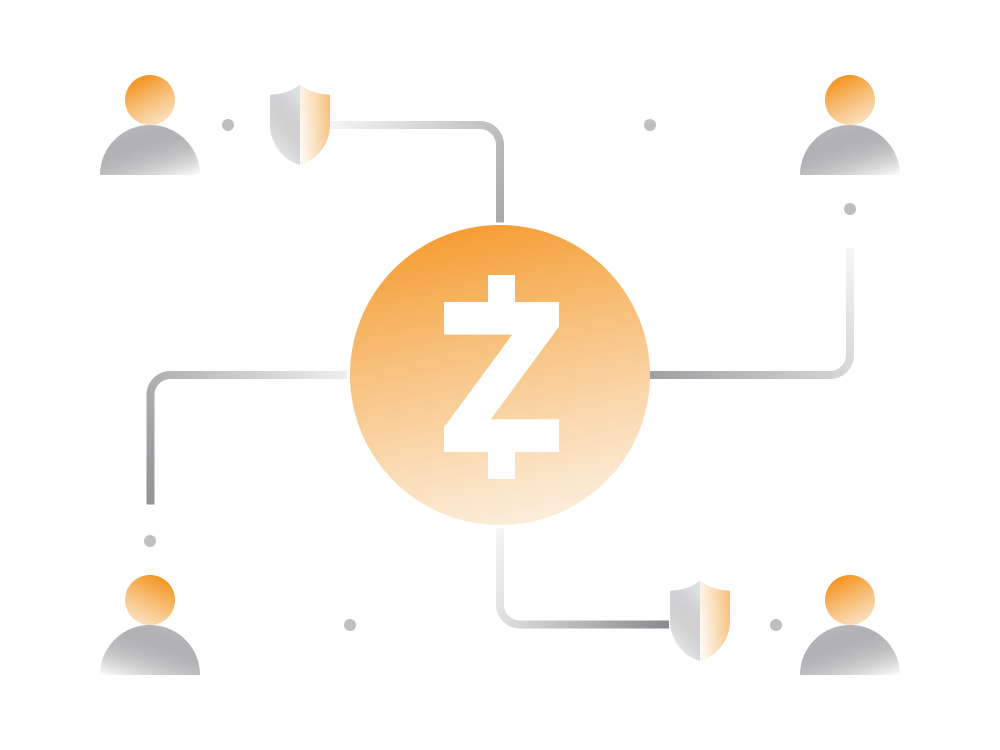
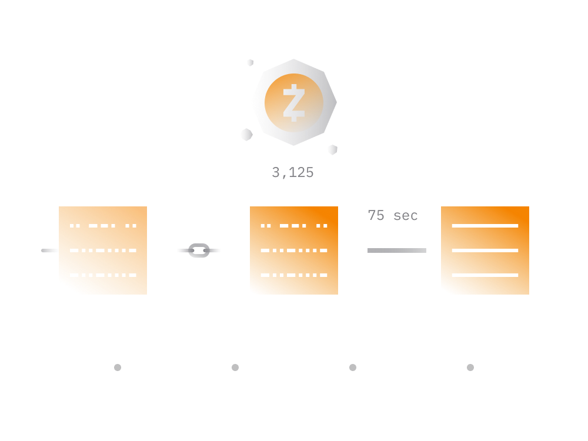
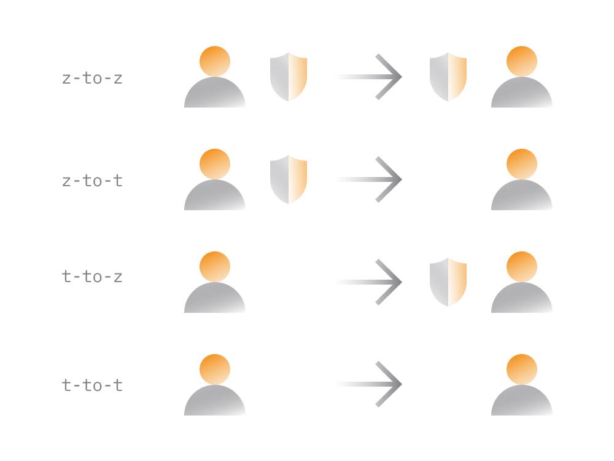

# Zcash In Simple Terms

Zcash is a [Bitcoin-like](bitcoin.md) cryptocurrency project but with a heavy focus on privacy which uses some of the most cutting-edge cryptography in the industry. 

This guide aims to explain what makes Zcash unique, how to transact with it and why its growing.

## 1. Zcash Origins

Zcash grew out of an experimental proposal from a group of scientists and mathematicians looking to fix lack of privacy on Bitcoin cryptocurrency. 

Zcash launched on October 28, 2016 by [Electric Coin Co](https://electriccoin.co) and was the first cryptocurrency project making use of so called [zk-SNARKs](https://www.investopedia.com/terms/z/zksnark.asp) technology, also known as zero-knowledge proofs.

> In simple terms, a zk-SNARK is a proof allowing one party to prove it possesses certain information without revealing information contents to the observer. 

As a result, Zcash blockchain enabled transactions which are verifiable for validity by a third party (i.e. spender having enough funds) without exposing private data of the entities involved in that transaction.

In comparison, every single Bitcoin transaction exposes some information about sender's balance as well as past and future transactions. 

## 2. Zcash vs Bitcoin

When compared to [Bitcoin](bitcoin.md) or [Ethereum](ethereum.md) blockchains Zcash provides enhanced privacy and allows for fully confidential transactions.

Zcash users are able to send private transactions depending on the situation and context of a given transaction.

Privacy aspects aside, Zcash is actually a fork of the Bitcoin project and shares a lot of fundamental properties such as having a limited supply of at most 21 million ZEC tokens.

> Just like on Bitcoin, Zcash transactions are publicly visible on a public blockchain.
>
> However, on Zcash, users may choose whether to transact in a public or private manner. Private transactions don't reveal any info about involved parties and amount transferred.
>
> Nodes powering Zcash blockchain can validate such private transactions without the need to know transaction details.

For purposes of compliance or audits (where transparency is required) Zcash blockchain provides selective payment feature. [Selective disclosures](https://www.zfnd.org/zcon/0/workshop-notes/selective-disclosure-workshop/) enable users to share details of specific transactions while keeping other information private.

Zcash highlights:

- Zcash cryptocurrency denoted by the symbol 'ZEC'. A single ZEC unit consists of 100 million sub-units known as zatoshi. It's same for Bitcoin but instead of zatoshi the sub-units are called satoshi :).

- While Bitcoin blockchain takes about 10 minutes to process a block with new transactions, on Zcash the blocks are on average processed once in about 75 seconds.

- Every time the block is processed and added to blockchain, a network node (miner) receives a reward of newly created ZECs. As of November 2020 the block reward is 3.125 ZEC.
 
- Just like Bitcoin, the amount of the block reward cuts in half about every four years until all 21 million ZEC are in circulation.

## 3. Zcash Privacy

Zcash has two different types of addresses: transparent and shielded.

- Transparent Zcash addresses start with "t" behave similarly to Bitcoin, exposing the sender, receiver and transaction amount on the blockchain. 

- Shielded addresses start with "z" and provide enhanced confidentiality. 

The two addresses are completely interoperable allowing users to send and receive funds between different addresses types.

Between the two Zcash address types, there are four Zcash transaction types: 

- fully shielded (z-to-z)
- partially shielded (z-to-t)
- partially shielded (t-to-z)
- fully transparent (t-to-t)

These different transactions provide varying layers of privacy.

With a fully-shielded Zcash transaction, the sender, recipient and amount are fully encrypted and completely private. Such transaction cannot be traced unless the sender or recipient leaks information about the transaction.

On the other hand, fully transparent Zcash transactions are similar to Bitcoin transactions where the addresses of sender, receiver and transaction amount are visible on a public blockchain.

## 4. Zcash Ecosystem

Just like all major cryptocurrency blockchains Zcash is an open source project allowing anyone to explore how it works and freely reuse its codebase.

Due to its privacy angle, Zcash has grown its own community of contributors, including world-class cryptographers, activists and freedom fighters.

> Any global cryptocurrency project looking to survive long term should aims to have a decentralized community willing to continue working on the ecosystem regardless of other entities involved.

While anyone is eligible to add improvements and grow Zcash protocol, the primary entities driving Zcash blockchain and surrounding ecosystem include:

- Electric Coin Company (ECC)
    
    The ECC team has created Zcash and supports the ongoing development of Zcash through R&D, engineering, business development and regulatory engagement. It was the first project to successfully implement zero-knowledge proofs. 

    Website: [Electric Coin Co](https://electriccoin.co)
    
- Zcash Foundation

    Zcash Foundation is a non-profit entity for maintaining and improving the Zcash protocol in the interests of all users, present and future. 
    
    Originally, Zcash Foundation was funded through a donation of several Zcash stakeholders. This donation came from the Founders’ Reward. 
    
    After the Canopy activation, Zcash Foundation will receive its funding from the Community Development Fund.
    
    Website: [https://www.zfnd.org](https://www.zfnd.org)

- Major Grant Review Committee

    The latest addition to the Zcash ecosystem that was initiated as part of the Canopy network upgrade. 
    
    Major Grants are meant for independent, third-party developers in an effort to further decentralize Zcash related efforts.
    
    Read more about [MGRC](https://electriccoin.co/blog/ecc-welcomes-the-major-grants-review-committee/).

Entities above are currently fundamental to further growth, expansion and further decentralization of Zcash ecosystem. 

Zcash is self-funded with strong community governance that aligns the incentives of key stakeholders. The key stakeholders get funding through Zcash cryptocurrency emission mechanism integrated into its protocol.

- During the period between October 28, 2016 and November 18, 2020, 10% of all newly issued coins went to a fund called the “Founders’ Reward.” 

- After November 18, about 20% of all newly issued ZEC coins (about 0.6 ZEC, every 75 seconds) will be distributed to Community Development Fund. At the same time, the “Founders Reward” will cease.

- Community Development Fund splits received 20% between Electric Coin Company (7%), Zcash foundation (5%) and third-party Major Grants Fund (8%).

This Community Development Fund, largely earmarked for new participants to improve, build upon, extend and support Zcash. 

## 5. Why Zcash Growing?

One of the major issues with existing cryptocurrencies is the lack of privacy. While traditional media portrays cryptocurrencies as untraceable and private it's far from reality. 

Except Zcash and a couple of other cryptocurrency projects the absolute majority of cryptocurrencies have close to zero privacy making it unviable to use for anything that requires privacy, leave alone anything illegal.

Bitcoin, Ethereum and other major cryptocurrencies so far were unsuccessful in addressing privacy concerns. Privacy is often cited as the weakest point in these projects.

At the same time, privacy become even more relevant as multinational technology giants continue to track every move on the internet. Central banks around the world are also trying to phase out privacy preserving cash payments by pushing to launch their own digital-only currency.

So, the entire community of privacy conscious cryptocurrency users and early adopters are in dire need of privacy coins.

Currently, Zcash is one of the very few coins that is able to provide privacy for these users. 

The fact that it has a strong fundamentals and backing of some of the brightest people in the cryptocurrency space attracts a lot of people to these privacy preserving cryptocurrency.

## 6. Zcash Challenges

As the case for nearly every cryptocurrency out there, Zcash has some issues which may inhibit its future growth.

- Trusted Set up

    Privacy technology implemented by Zcash currently rely on a so called 'trusted setup', which is used to form the initial parameters that allow network users to construct and verify private transactions. 

    While there are measures in place to prevent malicious behavior, Zcash research team has been working on [Halo](https://electriccoin.co/blog/explaining-halo-2/), which can potentially remove the need for trusted set up.

    Critics have suggested that the founders could potentially use this facet of the system to create an infinite number of Zcash tokens without anyone else being aware of the existence of those tokens. For that reason, it's not entirely possible to know the exact number of zcash tokens in existence at this point.

- Shielded Adoption

    The percentage of shielded transactions on the Zcash network remains low compared to total usage. Most transactions on Zcash are as transparent as on Bitcoin. 
    
    That said, Zcash has made significant progress toward the growth of shielded adoption including getting the support from major cryptocurrency exchanges.

- Blockchain Speed

    While Zcash blockchain can potentially process more transactions than Bitcoin it's still limited to roughly 20 transactions per second. 
    
    This is not an issue as such for the time being as the current activity on Zcash is significantly below the limit.
    
- Competition

    Another potential issue for Zcash is existence of competing cryptocurrencies, specifically DASH and Monero which are also trying to tackle the issue of privacy.
    
    While Monero currently being the one with the highest market cap it's yet to be seen which one will attract the most users in the long run. 
    
From users' perspective we are hopeful Zcash continues to grow and becomes the defacto privacy coin for those looking to abide regulations and at the same time have on demand privacy.
