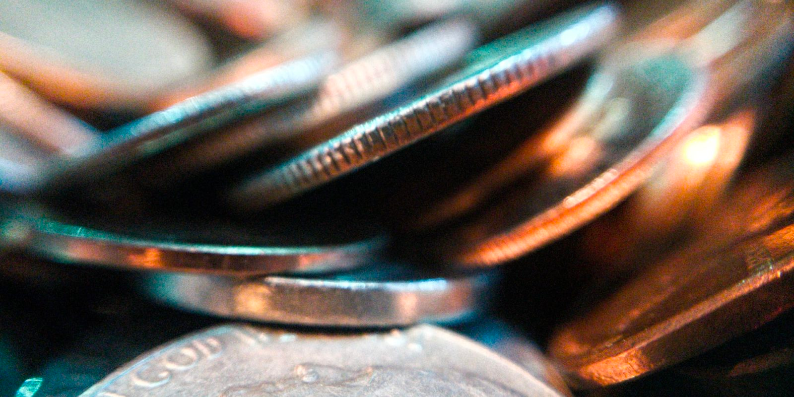

# Best Crypto Coins in 2020: The Ultimate List

Bitcoin is just one of many cryptocurrencies in existence. CoinGecko lists more than 8,000 individual tokens on its site—though it’s not clear how many of those are still active.

The Bitcoin alternatives are called altcoins. Some are more useful than others. But which are the best?

Here’s our list of the top cryptocurrency coins in 2020, complete with links to the coin studies we’ve published for each token.

## 1. Bitcoin (BTC)

The world’s most famous crypto coin, Bitcoin, was launched in early 2009. It is the most widely adopted token in the real-world and has provided the basis for many cryptocurrency forks.

Bitcoin is expensive. It hit an all-time high of $20,000 in 2018 and has spent much of 2020 valued between $8,000 and $10,000.

You can buy Bitcoin on an exchange or mine it on your computer. You could even try and mine Bitcoin on your Android. If you decide to mine on a computer, you will need one of the best mining GPUs to make a serious profit.

Once you have some Bitcoin, make sure you store it in a secure offline cold wallet. Just beware of the common Bitcoin scams before you start using it.

Want to explore Bitcoin storage solutions in more detail? Check out our crypto wallets guide.

## 2. Ethereum (ETH)

Ethereum is the second-largest cryptocurrency in the world.

There are some crucial differences between Ethereum and Bitcoin. The most significant difference is the use of smart contracts.

Although Bitcoin can theoretically host simple smart contracts, Ethereum was designed specifically for the purpose. It was designed using ERC token standards.

Smart contracts mean Ethereum has a lot of real-world uses, including hosting decentralized apps (DApps).

To learn more, check out the best Ethereum tutorials on the web.

## 3. Binance Coin (BNB)

Binance Coin is the in-house token of the Binance crypto exchange. It provides reduced trading fees on the Binance platform but also has several uses outside the exchange.

Binance itself is hugely popular. It is one of the world’s best crypto exchanges thanks to its easy-to-use app and widespread support of tokens. The only downside it is the KYC process, meaning you’ll have to get verified on Binance to be able to use the app.

(Note: Users in the US will need to use the separate Binance US due to government regulations. Check out some of the best crypto exchanges for Americans for alternatives.)
