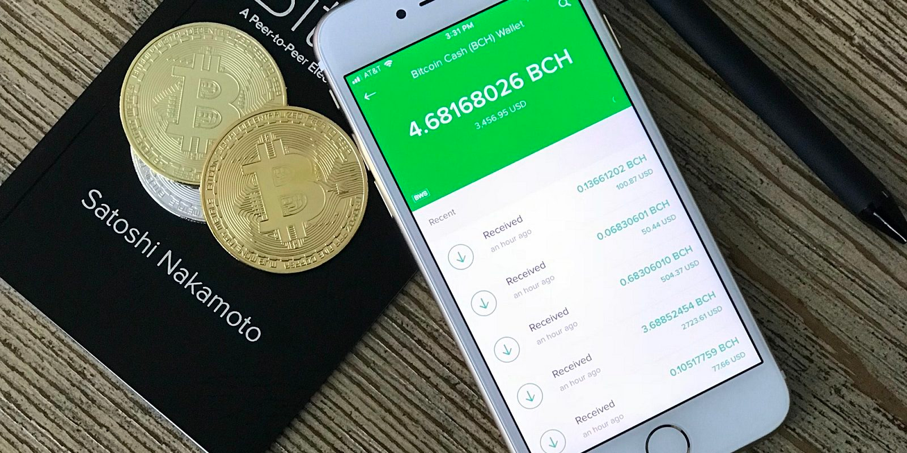

# What Is a Crypto Wallet and Which Is the Best?

If you own any crypto assets, you need to make sure you have a solid understanding of crypto wallets. Failure to use a secure and reliable method of
crypto storage can lead to a complete loss of funds.

Keep reading to learn what exactly is a crypto wallet, how to use a crypto wallet, which are the best crypto wallets, and why using crypto cold
storage is almost always the best solution.

## What Is a Crypto Wallet?

A crypto wallet is the crypto world’s answer to bank accounts.

In its purest form, a crypto wallet has one purpose: to store your public and private keys.

No crypto is stored on your wallet; instead, it lives on the blockchain. The set of two keys allow you to access and use the coins you own.

Not sure what a blockchain is? Read our guide to find out.

## How to Use a Crypto Wallet

As the crypto industry has grown, so too has the number of crypto wallets available. Predictably, each wallet has its own set of features and quirks to try and lure users. Some even let you send crypto via SMS.

At their core, however, all wallets work in the same way. To receive money, you need to use the public key. The public key can be shared with anyone.

The private key lets you send money out of the wallet. Anyone who has a wallet’s private key can perform a transaction, so it’s vital not to share it.

Storing private keys in the most safe and secure way possible is the primary goal of every crypto wallet. A lost private key can never be restored; the assets held in the wallet will be locked forever.

